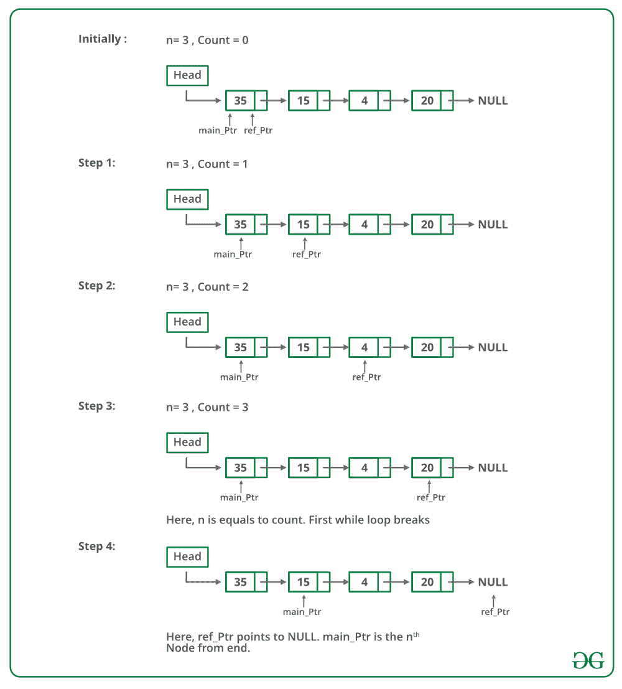

# 从链表末尾打印第 n 个节点的 Java 程序(重复)

> 原文:[https://www . geesforgeks . org/Java-打印程序-第 n 个链接列表末端的节点-2/](https://www.geeksforgeeks.org/java-program-for-printing-nth-node-from-the-end-of-a-linked-list-2/)

给定一个链表和一个数字 n，写一个函数，返回链表末尾第 n 个节点的值。
例如，如果输入在列表下方，n = 3，则输出为“B”

[](https://media.geeksforgeeks.org/wp-content/cdn-uploads/gq/2013/03/Linkedlist.png)

**方法 1(使用链表长度)**
1)计算链表长度。让长度为 len。
2)打印链表开头的第(len–n+1)个节点。
**双指针概念:**第一指针用于存储变量的地址，第二指针用于存储第一指针的地址。如果我们希望通过一个函数来改变变量值，我们传递一个指向它的指针。如果我们希望改变指针的值(即，它应该开始指向其他东西)，我们将指针传递给指针。

下面是上述方法的实现:

**Output**

```java
35
```

下面是同一方法的递归 C 代码。感谢 Anuj Bansal 提供以下代码。

## Java 语言(一种计算机语言，尤用于创建网站)

```java
static void printNthFromLast(Node head, int n)
{
    static int i = 0;

    if (head == null)
        return;
    printNthFromLast(head.next, n);

    if (++i == n)
        System.out.print(head.data);
}

// This code is contributed by rutvik_56.
```

**时间复杂度:** O(n)其中 n 是链表的长度。
**方法 2(使用两个指针)**
维护两个指针——引用指针和主指针。初始化指向 head 的引用指针和主指针。首先，将引用指针从头部移动到 n 个节点。现在逐个移动两个指针，直到引用指针到达末尾。现在主指针将从末尾指向第 n 个节点。返回主指针。
下图是上述方法的模拟运行:



以下是上述方法的实现:

**Output**

```java
Node no. 4 from last is 35 
```

**时间复杂度:** O(n)其中 n 是链表的长度。
详情请参考链表末尾第 n 节点[程序的完整文章！](https://www.geeksforgeeks.org/nth-node-from-the-end-of-a-linked-list/)