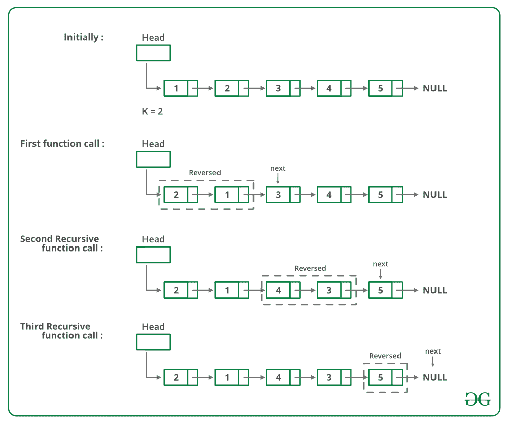

# 用于在给定大小的组中反转链表的 Java 程序–集合 1

> 原文:[https://www . geeksforgeeks . org/Java-用于反转给定大小的组中链表的程序集-1/](https://www.geeksforgeeks.org/java-program-for-reversing-a-linked-list-in-groups-of-given-size-set-1/)

给定一个链表，编写一个函数来反转每 k 个节点(其中 k 是函数的输入)。

**示例:**

> 输入:1->【2】>【3】>【4】>【5】>【6】>【7】>【8】>【null】，K = 3
> **输出【0】**

**算法** : [*反转*](https://www.geeksforgeeks.org/reverse-a-linked-list/) *(head，k)*

*   反转大小为 k 的第一个子列表。反转时，跟踪下一个节点和上一个节点。让指向下一个节点的指针为*下一个*，指向上一个节点的指针为*上一个*。反向链表见[本帖](https://www.geeksforgeeks.org/reverse-a-linked-list/)。
*   *head- > next = reverse(next，k)* (递归调用列表的其余部分并链接两个子列表)
*   返回 *prev* ( *prev* 成为新的列表头(参见[这篇文章](https://www.geeksforgeeks.org/reverse-a-linked-list/)的一个迭代方法的图表)

下图显示了反向功能的工作原理:



下面是上述方法的实现:

## Java 语言(一种计算机语言，尤用于创建网站)

```
// Java program to reverse a 
// linked list in groups of
// given size
class LinkedList
{
    // Head of list
    Node head; 

    // Linked list Node
    class Node 
    {
        int data;
        Node next;
        Node(int d)
        {
            data = d;
            next = null;
        }
    }

    Node reverse(Node head, int k)
    {
        if(head == null)
          return null;
        Node current = head;
        Node next = null;
        Node prev = null;

        int count = 0;

        // Reverse first k nodes of 
        // linked list
        while (count < k && 
               current != null) 
        {
            next = current.next;
            current.next = prev;
            prev = current;
            current = next;
            count++;
        }

        /* next is now a pointer to (k+1)th node
           Recursively call for the list starting from
           current. And make rest of the list as next of
           first node */
        if (next != null)
            head.next = reverse(next, k);

        // prev is now head of the input list
        return prev;
    }

    // Utility functions

    // Inserts a new Node at front
    // of the list.
    public void push(int new_data)
    {
        /* 1 & 2: Allocate the Node &
                  Put in the data*/
        Node new_node = new Node(new_data);

        // 3\. Make next of new Node 
        // as head 
        new_node.next = head;

        // 4\. Move the head to point to
        // new Node
        head = new_node;
    }

    // Function to print linked list
    void printList()
    {
        Node temp = head;
        while (temp != null) 
        {
            System.out.print(temp.data + " ");
            temp = temp.next;
        }
        System.out.println();
    }

    // Driver code
    public static void main(String args[])
    {
        LinkedList llist = new LinkedList();

        // Create Linked List is 
        // 1->2->3->4->5->6->
        // 7->8->8->9->null
        llist.push(9);
        llist.push(8);
        llist.push(7);
        llist.push(6);
        llist.push(5);
        llist.push(4);
        llist.push(3);
        llist.push(2);
        llist.push(1);

        System.out.println("Given Linked List");
        llist.printList();

        llist.head = llist.reverse(llist.head, 3);

        System.out.println("Reversed list");
        llist.printList();
    }
}
// This code is contributed by Rajat Mishra 
```

**输出:**

```
Given Linked List
1 2 3 4 5 6 7 8 9 
Reversed list
3 2 1 6 5 4 9 8 7 
```

**复杂度分析:**

*   **时间复杂度:** O(n)。
    遍历列表只做一次，它有 n 个元素。
*   **辅助空间:** O(n/k)。
    对于每个大小为 n、n/k 或(n/k)+1 的链表，在递归过程中将进行调用。

更多详细信息，请参考完整的文章[在给定大小的组中反向链表|集合 1](https://www.geeksforgeeks.org/reverse-a-list-in-groups-of-given-size/) ！