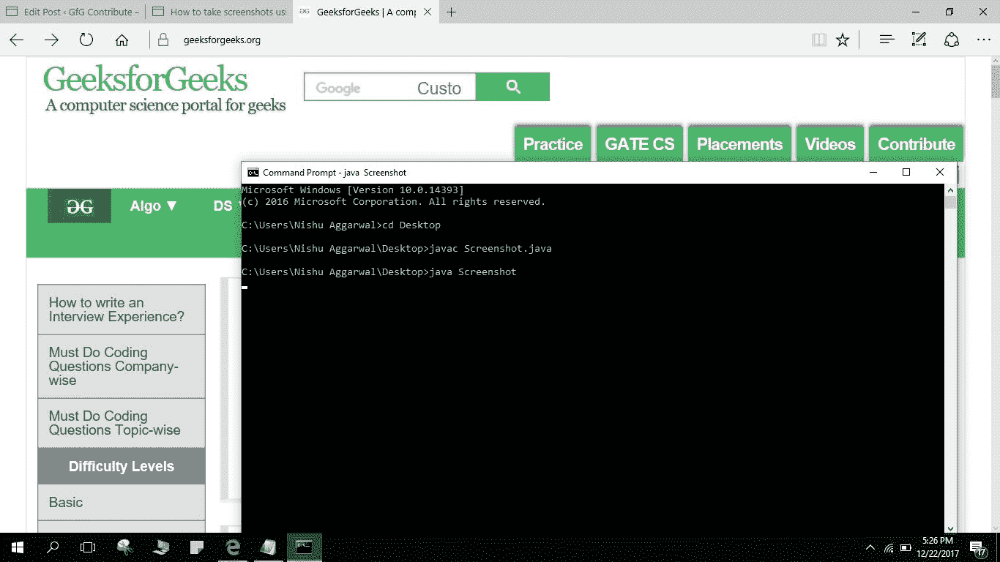

# Java 程序截图

> 原文:[https://www . geesforgeks . org/Java-program-take-截图/](https://www.geeksforgeeks.org/java-program-take-screenshots/)

在这个程序中，我们将看到如何使用 java 程序截图，并将截图保存在所需的文件夹中。
我们使用 [**java.awt.Robot**](https://www.geeksforgeeks.org/robot-class-java-awt/) 类来捕捉屏幕的像素。它提供了类似**创建屏幕捕捉**的方法来捕捉当前屏幕。该方法将捕获的图像作为 **BufferedImage** 对象返回，该对象可以保存为文件。它还使用 **ImageIO** 将其保存为 PNG 图像格式。 **Toolkit.getDefaultToolkit()。getSize()** 方法用于获取屏幕的大小。
**[serial version id](https://www.geeksforgeeks.org/serialversionuid-in-java/)**是 [Serializable 类](https://www.geeksforgeeks.org/serialization-in-java/)的通用版本标识符。使用线程是为了在执行程序后，我们可以切换到我们想要截图的屏幕。120 秒是以秒为单位的时间，即 2 分钟。

**注意:**方法名称请注意大写和小写。案例的微小变化可能会导致错误。

**如何用程序抓拍截图:**

*   用记事本写程序。
*   将其保存为 Screenshot.java，并在 CommandPrompt 上运行。
*   如有问题，请参考最后的截图。

```
// Java Program to Capture full
// Image of Screen
import java.awt.AWTException;
import java.awt.Rectangle;
import java.awt.Toolkit;
import java.awt.Robot;
import java.awt.image.BufferedImage;
import java.io.IOException;
import java.io.File;
import javax.imageio.ImageIO;

public class Screenshot {
    public static final long serialVersionUID = 1L;
    public static void main(String[] args)
    {
        try {
            Thread.sleep(120);
            Robot r = new Robot();

            // It saves screenshot to desired path
            String path = "D:// Shot.jpg";

            // Used to get ScreenSize and capture image
            Rectangle capture = 
            new Rectangle(Toolkit.getDefaultToolkit().getScreenSize());
            BufferedImage Image = r.createScreenCapture(capture);
            ImageIO.write(Image, "jpg", new File(path));
            System.out.println("Screenshot saved");
        }
        catch (AWTException | IOException | InterruptedException ex) {
            System.out.println(ex);
        }
    }
}
```

输出:


**参考文献:**
[http://viralpatel . net/blogs/how-in-Java-截图-Java/](http://viralpatel.net/blogs/how-to-take-screen-shots-in-java-taking-screenshots-java/)
[http://www . javatechblog . com/Java/how-in-Java-截图-程序化/](http://www.javatechblog.com/java/how-to-take-screenshot-programmatically-in-java/)