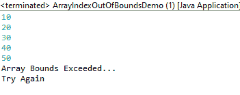
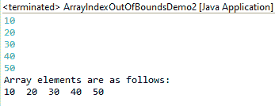

# 将元素输入数组时检查数组边界的 Java 程序

> 原文:[https://www . geesforgeks . org/Java-程序检查数组边界同时将元素输入数组/](https://www.geeksforgeeks.org/java-program-to-check-array-bounds-while-inputing-elements-into-the-array/)

**概念:**数组是静态数据结构，不会随着元素数量的增加而自动增长。对于数组，在声明时指定数组大小很重要。在 Java 中，当我们试图访问超出数组范围的数组索引时，它会抛出一个 ArrayIndexOutOfBounds 异常。一个[例外](https://www.geeksforgeeks.org/exceptions-in-java/)是对正常程序执行的阻碍。Java 有 try-catch-finally 块来实现高效的异常处理。ArrayIndexOutOfBoundsException 是一个运行时异常，必须小心处理，以防止程序突然终止。

**接近:**

1.  **使用试捕块，其中输入超出数组索引范围**
2.  **使用试捕块，其中输入在数组索引范围内**
3.  **对用户输入使用约束**

**第一次进场**

在第一种方法中，声明一个大小= 5 的数组。输入在一个 try 块内进行，循环执行 6 次。由于数组大小为 5，在第 6 次输入后，会抛出[ArrayIndexOutOfBoundsException](https://www.geeksforgeeks.org/understanding-array-indexoutofbounds-exception-in-java/)。异常由 catch 块处理。处理异常的代码放在 catch 块中。在本例中，我们通知用户发生了异常，并且输入超出了数组范围。

**实现**:在所有方法中，使用名为“I”的变量作为整数数据类型是考虑因素。

## Java 语言(一种计算机语言，尤用于创建网站)

```
// Importing generic Classes/Files
import java.util.*;

public class GFG {

    // Main driver method
    public static void main(String args[])
        throws ArrayIndexOutOfBoundsException
    {

        // Taking input from user
        Scanner s = new Scanner(System.in);

        // Storing user input elements in an array
        int arr[] = new int[5];

        // Try block to check exception
        try {
            // Forcefully iteration loop no of times
            // these no of times > array size
            for (int i = 0; i < 6; i++) {

                // Storing elements through nextInt()
                arr[i] = s.nextInt();
            }
        }
        catch (ArrayIndexOutOfBoundsException e) {
            // Print message when any exception occurs
            System.out.println(
                "Array Bounds Exceeded...\nTry Again");
        }
    }
}
```

**输出:**


**第二次进场**

在第二种方法中，我们声明一个大小= 5 的数组。输入在 try 块内的 while 循环中进行。每次迭代时都会根据数组的大小检查 I 的值。“I”的值从 0 开始，可以输入到索引 4。一旦“I”的值达到 5，就会引发异常。这个异常由 catch 块处理。这种方法与第一种方法类似，但是，在这种方法中，没有输入超出数组索引范围，而第一种方法不是这种情况。

**实施:**

## Java 语言(一种计算机语言，尤用于创建网站)

```
// Importing generic Classes/Files
import java.util.*;

public class GFG {

    // Main driver method
    public static void main(String args[])
        throws ArrayIndexOutOfBoundsException
    {

        // Taking input from user
        Scanner s = new Scanner(System.in);
        // Storing elements as array
        int arr[] = new int[5];

        / variable created and initialized with 0 int i = 0;

        // try block to check exception
        try {

            // Condition check
            while (true) {
                if (i == 5)

                    // Statement responsible for exception
                    throw new ArrayIndexOutOfBoundsException();
                arr[i++] = s.nextInt();
            }
        }

        // Catch block to handle exception
        catch (ArrayIndexOutOfBoundsException e) {

            // Message printed when exception occurs
            System.out.println(
                "Array Bounds Exceeded...\nTry Again");
        }
    }
}
```

**输出:**



**第三种方法**

在这种方法中，我们不使用异常处理的概念，而是使用循环来限制输入。从用户处获取输入时，这是检查数组边界的一种更简单方便的方法。

**实施:**

## Java 语言(一种计算机语言，尤用于创建网站)

```
// Importing Classes/Files
import java.util.*;

public class GFG {

    // Main driver code
    public static void main(String args[])
    {

        // Taking user input through scanner
        Scanner s = new Scanner(System.in);

        // Creating array to store elements
        int arr[] = new int[5];

        // creating and initializing variable with 0
        int i = 0;

        // Condition check
        while (i < 5) {

            // Storing user defined elements in array
            arr[i++] = s.nextInt();
        }
        System.out.println(
            "Array elements are as follows: ");

        // Iteration over elements
        for (int j = 0; j < 5; j++)
            System.out.print(arr[j] + "  ");
    }
}
```

**输出:**

