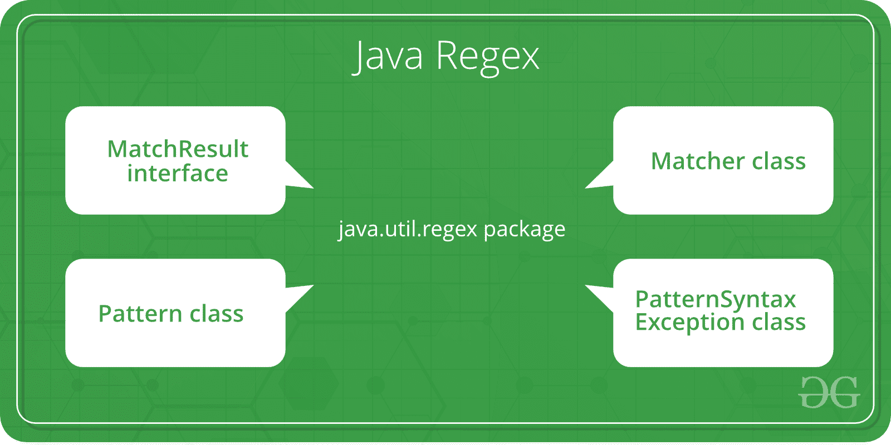

# 检查有效手机号码的 Java 程序

> 原文:[https://www . geesforgeks . org/Java-程序检查有效手机号码/](https://www.geeksforgeeks.org/java-program-to-check-for-a-valid-mobile-number/)

正则表达式(简称 Regex)是一个定义字符串模式的应用编程接口，可用于在 Java 中搜索、操作和编辑字符串。电子邮件验证和密码是少数几个广泛使用 Regex 来定义约束的字符串领域。正则表达式在 *java.util.regex 包*下提供。这包括 3 个类和 1 个接口。



这里我们将讨论两个例子，一个是针对印度的，另一个是针对所有国家的标准验证。因此，情况如下:

*   案例 1:印度本地电话号码
*   案例 2:全球电话号码

**案例 1:** 印度本地电话号码

手机号码验证标准如下:

*   第一个数字应该包含 7 到 9 之间的数字。
*   其余 9 位数字可以包含 0 到 9 之间的任何数字。
*   手机号码也可以有 11 位数字，在开头包括 0。
*   手机号码可以是 12 位数字，也可以是起始数字 91。

插图:

```
Input  : Enter Mobile Number: 7873923408
Output : Valid Mobile Number
```

```
Input  : Enter Mobile Number: 5678729234
Output : Invalid Mobile Number
```

**概念:**

一个人必须对[正则表达式](https://www.geeksforgeeks.org/regular-expressions-in-java/)有很好的理解，因为这是前提。Java 中的手机号码验证是使用 Java 的 ***模式和匹配器*** 类完成的。**模式**类用于编译给定的模式/正则表达式，**匹配器**类用于将输入字符串与编译后的模式/正则表达式进行匹配。在这个方法中，提到了一个正则表达式，它提到了输入字符串的验证标准，在本文中，输入字符串是一个移动号码。印度的手机号码有 10 位数字，所以我们可以提到一个只包含 10 位数字的正则表达式。

**示例:**

## Java 语言(一种计算机语言，尤用于创建网站)

```
// Java Program to Check if Mobile Number is Valid or Not

// Importing all regex classes from java.util package to
// match character sequence against patterns
// Importing input output classes
import java.io.*;
import java.util.regex.*;
// Main class
class GFG {

    // Method 1
    // To check whether number is valid or not
    public static boolean isValid(String s)
    {

        // The given argument to compile() method
        // is regular expression. With the help of
        // regular expression we can validate mobile
        // number.
        // The number should be of 10 digits.

        // Creating a Pattern class object
        Pattern p = Pattern.compile("^\\d{10}{content}quot;);

        // Pattern class contains matcher() method
        // to find matching between given number
        // and regular expression for which
        // object of Matcher class is created
        Matcher m = p.matcher(s);

        // Returning bollean value
        return (m.matches());
    }

    // Method 2
    // Main driver method
    public static void main(String[] args)
    {

        // Considering two numbers as inputs
        // Custom input numbers
        String s = "7984286257";
        String s_1 = "5426391";

        // Checking over method 1 for string 1
        if (isValid(s))

            // Print statement
            System.out.println("Valid Number");
        else

            // Print statement
            System.out.println("Invalid Number");

        // Again, checking over method 1 for string 1
        if (isValid(s_1))

            // Print statement
            System.out.println("Valid Number");
        else

            // Print statement
            System.out.println("Invalid Number");
    }
}
```

**Output**

```
Valid Number
Invalid Number
```

**案例 2:** 全球电话号码

该方法再次借助正则表达式来匹配所有国家格式的电话号码

手机号码验证标准:

1.  国家代码前缀以“+”开头，有 1-3 位数字。
2.  大多数国家在连字符(-)后有最后 4 位数字。

满足验证的数字如下图所示:

插图:

```
Input  : Enter Mobile Number : +1 212 555-3458 (USA)
Output : Valid Mobile Number
```

```
Input  : Enter Mobile Number : +4934 351 125-3456
Output : Invalid Mobile Number
```

**示例:**

## Java 语言(一种计算机语言，尤用于创建网站)

```
// Java program to Check if Mobile Number is Valid or Not

// Importing all regex classes for
// character sequences with pattern matching
import java.util.regex.*;

// Main class
class GFG {

    // Method 1
    //
    public static boolean isValid(String s)
    {

        // The given argument to compile() method
        // is regular expression. With the help of
        // regular expression we can validate mobile
        // number for which we create an object of
        // Pattern class

        Pattern p = Pattern.compile(
            "^(\\+\\d{1,3}( )?)?((\\(\\d{1,3}\\))|\\d{1,3})[- .]?\\d{3,4}[- .]?\\d{4}{content}quot;);

        // Pattern class contains matcher() method
        // to find matching between given number
        // and regular expression by creating an object of
        // Matcher class
        Matcher m = p.matcher(s);

        // Returns boolean value
        return (m.matches());
    }

    // Method 2
    // Main driver method
    public static void main(String[] args)
    {

        // Custom input strings
        String s = "+1 212 555-3458";
        String s_1 = "+4934 351 125-3456";

        // Checking if the strings are valid or not
        if (isValid(s))

            // Print statement
            System.out.println("Valid Number");
        else

            // Print statement
            System.out.println("Invalid Number");

        // Again, checking over another string(phone number)
        if (isValid(s_1))

            // Print statement
            System.out.println("Valid Number");
        else

            // Print statement
            System.out.println("Invalid Number");
    }
}
```

**Output**

```
Valid Number
Invalid Number
```