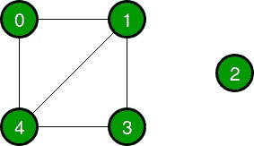

# 用 DFS 检查无向图是否连通的 Java 程序

> 原文:[https://www . geesforgeks . org/Java-program-to-check-undirected-graph-is-connected-use-DFS/](https://www.geeksforgeeks.org/java-program-to-check-whether-undirected-graph-is-connected-using-dfs/)

给定一个无向图，任务是检查给定的图是否使用 DFS 连接。

连通图是拓扑空间意义上的连通图，即从图中的任何节点到任何其他节点总有一条路径。不连通的图称为不连通图。

**示例:**

> **输入:**
> 
> 
> 
> **输出:**图形连接
> 
> **输入:**
> 
> 
> 
> **输出:**图形断开

**进场:**

1.  取一个布尔访问[]数组。
2.  从任一顶点开始深度优先搜索，并在访问的[]数组中将访问的顶点标记为真。
3.  完成 DFS 后，检查访问的[]数组中的所有顶点是否都标记为真。
4.  如果是，则该图是连通的，否则该图不是连通的或断开的。

**代码:**

## Java 语言(一种计算机语言，尤用于创建网站)

```java
// Java Program to check if 
// an undirected graph is connected or not
// using DFS

import java.util.*; 

public class checkConnectivity {

    // Graph class
    static class Graph{

        int vertices;
        // Linked list for adjacency list of a vertex
        LinkedList<Integer> adjacencyList [];

        @SuppressWarnings("unchecked")
        public Graph(int vertices)
        {
            this.vertices = vertices;
            adjacencyList = new LinkedList[vertices];

            for (int i = 0; i<vertices ; i++) 
            {
                adjacencyList[i] = new LinkedList<>();
            }
        }

        // Function for adding edges
        public void addEdge(int source, int dest)
        {
            adjacencyList.addFirst(dest);
            adjacencyList[dest].addFirst(source);
        }
    }

    // Function to check if the graph is connected or not
    public void isConnected(Graph graph){

        int vertices = graph.vertices;
        LinkedList<Integer> adjacencyList [] = graph.adjacencyList;

        // Take a boolean visited array
        boolean[] visited = new boolean[vertices];

        // Start the DFS from vertex 0
        DFS(0, adjacencyList, visited);

        // Check if all the vertices are visited
        // Set connected to False if one node is unvisited
        boolean connected = true;

        for (int i = 0; i <visited.length ; i++) {
            if(!visited[i]){
                connected = false;
                break;
            }
        }

        if(connected){
            System.out.println("Graph is connected");
        }else{
            System.out.println("Graph is disconnected");
        }
    }

    public void DFS(int source, LinkedList<Integer> adjacencyList [], boolean[] visited){

        // Mark the vertex visited as True
        visited = true;

        // Travel the adjacent neighbours
        for (int i = 0; i <adjacencyList.size() ; i++) {

            int neighbour = adjacencyList.get(i);

            if(visited[neighbour]==false){

                // Call DFS from neighbour
                DFS(neighbour, adjacencyList, visited);
            }
        }
    }

    // Driver code
    public static void main(String[] args) {

        // Given graph 1
        Graph graph = new Graph(5);
        graph.addEdge(0,1);
        graph.addEdge(0,4);
        graph.addEdge(1,4);
        graph.addEdge(1,3);
        graph.addEdge(3,4);
        graph.addEdge(2,1);
        graph.addEdge(2,3);

        // Check if it's connected
        System.out.print("Graph 1:- ");

        checkConnectivity c = new checkConnectivity();
        c.isConnected(graph);

        // Given graph 2
        graph = new Graph(5);
        graph.addEdge(0,1);
        graph.addEdge(0,4);
        graph.addEdge(1,4);
        graph.addEdge(1,3);
        graph.addEdge(3,4);

        // Check if it's connected
        System.out.print("Graph 2:- ");

        c = new checkConnectivity();
        c.isConnected(graph);
    }
}
```

**Output**

```java
Graph 1:- Graph is connected
Graph 2:- Graph is disconnected

```