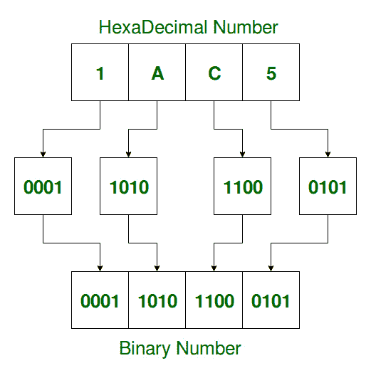

# 将十六进制转换为二进制的 Java 程序

> 原文:[https://www . geesforgeks . org/Java-程序到转换-十六进制到二进制/](https://www.geeksforgeeks.org/java-program-to-convert-hexadecimal-to-binary/)

**十六进制** l 是一个非常有用的数字系统，其前提是一次将 4 位组合在一起，构成系统的单个实体，该系统由 16 个符号组成，包括范围从 **0-9** 的 10 个数字和来自 **A-F 的前 6 个字母。**十六进制一词来源于单词**十六进制**表示**六个**和**十进制**表示**十个**。

因此，组合词表示十六，即六加十。十六进制序列也称为基数或基数 16。在处理不同的数字系统时，能够将它们从一个系统转换到另一个系统变得至关重要。在本文中，我们重点讨论将十六进制转换为二进制，这是一个由 1 和 0 组成的系统，是计算机存储和处理指令以及数据的机制。

**示例:**

```
Hexadecimal Sequence : 458A
Binary Equivalent : 0100010110001010
Explanation : Binary representation of A : 1010
          Binary representation of 8 : 1000
          Binary representation of 5 : 0101
          Binary representation of 4 : 0100

Hexadecimal Sequence : B36
Binary Equivalent : 101100110110
```



将十六进制转换为二进制有两种方法**和**如下:

1.  使用**键值对**进行从十六进制字符到其二进制等价字符的相应转换
2.  将**十六进制转换为其十进制**等价物，后者进一步**转换为其二进制等价物**

**方法 1 :**

使用这种方法，我们制定键值并提取十六进制字符串的每个字符，添加其相应的二进制序列并返回完整的二进制序列。

1.  创建一个哈希表来存储键值对。
2.  接受十六进制序列作为字符串，并在遍历字符串长度时提取每个字符。
3.  检查提取的字符是否出现在哈希映射的键中。
4.  如果存在，将存储二进制序列的字符串与相应的键值连接起来。
5.  如果不存在，则返回无效的十六进制字符串。

**代码:**

## Java 语言(一种计算机语言，尤用于创建网站)

```
// Java program to convert Hexadecimal to Binary

import java.util.HashMap;

class GFG {

    // declaring the method to convert
    // Hexadecimal to Binary
    String hexToBinary(String hex)
    {

        // variable to store the converted
        // Binary Sequence
        String binary = "";

        // converting the accepted Hexadecimal
        // string to upper case
        hex = hex.toUpperCase();

        // initializing the HashMap class
        HashMap<Character, String> hashMap
            = new HashMap<Character, String>();

        // storing the key value pairs
        hashMap.put('0', "0000");
        hashMap.put('1', "0001");
        hashMap.put('2', "0010");
        hashMap.put('3', "0011");
        hashMap.put('4', "0100");
        hashMap.put('5', "0101");
        hashMap.put('6', "0110");
        hashMap.put('7', "0111");
        hashMap.put('8', "1000");
        hashMap.put('9', "1001");
        hashMap.put('A', "1010");
        hashMap.put('B', "1011");
        hashMap.put('C', "1100");
        hashMap.put('D', "1101");
        hashMap.put('E', "1110");
        hashMap.put('F', "1111");

        int i;
        char ch;

        // loop to iterate through the length
        // of the Hexadecimal String
        for (i = 0; i < hex.length(); i++) {
            // extracting each character
            ch = hex.charAt(i);

            // checking if the character is
            // present in the keys
            if (hashMap.containsKey(ch))

                // adding to the Binary Sequence
                // the corresponding value of
                // the key
                binary += hashMap.get(ch);

            // returning Invalid Hexadecimal
            // String if the character is
            // not present in the keys
            else {
                binary = "Invalid Hexadecimal String";
                return binary;
            }
        }

        // returning the converted Binary
        return binary;
    }

    // Driver Code
    public static void main(String[] args)
    {

        // instantiating the class
        GFG ob = new GFG();

        String hex = "deafa";

        System.out.println(hex.toUpperCase());

        // printing and calling the
        // hexToBinary() function
        System.out.println(ob.hexToBinary(hex));
    }
}
```

**Output**

```
DEAFA
11011110101011111010
```

**方法 2:**

这种方法首先将十六进制字符串转换为其十进制等价物，然后再转换为其二进制等价物。我们使用两个函数，第一个函数将十六进制转换为十进制，第二个函数将十进制转换为二进制。

1.  首先，我们编写将十进制转换为二进制的函数。
2.  接下来，我们编写将十六进制转换为十进制的函数，并在该函数中调用上述函数，将转换后的十进制进一步转换为二进制。
3.  在这个函数中，我们遍历十六进制字符串的长度，每次提取一个字符。
4.  接下来，我们检查提取的字符是否在 0-9 或 A-F 的范围内。
5.  如果字符出现在上述范围内，我们将它们连接到十进制字符串。
6.  接下来，使用**十进制二进制()**函数将十进制字符串转换为二进制。
7.  如果上述范围内甚至没有一个字符，则返回无效的十六进制字符串作为输出。

**代码:**

## Java 语言(一种计算机语言，尤用于创建网站)

```
// Java program to convert Hexadecimal to Binary

class GFG {

    // method to convert Decimal to Binary
    String decimalToBinary(int decimal)
    {

        // variable to store the converted
        // binary string
        String binaryString = "";

        // loop to generate the binary
        while (decimal != 0) {

            // concatenating the remainder
            // on dividing by 2 to the
            // binary string
            binaryString = (decimal % 2) + binaryString;

            // updating the decimal integer
            // by dividing by 2 in each iteration
            decimal /= 2;
        }

        // loop to ensure that each
        // Hexadecimal character is
        // represented by 4 bits
        while (binaryString.length() % 4 != 0) {
            // adding leading 0's if the
            // character is represented by less
            // than 4 bits
            binaryString = "0" + binaryString;
        }

        // returning the converted binary string
        return binaryString;
    }

    // method to convert Hexadecimal to Binary
    String hexToBinary(String hexadecimal)
    {

        // declaring the variables
        int i;
        char ch;
        String binary = "";
        int returnedBinary;

        // converting the accepted Hexadecimal
        // String to upper case
        hexadecimal = hexadecimal.toUpperCase();

        // loop to iterate through the length
        // of the Hexadecimal String
        for (i = 0; i < hexadecimal.length(); i++) {

            // extracting the characters
            ch = hexadecimal.charAt(i);

            // condition to check if
            // the character is not a valid Hexadecimal
            // character
            if (Character.isDigit(ch) == false
                && ((int)ch >= 65 && (int)ch <= 70)
                       == false) {

                // returning Invalid Hexadecimal
                // String for the invalid Hexadecimal
                // character
                binary = "Invalid Hexadecimal String";
                return binary;
            }

            // checking if the character is a valid
            // Hexadecimal alphabet
            else if ((int)ch >= 65 && (int)ch <= 70)

                // converting alphabet to
                // corresponding value such as 10
                // for A and so on using ASCII code
                returnedBinary = (int)ch - 55;
            else
                returnedBinary
                    = Integer.parseInt(String.valueOf(ch));

            // converting the decimal to binary
            // by calling the decimalToBinary() method
            binary += decimalToBinary(returnedBinary);
        }

        // returning the converted binary sequence
        return binary;
    }

    // Driver Code
    public static void main(String[] args)
    {

        // instantiating the class
        GFG ob = new GFG();

        String hex = "abcfde";

        System.out.println(hex);

        // printing and calling the
        // hexToBinary() function to display the
        // output
        System.out.println(ob.hexToBinary(hex));
    }
}
```

**Output**

```
abcfde
101010111100111111011110
```