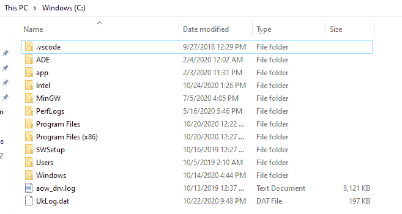

# 删除目录的 Java 程序

> 原文:[https://www . geesforgeks . org/Java-program-to-delete-a-directory/](https://www.geeksforgeeks.org/java-program-to-delete-a-directory/)

名为 [java.io.File](https://www.geeksforgeeks.org/file-class-in-java/) 的类表示系统中的一个文件或目录(路径名)。这个类提供了对文件/目录执行各种操作的方法。

**文件**类的 [delete()](https://www.google.com/url?client=internal-element-cse&cx=009682134359037907028:tj6eafkv_be&q=https://www.geeksforgeeks.org/file-delete-method-in-java-with-examples/&sa=U&ved=2ahUKEwiqsJC-p9fsAhXI4jgGHQNQCD0QFjABegQICRAB&usg=AOvVaw3Eg6_-e34up2PtRVpMlBXW) 方法删除当前文件对象代表的文件和空目录。如果目录不为空或包含文件，则不能直接删除。首先清空目录，然后删除文件夹。

假设存在一个路径为 **C:\\GFG** 的目录。下图显示了存在于 **GFG** 文件夹中的文件和目录。子目录 **Ritik** 包含名为 **Logistics.xlsx** 的文件，子目录 **Rohan** 包含名为 **Payments.xlsx** 的文件。


GFG 目录

下面的 java 程序演示了如何删除目录。

**方法一:使用 delete()删除文件和清空文件夹**

*   提供目录的路径。
*   调用用户定义的方法 deleteDirectory()删除所有文件和子文件夹。

## Java 语言(一种计算机语言，尤用于创建网站)

```java
// Java program to delete a directory

import java.io.File;

class DeleteDirectory {

    // function to delete subdirectories and files
    public static void deleteDirectory(File file)
    {
        // store all the paths of files and folders present
        // inside directory
        for (File subfile : file.listFiles()) {

            // if it is a subfolder,e.g Rohan and Ritik,
            // recursiley call function to empty subfolder
            if (subfile.isDirectory()) {
                deleteDirectory(subfile);
            }

            // delete files and empty subfolders
            subfile.delete();
        }
    }

    public static void main(String[] args)
    {
        // store file path
        String filepath = "C:\\GFG";
        File file = new File(filepath);

        // call deleteDirectory function to delete
        // subdirectory and files
        deleteDirectory(file);

        // delete main GFG folder
        file.delete();
    }
}
```

**输出**

下图是没有 **GFG** 文件夹的 c 盘。



GFG 文件夹已成功删除

**方法 2:使用 commons-io 中的 deleteDirectory()方法**

要使用 deleteDirectory()方法，您需要向 maven 项目添加一个 commons-io 依赖项。

> <groupid>commons-io</groupid>
> 
> <artifactid>commons-io</artifactid>
> 
> <version>2.5</version>

## Java 语言(一种计算机语言，尤用于创建网站)

```java
// Java program to delete a directory

import java.io.File;
import org.apache.commons.io.FileUtils;

class DelteDirectory {

    public static void main(String[] args)
    {
        // store file path
        String filepath = "C:\\GFG";
        File file = new File(filepath);

        // call deleteDirectory method to delete directory
        // recursively
        FileUtils.deleteDirectory(file);

        // delete GFG folder
        file.delete();
    }
}
```

**输出**

下图是没有 **GFG** 文件夹的 c 盘。


GFG 文件夹已成功删除