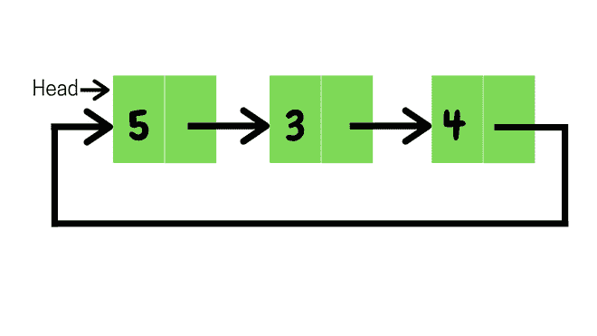

# 从循环链表开头删除节点的 Java 程序

> 原文:[https://www . geesforgeks . org/Java-program-to-delete-一个从循环链表开始的节点/](https://www.geeksforgeeks.org/java-program-to-delete-a-node-from-the-beginning-of-the-circular-linked-list/)

在本文中，我们将学习如何从[循环链表](https://www.geeksforgeeks.org/circular-linked-list/)的开头删除一个节点。考虑如下所示的链表。



**示例:**

```
Input : 5->3->4->(head node)
Output: 3->4->(head node)
```

两个案例在解决问题的同时出现，

**情况 1:** 列表为空

*   如果列表是空的，我们将简单地返回。

**情况 2:** 列表不为空

*   定义表示节点的节点类。
*   删除():
    *   如果没有节点，则从函数返回
    *   如果只有一个节点，则将头和尾都设置为空
    *   如果它有一个以上的节点，那么它将删除前一个头节点，头将指向列表中的下一个节点，尾将指向新的头。
*   printNode()将打印列表中的所有节点，如下所示:
    *   节点电流被定义为指向头部
    *   打印当前值，直到它再次指向头部
    *   在每次迭代中，它将指向下一个节点

**代码:**

## Java 语言(一种计算机语言，尤用于创建网站)

```
// Java Program to Delete a Node From the Beginning of the
// Circular Linked List

public class Main {

    // Represents the node of list.
    public class Node {
        int val;
        Node next;
        public Node(int val) { this.val = val; }
    }

    // Initialising head and tail pointers
    public Node head = null;
    public Node tail = null;

    // add new node to the end
    public void addNode(int val)
    {
        // Creating new node
        Node node = new Node(val);

        // head and tail will point to new node
        // if list is empty
        if (head == null) {
            head = node;
            tail = node;
            node.next = head;
        }

        // otherwise tail point to new node and
        else {
            tail.next = node;
            tail = node;
            tail.next = head;
        }
    }

    // Deletes node from the beginning of the list
    public void delete()
    {
        // returns if list is empty
        if (head == null) {
            return;
        }

        // otherwise head will point to next element in the
        // list and tail will point to new head
        else {
            if (head != tail) {
                head = head.next;
                tail.next = head;
            }

            // if the list contains only one element
            // then both head and tail will point to null
            else {
                head = tail = null;
            }
        }
    }

    // displaying the nodes
    public void display()
    {
        Node current = head;
        if (head == null) {
            System.out.println("List is empty");
        }
        else {
            do {
                System.out.print(" " + current.val);
                current = current.next;
            } while (current != head);
            System.out.println();
        }
    }

    public static void main(String[] args)
    {
        Main list = new Main();

        // Adds data to the list
        list.addNode(5);
        list.addNode(3);
        list.addNode(4);

        // Printing original list
        System.out.println("Original List: ");
        list.display();

        // deleting node from beginning and
        // displaying the Updated list
        list.delete();
        System.out.println("Updated List: ");
        list.display();
    }
}
```

**Output**

```
Original List: 
 5 3 4
Updated List: 
 3 4
```