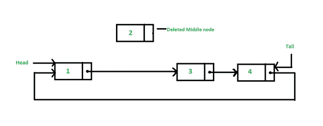

# 从循环链表中间删除节点的 Java 程序

> 原文:[https://www . geesforgeks . org/Java-program-to-delete-一个循环链表中间的节点/](https://www.geeksforgeeks.org/java-program-to-delete-a-node-from-the-middle-of-the-circular-linked-list/)

在本文中，我们将学习在 java 中从循环链表中删除中间节点。对于这个程序，我们将遵循的方法是，首先我们计算列表中的节点数，然后将节点数除以 2，得到列表的中间节点。

 

### 算法

**情况 1** :列表为空

*   然后简单地从函数返回。

**情况 2** :列表只有一个节点

*   意思是 head == tail，那么分配的 head 和 tail 等于 null。

**情况 3** :列表只有两个节点

*   这意味着列表的中间节点在 1 个位置。在这种情况下，我们还必须修改头部和尾部。头变成尾巴，然后也变成尾巴。

**情况 4** :列表有两个以上节点

*   表示中间节点的位置大于 1。在这种情况下，我们定义双节点**温度**和**前一个**。给临时工分配主管。
*   然后使用 temp 遍历列表直到中间节点。在每次迭代中，分配 **prev =温度**和 **temp =温度 next**
*   现在 temp 指向中间节点，prev 指向中间节点的前一个节点。
*   然后简单地设置 prev.next=temp.next 和 temp=null，

## Java 语言(一种计算机语言，尤用于创建网站)

```
// Java Program to Delete a 
// Node From the Middle of the
// Circular Linked List

class CLinkedList {

    class Node {
        int data;
        Node next;
    }
    private static int size;

    // head points first node and
    // tail points to last node
    private Node head, tail;
    CLinkedList()
    {
        this.head = null;
        this.tail = null;
        size = 0;
    }
    public void addNode(int d)
    {
        // create a empty node
        Node n = new Node();

        // list is empty
        if (this.head == null) {
            n.data = d;
            this.head = n;
            this.tail = n;
            n.next = this.head;
        }

        // list has one node or more than one nodes
        else {
            n.data = d;
            tail.next = n;
            tail = n;
            tail.next = head;
        }
        size++;
    }
    public void deleteNodeMiddle()
    {
        int loc;
        Node temp, prev;

        // calculating position of middle node
        if (size % 2 == 0) {
            loc = size / 2;
        }
        else {
            loc = (size / 2) + 1;
        }

        // list is empty
        if (head == null) {
            return;
        }

        // list contains only one node
        else if (head == tail) {
            head = null;
            tail = null;
        }

        // list contains only two nodes
        else if (loc == 1) {
            head = tail;
            tail.next = tail;
        }

        // list contains more than two nodes
        else {
            temp = head;
            prev = null;
            int i = 1;
            while (i < loc) {
                prev = temp;
                temp = temp.next;
                i++;
            }
            prev.next = temp.next;
            temp = null;
        }

        size--;
        if (size < 0) {
            size = 0;
        }
    }
    public void display()
    {
        // displaying list
        if (head == null) {
            System.out.println("List is empty");
        }
        else {
            Node temp = head;
            do {
                System.out.print(temp.data + " ");
                temp = temp.next;
            } while (temp != head);
            System.out.println();
        }
    }
}
class Test {
    public static void main(String args[])
    {
        CLinkedList c1 = new CLinkedList();

        // adding node in linkedlist
        c1.addNode(10);
        c1.addNode(20);
        c1.addNode(30);
        c1.addNode(40);

        // displaying nodes after adding
        System.out.print("List=");
        c1.display();

        // delete node in middle
        c1.deleteNodeMiddle();

        // displaying linkedlist after deleting middle node
        System.out.print(
            "List after deleting middle node=");
        c1.display();

        c1.deleteNodeMiddle();

        // displaying linkedlist after deleting middle node
        System.out.print(
            "List after deleting middle node=");
        c1.display();

        c1.deleteNodeMiddle();

        // displaying linkedlist after deleting middle node
        System.out.print(
            "List after deleting middle node=");
        c1.display();

        c1.deleteNodeMiddle();

        // displaying linkedlist after deleting middle node
        System.out.print(
            "List after deleting middle node=");
        c1.display();
    }
}
```

**Output**

```
List=10 20 30 40 
List after deleting middle node=10 30 40 
List after deleting middle node=10 40 
List after deleting middle node=40 
List after deleting middle node=List is empty
```