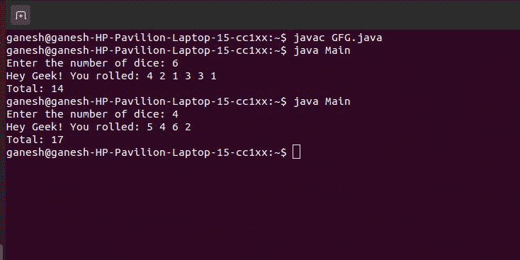

# 模拟 N 骰子滚轮的程序

> 原文:[https://www . geesforgeks . org/Java-程序模拟-n-骰子滚轮/](https://www.geeksforgeeks.org/java-program-to-emulate-n-dice-roller/)

在本文中，我们模拟 **N** 骰子滚轮。给定 **N** ，任务是创建一个 Java 程序，该程序输出 N 个随机数，其中每个数在 1 到 6(包括 1 和 6)的范围内。这种类型的仿真可以用在游戏中，除此之外，问题陈述的一些类似变体也可以用在其他几个应用中。

**示例 1:**

```java
Enter the Number of dice: 4  
Hey Geek! You rolled: 3 2 1 6
Total: 12
```

**示例 2:**

```java
Enter the Number of dice: 2  
Hey Geek! You rolled: 1 6
Total: 7
```

**注意:**由于我们使用的是随机数，输出可能会发生变化。

**进场:**

这里，我们使用 Java 中的 [Random](https://www.google.com/url?client=internal-element-cse&cx=009682134359037907028:tj6eafkv_be&q=https://www.geeksforgeeks.org/java-util-random-class-java/&sa=U&ved=2ahUKEwiK9I3qof_sAhUrzjgGHV0RDNgQFjAAegQIABAC&usg=AOvVaw2qGtmvFmCzu2tkrnIkP9gV) 对象来[生成 1 到 6(含 1 到 6)范围内的随机整数](https://www.google.com/url?client=internal-element-cse&cx=009682134359037907028:tj6eafkv_be&q=https://www.geeksforgeeks.org/generating-random-numbers-in-java/&sa=U&ved=2ahUKEwiK9I3qof_sAhUrzjgGHV0RDNgQFjABegQIARAC&usg=AOvVaw0uKplWUi--3uHs0fVUZalB)，并执行一个循环来生成 N 次这样的随机数。

**实施**

## C++

```java
#include <cstdlib>
#include <ctime>
#include <iostream>
using namespace std;
int main()
{
    int numberOfDice, total = 0;

    cout << "Enter the Number of dice: ";
    cin >> numberOfDice;

    // calling srand() with time() function for seed
    // generation
    srand((unsigned)time(0));
    cout << "Hey Geek! You rolled: ";

    for (int i = 0; i < numberOfDice ; i++)
    {

        // Generating the random number and storing it
        // in the 'randomNumber' variable
        int  randomNumber = (rand() % 6) + 1;
        total +=  randomNumber;
        cout <<  randomNumber << " ";
    }
    cout << "\n"
         << "Total: " << total << "\n";
    return 0;
}

// This code is contributed by anurag31.
```

## Java 语言(一种计算机语言，尤用于创建网站)

```java
import java.util.Random;
import java.util.Scanner;

public class Main {
    public static void main(String args[])
    {
        System.out.print("Enter the number of dice: ");

        // Initializing the Scanner object to read input
        Scanner input = new Scanner(System.in);
        int numberOfDice = input.nextInt();

        // Initializing the Random object for
        // generating random numbers
        Random ranNum = new Random();

        System.out.print("Hey Geek! You rolled: ");
        int total = 0;
        int randomNumber = 0;

        for (int i = 0; i < numberOfDice; i++) {

            // Generating the random number and storing it
            // in the 'randomNumber' variable
            randomNumber = ranNum.nextInt(6) + 1;
            total = total + randomNumber;
            System.out.print(randomNumber);
            System.out.print(" ");
        }

        System.out.println("");
        System.out.println("Total: " + total);
        input.close();
    }
}
```

**输出**



**时间复杂度:** O(N)

**辅助空间:** O(1)