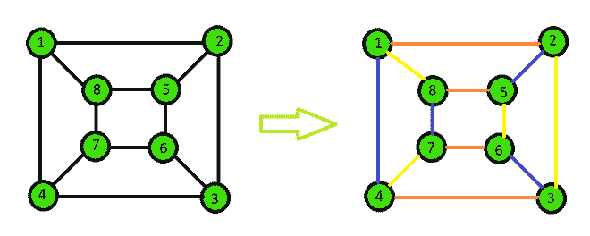

# 寻找循环图色指数的 Java 程序

> 原文:[https://www . geesforgeks . org/Java-程序查找循环图的色索引/](https://www.geeksforgeeks.org/java-program-to-find-chromatic-index-of-cyclic-graphs/)

图的颜色指数是给图的边着色所需的最小颜色数，这样共享同一个顶点的任何两条边都有不同的颜色。

然而，循环图是包含至少一个图循环的图，即循环意味着从至少一个节点回到其自身的路径。在这里给定循环图，我们必须找到该图的色指数。

**示例:**

> **输入:** e = 12
> 
> edges = {{ 1，2}，{ 2，3}，{ 3，4}，
> 
>                           { 4, 1}, { 5, 6}, { 6, 7},
> 
>                           { 7, 8}, { 8, 5}, { 1, 8},
> 
>                           { 2, 5}, { 3, 6}, { 4, 7}}
> 
> **输出:**色度指数= 3
> 
> **说明:**
> 
> 

**进场:**

通过应用[维辛定理](https://www.geeksforgeeks.org/vizings-theorem/)我们可以证明给定的图可以有一个‘d’或‘d’+1 的色指数，其中 d 是图的最大度。

以下是该算法的分步方法

1.  初始化边的数量和边列表。
2.  根据维京定理给图表上色。
3.  为边指定一种颜色，并检查是否有任何相邻的边具有相同的颜色。
4.  如果任何相邻的边具有相同的颜色，则增加颜色以尝试该边的下一种颜色。
5.  根据定理，重复直到所有的边都变成它的颜色。
6.  完成后，打印所有边的最大颜色值和每个边的颜色。

下面是上述方法的实现:

## Java 语言(一种计算机语言，尤用于创建网站)

```java
// Java program to find the chromatic
// index of a cyclic graph
import java.util.*;

public class chromaticIndex {

    // Function to find the chromatic index
    public void edgeColoring(int[][] edges, int e)
    {
        // Initialize edge to first
        // edge and color to color 1
        int i = 0, color = 1;

        // Repeat until all edges are done coloring
        while (i < e) {
            // Give the selected edge a color
            edges[i][2] = color;
            boolean flag = false;
            // Iterate through all others edges to check
            for (int j = 0; j < e; j++) {
                // Ignore if same edge
                if (j == i)
                    continue;
                // Check if one vertex is similar
                if ((edges[i][0] == edges[j][0])
                    || (edges[i][1] == edges[j][0])
                    || (edges[i][0] == edges[j][1])
                    || (edges[i][1] == edges[j][1])) {
                    // Check if color is similar
                    if (edges[i][2] == edges[j][2]) {
                        // Increment the color by 1
                        color++;
                        flag = true;
                        break;
                    }
                }
            }

            // If same color faced then repeat again
            if (flag == true) {
                continue;
            }

            // Or else proceed to a new vertex with color 1
            color = 1;
            i++;
        }

        // Check the maximum color from all the edge colors
        int maxColor = -1;
        for (i = 0; i < e; i++) {
            maxColor = Math.max(maxColor, edges[i][2]);
        }

        // Print the chromatic index
        System.out.println("Chromatic Index = " + maxColor);
    }

    // Driver code
    public static void main(String[] args)
    {

        // Number of edges
        int e = 4;

        // Edge list
        int[][] edges = new int[e][3];

        // Initialize all edge colors to 0
        for (int i = 0; i < e; i++) {
            edges[i][2] = -1;
        }

        // Edges
        edges[0][0] = 1;
        edges[0][1] = 2;

        edges[1][0] = 2;
        edges[1][1] = 3;

        edges[2][0] = 3;
        edges[2][1] = 4;

        edges[3][0] = 4;
        edges[3][1] = 1;

        // Run the function
        chromaticIndex c = new chromaticIndex();
        c.edgeColoring(edges, e);
    }
}
```

**Output**

```java
Chromatic Index = 2

```

**输出:**

```java
Chromatic Index = 2
```

**参考文献:**

1.  [vizings-定理](https://www.geeksforgeeks.org/vizings-theorem/)
2.  [https://en.wikipedia.org/wiki/Vizing%27s_theorem](https://en.wikipedia.org/wiki/Vizing%27s_theorem)