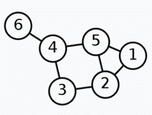

# 寻找无向图拉普拉斯矩阵的 Java 程序

> 原文:[https://www . geesforgeks . org/Java-program-to-find-laplacian-矩阵的无向图/](https://www.geeksforgeeks.org/java-program-to-find-laplacian-matrix-of-an-undirected-graph/)

拉普拉斯矩阵，又称图拉普拉斯、导纳矩阵、基尔霍夫矩阵或离散拉普拉斯，是图的矩阵表示。先求拉普拉斯矩阵，求图的邻接矩阵和度矩阵，拉普拉斯矩阵的公式如下:

> **拉普拉斯矩阵=度矩阵–邻接矩阵**

**例**



```
Laplacian Matrix: 
 2  -1   0   0  -1   0  
-1   3  -1   0  -1   0  
 0  -1   2  -1   0   0  
 0   0  -1   3  -1  -1  
-1  -1   0  -1   3   0  
 0   0   0  -1   0   1
```

**基本定义:**

1.  **邻接矩阵:**值可以是 0 也可以是 1 根据图的顶点是否相互连接。
2.  **度矩阵:**与一个顶点相邻的顶点数。

**算法:**

1.  添加无向图的适当边。
2.  读图的邻接矩阵和度矩阵
3.  用公式计算拉普拉斯矩阵。

下面是上述方法的实现:

## Java 语言(一种计算机语言，尤用于创建网站)

```
// Java program to find laplacian
// matrix of an undirected graph
class Graph {
    class Edge {
        int src, dest;
    }
    int vertices, edges;
    Edge[] edge;

    Graph(int vertices, int edges)
    {
        this.vertices = vertices;
        this.edges = edges;
        edge = new Edge[edges];
        for (int i = 0; i < edges; i++) {
            edge[i] = new Edge();
        }
    }
    public static void main(String[] args)
    {
        int i, j;
        int numberOfVertices = 6;
        int numberOfEdges = 7;
        int[][] adjacency_matrix
            = new int[numberOfEdges][numberOfEdges];
        int[][] degree_matrix
            = new int[numberOfEdges][numberOfEdges];
        int[][] laplacian_matrix
            = new int[numberOfEdges][numberOfEdges];
        Graph g
            = new Graph(numberOfVertices, numberOfEdges);

        // Adding edges with source and destination
        // edge 1--2
        g.edge[0].src = 1;
        g.edge[0].dest = 2;

        // edge 1--5
        g.edge[1].src = 1;
        g.edge[1].dest = 5;

        // edge 2--3
        g.edge[2].src = 2;
        g.edge[2].dest = 3;

        // edge 2--5
        g.edge[3].src = 2;
        g.edge[3].dest = 5;

        // edge 3--4
        g.edge[4].src = 3;
        g.edge[4].dest = 4;

        // edge 4--6
        g.edge[5].src = 4;
        g.edge[5].dest = 6;

        // edge 5--4
        g.edge[6].src = 5;
        g.edge[6].dest = 4;

        // Adjacency Matrix
        for (i = 0; i < numberOfEdges; i++) {
            for (j = 0; j < numberOfEdges; j++) {
                adjacency_matrix[g.edge[i].src]
                                [g.edge[i].dest]
                    = 1;
                adjacency_matrix[g.edge[i].dest]
                                [g.edge[i].src]
                    = 1;
            }
        }
        System.out.println("Adjacency matrix : ");
        for (i = 1; i < adjacency_matrix.length; i++) {
            for (j = 1; j < adjacency_matrix[i].length;
                 j++) {
                System.out.print(adjacency_matrix[i][j]
                                 + " ");
            }
            System.out.println();
        }
        System.out.println("\n");

        // Degree Matrix
        for (i = 0; i < numberOfEdges; i++) {
            for (j = 0; j < numberOfEdges; j++) {
                degree_matrix[i][i]
                    += adjacency_matrix[i][j];
            }
        }
        System.out.println("Degree matrix : ");
        for (i = 1; i < degree_matrix.length; i++) {
            for (j = 1; j < degree_matrix[i].length; j++) {
                System.out.print(degree_matrix[i][j] + " ");
            }
            System.out.println();
        }
        System.out.println("\n");

        // Laplacian Matrix
        System.out.println("Laplacian matrix : ");
        for (i = 0; i < numberOfEdges; i++) {
            for (j = 0; j < numberOfEdges; j++) {
                laplacian_matrix[i][j]
                    = degree_matrix[i][j]
                      - adjacency_matrix[i][j];
            }
        }
        for (i = 1; i < laplacian_matrix.length; i++) {
            for (j = 1; j < laplacian_matrix[i].length;
                 j++) {
                System.out.printf("%2d",
                                  laplacian_matrix[i][j]);
                System.out.printf("%s", "  ");
            }
            System.out.println();
        }
    }
}
```

**Output**

```
Adjacency matrix : 
0 1 0 0 1 0 
1 0 1 0 1 0 
0 1 0 1 0 0 
0 0 1 0 1 1 
1 1 0 1 0 0 
0 0 0 1 0 0 

Degree matrix : 
2 0 0 0 0 0 
0 3 0 0 0 0 
0 0 2 0 0 0 
0 0 0 3 0 0 
0 0 0 0 3 0 
0 0 0 0 0 1 

Laplacian matrix : 
 2  -1   0   0  -1   0  
-1   3  -1   0  -1   0  
 0  -1   2  -1   0   0  
 0   0  -1   3  -1  -1  
-1  -1   0  -1   3   0  
 0   0   0  -1   0   1
```