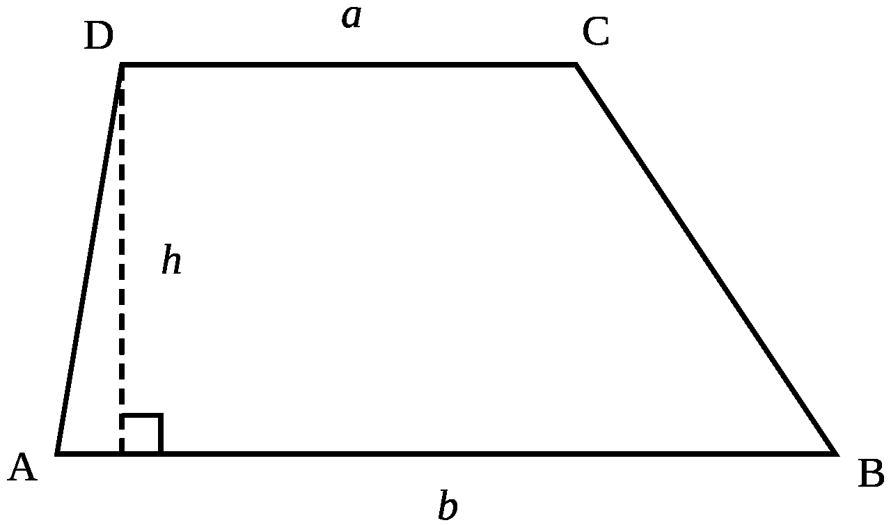

# 寻找梯形区域的 Java 程序

> 原文:[https://www . geesforgeks . org/Java-program-to-find-area-of-梯形/](https://www.geeksforgeeks.org/java-program-to-find-the-area-of-trapezium/)

A [梯形](https://en.wikipedia.org/wiki/Trapezium)是一个*凸四边形*，只有两条平行边，另外两条不平行。斜方肌的非平行边称为它的腿，而平行边称为底部。也叫梯形。平行四边形也常被称为有两条平行边的梯形。

下图中，AB 和 DC 相互平行，而 AD 和 BC 为非平行边。h’也是表示两个平行边之间梯形高度的距离。



**斜方肌面积:**

```java
Area = 1/2*(sum of parallel sides)*height of the trapezium
```

**示例:**

```java
Input : base1 = 3, base2 = 4, height = 6
Output: area = 21

Input : base1 = 5, base2 = 7, height = 3 
Output: area = 18
```

**进场:**

1.  将三个输入作为梯形和高度的两个基础。
2.  应用梯形公式的面积来计算面积。
3.  打印区域。

下面是上述方法的实现:

## Java 语言(一种计算机语言，尤用于创建网站)

```java
// Java Program to Find the Area of Trapezium

import java.io.*;

class GFG {
    public static void main(String[] args)
    {
        double base_1 = 10.00;

        double base_2 = 20.00;

        double height = 50.00;

        // formula for calculating the area
        double area_of_trapezium
            = ((base_1 + base_2) * height) / 2;

        // printing the area
        System.out.println("Area of trapezium:"
                           + area_of_trapezium);
    }
}
```

**Output**

```java
Area of trapezium:750.0
```