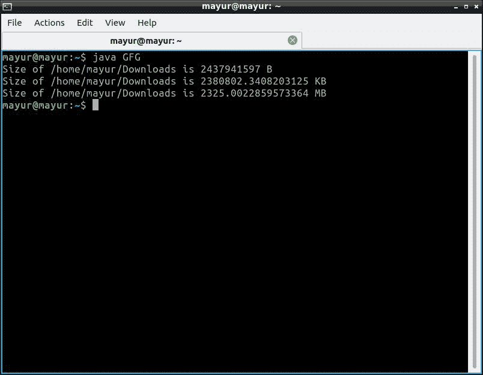

# 获取目录大小的 Java 程序

> 原文:[https://www . geesforgeks . org/Java-program-to-get-size-a-directory/](https://www.geeksforgeeks.org/java-program-to-get-the-size-of-a-directory/)

Java 中文件的大小可以使用 File 类获得。“fileName.length()”的内置函数用于查找以字节为单位的文件大小。目录可能包含“N”个文件，为了计算目录的大小，需要所有文件大小的总和。

**长度()方法:**

文件类对象中的 length()方法返回的是 *long* (数据类型)格式的文件大小。文件大小以字节为单位。

**返回类型:**长

**语法:**

```java
java.io.File file = new java.io.File("file_name.txt");
file.length();
```

**工作:**

1.  如果文件存在，那么函数返回文件的大小
2.  否则函数返回 null。

但是，文件的大小可以使用[单位转换](https://www.geeksforgeeks.org/program-to-convert-kilobytes-to-bytes-and-bits/#:~:text=1%20Kilobytes%20%3D%201024%20Bytes%20and%208192%20Bits.,-Attention%20reader!)以兆、千单位显示。

## Java 语言(一种计算机语言，尤用于创建网站)

```java
// Java program to Get the size of a directory

import java.io.File;

class GFG {
    private static long getFolderSize(File folder)
    {
        long length = 0;

        // listFiles() is used to list the
        // contents of the given folder
        File[] files = folder.listFiles();

        int count = files.length;

        // loop for traversing the directory
        for (int i = 0; i < count; i++) {
            if (files[i].isFile()) {
                length += files[i].length();
            }
            else {
                length += getFolderSize(files[i]);
            }
        }
        return length;
    }

    // Driver Code
    public static void main(String[] args)
    {
        // Creating an instances of file class
        File file1 = new File("/home/mayur/Downloads");

        long size = getFolderSize(file1);
        // Size of folder in Bytes
        System.out.println("Size of " + file1 + " is "
                           + size + " B");
        // Size of folder in Kilobytes
        System.out.println("Size of " + file1 + " is "
                           + (double)size / 1024 + " KB");
        // Size of folder in Megabytes
        System.out.println("Size of " + file1 + " is "
                           + (double)size / (1024 * 1024)
                           + " MB");
    }
}
```

#### 输出:

