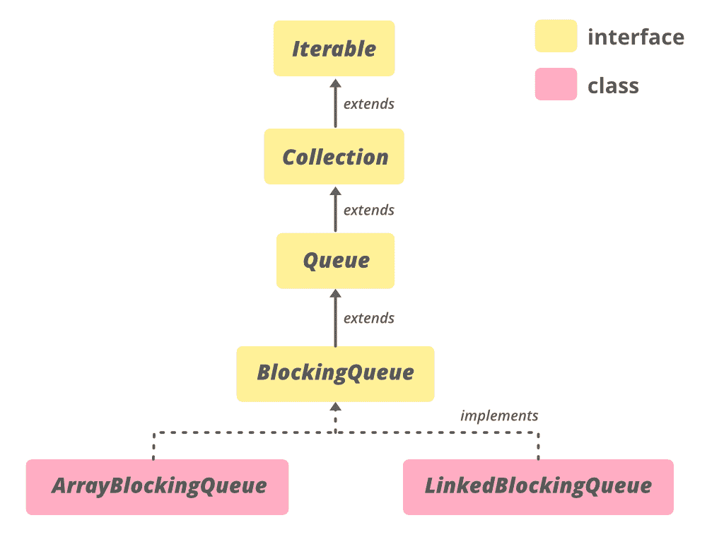

# 实现 ArrayBlockingQueue API 的 Java 程序

> 原文:[https://www . geesforgeks . org/Java-程序到实现-arrayblockingqueue-api/](https://www.geeksforgeeks.org/java-program-to-implement-arrayblockingqueue-api/)

ArrayBlockingQueue 类是 Java 集合框架的成员。ArrayBlockingQueue 是一个有界阻塞队列。术语“有界”意味着队列的大小是固定的，不能更改。任何将元素放入完整队列的尝试都会导致阻塞操作。同样，从空队列中移除元素的任何尝试都将导致阻塞操作。

ArrayBlockingQueue 的这种绑定大小特性可以通过最初将容量作为参数传递给 ArrayBlockingQueue 的构造函数来实现。该队列对元素进行先进先出排序。这意味着元素可以插入到队列的尾部，也可以从队列的头部移除。

队列的尾部有最新的元素，而队列的头部有最旧的元素。



这个类扩展了抽象队列<e>，实现了可序列化、可迭代<e>、集合<e>、阻塞队列<e>、队列<e>接口。</e></e></e></e></e>

**语法:**

> 公共类 ArrayBlockingQueue <e>扩展抽象队列<e>实现阻塞队列<e>，可序列化</e></e></e>
> 
> //这里，E 是集合中存储的元素类型

### 基础操作

*   **添加(E e):** 如果有可能在不超出队列容量的情况下立即插入指定元素，则在成功时返回 true，如果该队列已满，则抛出 IllegalStateException。
*   **clear():** 自动从该队列中移除所有元素。
*   **包含(对象 o)**–如果该队列包含指定元素，则返回真。
*   **沥水图(收藏<？super E>c)**–从此队列中移除所有可用的元素，并将它们添加到给定的集合中。
*   **沥水图(收藏<？super E > c，int maxElements)**–从这个队列中最多移除给定数量的可用元素，并将它们添加到给定的集合中。
*   **forEach(消费者<？super E >动作)**–对 Iterable 的每个元素执行给定的动作，直到所有元素都被处理完或者该动作抛出异常。
*   **迭代器()**–以正确的顺序返回该队列中元素的迭代器。
*   **offer(E E)**–如果可以立即在不超出队列容量的情况下插入指定元素，则在成功时返回 true，如果队列已满，则返回 false。
*   **offer (E e，长超时，时间单位单位)**–在该队列的尾部插入指定的元素，等待指定的等待时间，如果队列已满，则等待空间可用。
*   **put(E E)**–在这个队列的尾部插入指定的元素，等待空间变得可用，如果队列已满。
*   **remainingCapacity()**–返回该队列理想情况下(在没有内存或资源限制的情况下)可以接受而不阻塞的附加元素的数量。
*   **移除(对象 o)**–从该队列中移除指定元素的单个实例(如果存在)。
*   **移除所有(集合<？>c)**–删除所有包含在指定集合中的集合元素(可选操作)。
*   **removeIf(谓语<？super E >过滤器)**–移除该集合中满足给定谓词的所有元素。
*   **零售(收藏<？>c)**–仅保留该集合中包含在指定集合中的元素(可选操作)。
*   **size()**–返回该队列中的元素数量。
*   **拆分器()**–返回该队列中元素的拆分器。
*   **to array()**–以正确的顺序返回包含该队列中所有元素的数组。
*   **to array(T[]a)**–按正确的顺序返回包含该队列中所有元素的数组；返回数组的运行时类型是指定数组的运行时类型。
*   **take()**–检索并移除该队列的头部，如有必要，等待直到某个元素变得可用。

## Java 语言(一种计算机语言，尤用于创建网站)

```java
import java.util.Collection;
import java.util.Iterator;
import java.util.concurrent.ArrayBlockingQueue;
import java.util.concurrent.TimeUnit;

public class ArrayBlockingQueueImpl<E> {
    private ArrayBlockingQueue<E> arrayBlockingQueue;

    // constructor to create object of ArrayBlockingQueue
    // class with the specified capacity.
    public ArrayBlockingQueueImpl(int cap)
    {
        arrayBlockingQueue = new ArrayBlockingQueue<E>(cap);
    }

    // constructor to create object of ArrayBlockingQueue
    // class with the specified capacity and specified
    // access policy.
    public ArrayBlockingQueueImpl(int cap, boolean fair)
    {
        arrayBlockingQueue
            = new ArrayBlockingQueue<>(cap, fair);
    }

    // constructor to create object of ArrayBlockingQueue
    // class with the specified capacity and specified
    // access initially containing the elements of the given
    // collection.
    public ArrayBlockingQueueImpl(
        int cap, boolean fair,
        Collection<? extends E> collection)
    {
        arrayBlockingQueue = new ArrayBlockingQueue<E>(
            cap, fair, collection);
    }

    // method used to append a element to queue's
    // tail.Return true upon successful operation else throw
    // IllegalStateException if this queue reached capacity.
    boolean add(E e) { return arrayBlockingQueue.add(e); }

    // method used to removes all elements from the queue
    void clear() { arrayBlockingQueue.clear(); }

    // method used to check it queue contains specified
    // element.
    public boolean contains(Object o)
    {
        return arrayBlockingQueue.contains(o);
    }

    // method used clear the queue and add all the elements
    // to specified collection.
    public int drainTo(Collection<? super E> c)
    {
        return arrayBlockingQueue.drainTo(c);
    }

    // method used to remove at most specified number of
    // elements from the queue and adds them to the
    // specified collection.
    public int drainTo(Collection<? super E> c,
                       int maxElements)
    {
        return arrayBlockingQueue.drainTo(c, maxElements);
    }

    // method used to return an iterator over the elements
    // in the queue.This iterator could be used for
    // traversing the element of queue.
    public Iterator<E> iterator()
    {
        return arrayBlockingQueue.iterator();
    }

    // method used to append specified element to queue's
    // tail.Return true upon successful operation else
    // return false.
    public boolean offer(E e)
    {
        return arrayBlockingQueue.offer(e);
    }

    // method used to insert the specified element at the
    // tail of the queue
    public boolean offer(E e, long timeout, TimeUnit unit)
        throws InterruptedException
    {
        return arrayBlockingQueue.offer(e, timeout, unit);
    }

    // method used to get head of queue.Return NULL in case
    // of empty queue.
    public E peek() { return arrayBlockingQueue.peek(); }

    // method used to remove head of the queue.Returns NULL
    // if queue is empty else returns removed element.
    public E poll() { return arrayBlockingQueue.poll(); }

    // method used to remove head of this queue, waiting up
    // to the specified wait time if necessary for an
    // element to become available
    public E poll(long timeout, TimeUnit unit)
        throws InterruptedException
    {
        return arrayBlockingQueue.poll(timeout, unit);
    }

    // method used to inserts the specified element at
    // queue's tail.
    public void put(E e) throws InterruptedException
    {
        arrayBlockingQueue.put(e);
    }

    // method used to return number of additional elements
    // that the queue can have without blocking.
    public int remainingCapacity()
    {
        return arrayBlockingQueue.remainingCapacity();
    }

    // method used to remove single instance of the
    // specified element from this queue
    public boolean remove(Object o)
    {
        return arrayBlockingQueue.remove(o);
    }

    // method used to return size of queue.
    public int size() { return arrayBlockingQueue.size(); }

    // method used remove head of queue.Return NULL if queue
    // is empty else return removed element.
    public E take() throws InterruptedException
    {
        return arrayBlockingQueue.take();
    }

    // method used to return an array of the elements in
    // this queue.
    public Object[] toArray()
    {
        return arrayBlockingQueue.toArray();
    }

    // method used to return an array of the elements in
    // this queue.
    public <T> T[] toArray(T[] a)
    {
        return arrayBlockingQueue.toArray(a);
    }

    // method used to return string representation queue.
    public String toString()
    {
        return arrayBlockingQueue.toString();
    }

    public static void main(String[] args)
    {
        // capacity of ArrayBlockingQueue
        int capacity_queue = 10;

        // fair value of queue.If fair value is if true then
        // queue accesses for threads blocked on insertion or
        // removal, are processed in FIFO order if false then
        // access order is unspecified.
        boolean fair = true;

        // create object of ArrayBlockingQueue
        ArrayBlockingQueue<String> queue
            = new ArrayBlockingQueue<String>(capacity_queue,
                                             fair);

        // add  element to the queue
        queue.add("one");
        queue.add("two");
        queue.add("three");
        queue.add("four");
        queue.add("five");

        // print queue
        System.out.println(
            "ArrayBlockingQueue (when fair policy is true):"
            + queue);

        // print head element of queue
        System.out.println("Peek element of the queue : "
                           + queue.peek());

        // delete the specified element from the queue
        System.out.println(
            "Deleting the element 'five' from the queue : "
            + queue.remove("five"));

        // print queue
        System.out.println("ArrayBlockingQueue :" + queue);

        // clear the queue
        queue.clear();

        // print queue
        System.out.println(
            "ArrayBlockingQueue after clear operation :"
            + queue);
    }
}
```

**Output**

```java
ArrayBlockingQueue (when fair policy is true):[one, two, three, four, five]
Peek element of the queue : one
Deleting the element 'five' from the queue : true
ArrayBlockingQueue :[one, two, three, four]
ArrayBlockingQueue after clear operation :[]
```