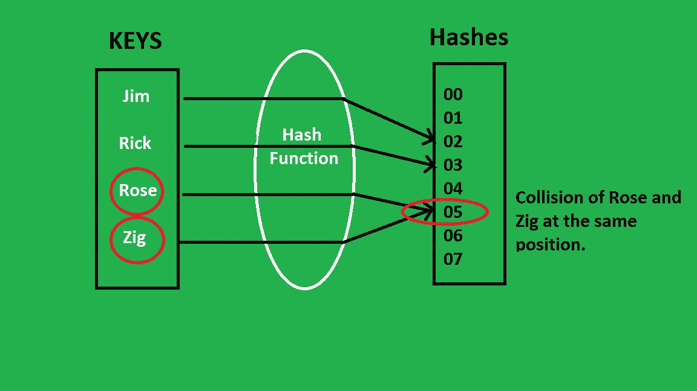

# 用双链表实现哈希表链接的 Java 程序

> 原文:[https://www . geesforgeks . org/Java-程序到实现-哈希表-用双链表链接/](https://www.geeksforgeeks.org/java-program-to-implement-hash-tables-chaining-with-doubly-linked-lists/)

哈希表(一般类似于表)提供了动态集合操作的子集。通常，一组键与基于特定关系的一些值进行映射。但是，可能会出现不同的键映射到哈希函数提供的相同位置，从而导致冲突的情况。



克服这种情况的方法之一是**哈希表链接**。

解决冲突的链接方法是这样处理的:将映射到一个槽的所有键放在该槽中，但将它们表示为一个链表。

[Java 中的哈希表链接](https://www.geeksforgeeks.org/implementing-our-own-hash-table-with-separate-chaining-in-java/)可以同时使用单链表和 [**双链表**](https://www.geeksforgeeks.org/doubly-linked-list/) 。虽然实现是相同的，但唯一的区别是双向链表允许双向遍历，即节点包含指向下一个和上一个节点的指针。因此，与单链表(0(n))相比，在已知位置插入和删除的复杂性降低到 0(1)。

**示例:**

```
In Singly Linked List : g -> e -> e -> k -> s
Here, each node contains a pointer to the next node only.

In Doubly Linked List : g <-> e <-> e <-> k <-> s
Each node contains pointer to the next as well as previous node.
```

**进场:**

1.  **插入:**要插入，只需对一个键进行哈希运算，得到表中的位置(必须插入这个新键的列表)，然后使用标准链表过程(在代码中给出)将该键插入双链表的头部。
2.  **删除:**只需通过哈希函数遍历密钥映射到的列表，并使用标准链表过程(在代码中给出)从该列表中删除密钥。

以下是上述方法的**实现方式**:

## Java 语言(一种计算机语言，尤用于创建网站)

```
// Java implementation of Hashtable chaining
// using doubly linked list

import java.util.*;

class DoublyLinkedListNode {
    // Declaration of Nodes
    DoublyLinkedListNode next, prev;
    int data;

    // constructor
    DoublyLinkedListNode(int data)
    {
        this.data = data;
        next = null;
        prev = null;
    }
}
class HashTableChainingDoublyLinkedList {
    // Declaration of Hash Table
    DoublyLinkedListNode[] hashTable;

    // stores the size of HashTable
    int size;

    // Constructor
    HashTableChainingDoublyLinkedList(int hashTableSize)
    {
        // Creating an empty Hash Table
        hashTable = new DoublyLinkedListNode[hashTableSize];
        size = 0;
    }

    // Function to check if hash table is empty
    public boolean isEmpty() { return size == 0; }

    // Function to clear/delete all elements from Hash table
    public void clear()
    {
        // Capacity of Hash Table
        int len = hashTable.length;

        // Creating new empty Hash Table
        // of same initial capacity
        hashTable = new DoublyLinkedListNode[len];
        size = 0;
    }

    // Function that returns size of Hash Table
    public int getSize() { return size; }

    // Function to insert a value/element
    public void insert(int value)
    {
        size++;

        // gets the position/index where the value should be
        // stored
        int position = hash(value);

        // creates a node for storing value
        DoublyLinkedListNode node
            = new DoublyLinkedListNode(value);

        DoublyLinkedListNode start = hashTable[position];

        if (hashTable[position] == null)
            hashTable[position] = node;
        else {
            node.next = start;
            start.prev = node;
            hashTable[position] = node;
        }
    }

    // Function to remove an element
    public void remove(int value)
    {
        try {
            // gets the position where the value to
            // be deleted exists
            int position = hash(value);

            DoublyLinkedListNode start
                = hashTable[position];

            DoublyLinkedListNode end = start;

            // if value is found at start
            if (start.data == value) {
                size--;
                if (start.next == null) {
                    // removing the value
                    hashTable[position] = null;
                    return;
                }

                start = start.next;
                start.prev = null;
                hashTable[position] = start;

                return;
            }

            // traversing the list
            // until the value is found
            while (end.next != null
                   && end.next.data != value)
                end = end.next;

            // if reached at the end without finding the
            // value
            if (end.next == null) {
                System.out.println("\nElement not found\n");
                return;
            }

            size--;

            if (end.next.next == null) {
                end.next = null;
                return;
            }

            end.next.next.prev = end;
            end.next = end.next.next;

            hashTable[position] = start;
        }
        catch (Exception e) {
            System.out.println("\nElement not found\n");
        }
    }

    // Definition of Hash function
    private int hash(Integer x)
    {
        int hashValue = x.hashCode();

        hashValue %= hashTable.length;

        if (hashValue < 0)
            hashValue += hashTable.length;

        return hashValue;
    }

    // Function to print hash table
    public void printHashTable()
    {
        System.out.println();
        for (int i = 0; i < hashTable.length; i++) {
            System.out.print("At " + i + ":  ");

            DoublyLinkedListNode start = hashTable[i];

            while (start != null) {
                System.out.print(start.data + " ");
                start = start.next;
            }

            System.out.println();
        }
    }

    // Driver Code
    public static void main(String[] args)
    {
        HashTableChainingDoublyLinkedList hashTab
            = new HashTableChainingDoublyLinkedList(5);

        hashTab.insert(99);
        hashTab.insert(23);
        hashTab.insert(36);
        hashTab.insert(47);
        hashTab.insert(80);

        hashTab.printHashTable();

        hashTab.insert(92);
        hashTab.insert(49);

        hashTab.printHashTable();

        hashTab.remove(99);

        hashTab.printHashTable();

        hashTab.clear();

        hashTab.printHashTable();

        System.out.println(hashTab.isEmpty());
    }
}
```

**Output**

```
At 0:  80 
At 1:  36 
At 2:  47 
At 3:  23 
At 4:  99 

At 0:  80 
At 1:  36 
At 2:  92 47 
At 3:  23 
At 4:  49 99 

At 0:  80 
At 1:  36 
At 2:  92 47 
At 3:  23 
At 4:  49 

At 0:  
At 1:  
At 2:  
At 3:  
At 4:  
true

```