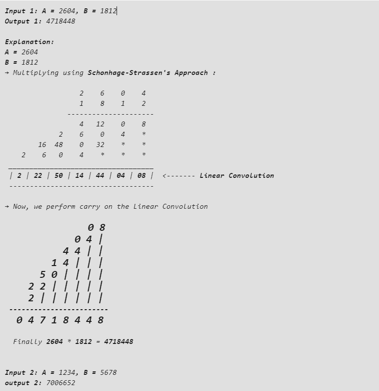

# 实现两个数相乘的 Schonhage-Strassen 算法的 Java 程序

> 原文:[https://www . geeksforgeeks . org/Java-实现两个数相乘的 schonhage-strassen 算法的程序/](https://www.geeksforgeeks.org/java-program-to-implement-the-schonhage-strassen-algorithm-for-multiplication-of-two-numbers/)

[**Schonhage-Strassen 算法**](https://en.wikipedia.org/wiki/Sch%C3%B6nhage%E2%80%93Strassen_algorithm) 是将非常大的整数值(30000 到 150000 个十进制数字)相乘的最快方法之一。该算法由**阿诺德·舍恩赫**和**沃尔克·斯特拉森**开发。虽然 [**弗勒算法**](https://en.wikipedia.org/wiki/F%C3%BCrer%27s_algorithm) 比勋伯格-斯特拉森算法快，但除了[银河算法](https://en.wikipedia.org/wiki/Galactic_algorithm)之外(可能不用于地球上存在的任何数据)，没有实际应用。因此，Schonhage-Strassen 算法被认为是乘法大整数值的最佳算法。

在这种乘法方法中，两个整数首先相乘，而不执行进位。然后得到的结果集称为**非循环卷积**或**线性卷积**。然后我们对线性卷积的各个列进行进位。

**示例:**



## Java 语言(一种计算机语言，尤用于创建网站)

```
// Java program to implement Schonhage-Strassen's
// Multiplication Algorithm
import java.io.*;

class GFG {
    // two class level variables to
    // store the given values
    static long a, b;
    // class level array to store the LinearConvolution
    static int[] linearConvolution;
    // an integer variable to determine
    // the length of the LinearConvolution
    static int length;

    // to count the no.of digits in each of
    // the given values a and b
    static int countDigits(long num)
    {
        // an integer variable initialized to
        // 0 to store the no.of digits
        int count = 0;
        // as long as the number is
        // greater than 0, divide it by 10
        // and increment the count
        while (num > 0) {
            num /= 10;
            count++;
        }
        // return the count when number becomes 0
        return count;
    }

    // to perform schonhage-Strassen's Multiplication
    static void schonhageStrassenMultiplication()
    {
        // first find the LinearConvolution
        findLinearConvolution();
        // Then perform carry on it
        performCarry();
    }

    // to find LinearConvolution
    static void findLinearConvolution()
    {
        // no.of digits in first number (a)
        int aDigits = countDigits(a);
        // no.of digits in second number (b)
        int bDigits = countDigits(b);
        // a temporary variable to store the value of a
        long temp = a;
        // length of the LinearConvolution is
        // 1 less than the no.of Digits in a +
        // no.of digits in b
        length = aDigits + bDigits - 1;
        linearConvolution = new int[length];
        for (int i = 0; i < aDigits; i++, b /= 10) {
            a = temp;
            for (int j = 0; j < bDigits; j++, a /= 10) {
                // multiply the current digit of a with
                // current digit of b and store in
                // LinearConvolution
                linearConvolution[i + j]
                    += (b % 10) * (a % 10);
            }
        }
        System.out.print("The Linear Convolution is: [ ");
        for (int i = length - 1; i >= 0; i--) {
            // print the LinearConvolution array
            System.out.print(linearConvolution[i] + "  ");
        }
        System.out.println("]");
    }

    // to perform carry on the obtained LinearConvolution
    static void performCarry()
    {
        // initialize product to 0
        long product = 0;
        int carry = 0, base = 1;
        // for every value in the LinearConvolution
        for (int i = 0; i < length; i++) {
            linearConvolution[i] += carry;
            // add the product of base and units digit of
            // LinearConvolution[i] to the product
            product
                = product
                  + (base * (linearConvolution[i] % 10));
            // now LinearConvolution[i]/10
            // will become the carry
            carry = linearConvolution[i] / 10;
            base *= 10;
        }
        System.out.println("\nThe Product is : " + product);
    }

    // Driver method
    public static void main(String[] args)
    {
        // initialize the two declared class variables with
        // the desired values
        a = 2604;
        b = 1812;
        // call schonhageStrassenMultiplication() method
        schonhageStrassenMultiplication();
    }
}
```