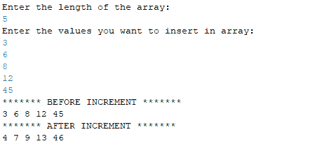

# 将数组的所有元素递增 1 的 Java 程序

> 原文:[https://www . geesforgeks . org/Java-程序对数组的所有元素逐个递增/](https://www.geeksforgeeks.org/java-program-to-increment-all-element-of-an-array-by-one/)

给定数组，任务是将数组的每个元素增加 1。递增数组的所有元素需要完整的遍历。完成给定任务的一种优化方法是将时间复杂度设为 O(N)。

**示例:**

```java
Input : arr1[] = {50, 25, 32, 12, 6, 10, 100, 150}
Output:arr1[] = {51, 25, 33, 13, 7, 11, 101, 151}

Input :arr2[] = {3, 6, 8, 12, 45}
Output:arr2[] = {4, 7, 9, 13, 46}

```

**1。带有预定义值:**

首先，用预定义的值初始化数组 arr[]，然后计算数组的长度。然后使用循环，在 for 循环的帮助下，执行一个接一个递增值的操作。之后，上述操作的结果将被存储到数组中，然后输出将在 for 循环的帮助下逐一显示。

## Java 语言(一种计算机语言，尤用于创建网站)

```java
// Java Program to Increment All
// Element of an Array by One
public class Increment {
    public static void main(String[] args)
    {
        // assigning values in array
        int[] arr = { 50, 25, 32, 12, 6, 10, 100, 150 };

        // finding the length of the array
        // and assigning it to the variable n
        int n = arr.length;

        System.out.println(
            "******* BEFORE INCREMENT *******");

        // printing the elements of array
        // before performing operation
        for (int i = 0; i < n; i++) {
            System.out.print(arr[i]);
            System.out.print(" ");
        }

        // incrementing the values of array
        // by 1 with the help of loop
        for (int i = 0; i < n; i++) {
            arr[i] = arr[i] + 1;
        }

        System.out.println(" ");

        // elements of the array after increment
        System.out.println(
            "******* AFTER INCREMENT *******");

        // printing the elements of array after operation
        for (int i = 0; i < n; i++) {
            System.out.print(arr[i]);
            System.out.print(" ");
        }
    }
}
```

**Output**

```java
******* BEFORE INCREMENT *******
50 25 32 12 6 10 100 150  
******* AFTER INCREMENT *******
51 26 33 13 7 11 101 151 

```

**时间复杂度:** O(N)，其中 N 是数组的大小

**2。带有用户定义的值:**

用用户定义的值初始化数组 arr[]，即数组的值将由用户给出，然后计算数组的长度。然后使用循环，在 for 循环的帮助下，执行一个接一个递增值的操作。之后，上述操作的结果将被存储到数组中，然后输出将在 for 循环的帮助下逐一显示。

## Java 语言(一种计算机语言，尤用于创建网站)

```java
// Java Program to Increment All
// Element of an Array by One
import java.util.Scanner;

public class Increment2 {

    public static void main(String[] args)
    {
        System.out.println(
            "Enter the length of the array: ");

        // The object of scanner class is created
        // in order to take the input from user
        Scanner sc = new Scanner(System.in);

        int n = sc.nextInt();

        // Initializing the array of size that
        // is given by the user
        int[] arr = new int[n];

        // Calculating the length of the array
        int l = arr.length;

        System.out.println(
            "Enter the values you want to insert in array: ");

        // Taking the values from user
        for (int i = 0; i < l; i++) {
            arr[i] = sc.nextInt();
        }

        System.out.println(
            "******* BEFORE INCREMENT *******");

        // The elements of array before increment
        for (int i = 0; i < l; i++) {
            System.out.print(arr[i]);
            System.out.print(" ");
        }

        // Incrementing the values of the array by 1
        for (int i = 0; i < l; i++) {
            arr[i] = arr[i] + 1;
        }

        System.out.println(" ");
        System.out.println(
            "******* AFTER INCREMENT *******");
        // Elements of array after increment
        for (int i = 0; i < l; i++) {
            System.out.print(arr[i]);
            System.out.print(" ");
        }
    }
}
```

**输出:**



**时间复杂度:** O(N)，其中 N 是数组的大小