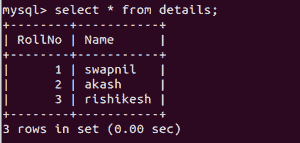
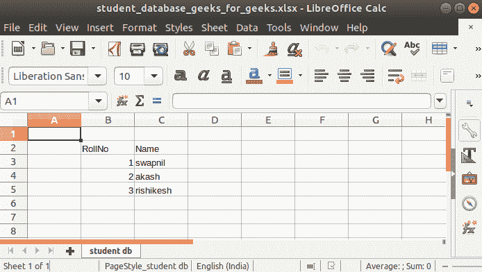

# 将数据从数据库插入到数据表的 Java 程序

> 原文:[https://www . geesforgeks . org/Java-程序-插入-数据-从数据库到数据表/](https://www.geeksforgeeks.org/java-program-to-insert-data-from-a-database-to-a-spread-sheet/)

数据库是数据和信息的持久集合，以特定的方式组织起来以便快速访问。类似地，电子表格是以表格形式存储数据的另一种方式。有两种类型的数据库，这里展示了结构化数据库，特别是 MySQL 数据库，以及作为电子表格工具的 LibreOffice Calc。将数据从 MySQL 插入电子表格非常有用，因为它为不熟悉 SQL 的人带来了查看和检索数据的便利。使用 java 处理电子表格需要使用 APACHE POI。Apache Poi 是用于处理微软文档的 Java API。下载下面提到的与 apache 相关的 jar 文件，它将帮助我们处理电子表格。同样，JDBC 是用于连接 java 和 MySQL 的 Java 应用编程接口。从下面给出的链接下载 MySQL-connector-Java-5 . 1 . 6-bin . jar 文件。

> *   [mysqlūū-Java-5 . 1 . 6-bin。jar〔t1〕](http://www.java2s.com/Code/JarDownload/mysql/mysql-connector-java-5.1.6-bin.jar.zip)*   [DOM 4j-1.6。jar〔t1〕](http://www.java2s.com/Code/JarDownload/dom4j/dom4j-1.6.jar.zip)*   [然后-3.9.jar 【T】](http://www.java2s.com/Code/JarDownload/poi/poi-3.9.jar.zip)

给定以下表格结构，该表格中的所有数据都应存储在电子表格中，表格属性作为电子表格的单元格名称。


表模式

**算法:**

1.  使用数据库登录凭据打开到数据库的新连接。这是使用 getConnection()方法完成的。连接类的每个对象都代表一个到数据库的新连接。
2.  执行 SQL 查询并存储结果。
3.  创建新工作簿->工作表->行。
4.  创建对应于数据库表中每一列的新单元格。
5.  遍历存储的结果集，并将值存储在相应的列中。

**语法、参数**、**和使用的内置函数的返回类型:**

```java
1\. Connection getConnection(String URL, String username, String Password);
2\. Statement createStatement();
3\. ResultSet executeQuery(String sql_query);
4\. XSSFSheet createSheet(String sheet_name);
5\. XSSFRow createRow(int row_no);
6\. XSSFCell createCell(int cell_no);
7\. void setCellValue(String cell_name);
8\. bool next();
9\. void write(FileOutputStream output);
```

实施:

## Java 语言(一种计算机语言，尤用于创建网站)

```java
// Java Program to Insert Data
// from a Database to a Spread Sheet

// Importing required modules

// File libraries
import java.io.File;
import java.io.FileOutputStream;
// Step 1: Importing Database modules
import java.sql.Connection;
import java.sql.DriverManager;
import java.sql.ResultSet;
import java.sql.Statement;
// Importing API modules
import org.apache.poi.xssf.usermodel.XSSFCell;
import org.apache.poi.xssf.usermodel.XSSFRow;
import org.apache.poi.xssf.usermodel.XSSFSheet;
import org.apache.poi.xssf.usermodel.XSSFWorkbook;

// Main (App) class shown only
// not its Connection class
public class GFG {

    // Main driver method
    public static void main(String[] args) throws Exception
    {

        // Step 2 : Load and Register drivers

        // Loading drivers using forName() method
        Class.forName("com.mysql.jdbc.Driver");

        // Registering drivers using Driver Manager
        // Step 3: Establish. a connection
        Connection connection = DriverManager.getConnection(
            "jdbc:mysql://localhost:3306/students", "root",
            "Swapnil@123");

        // Step 4: Proces the statement
        // Getting data from the table details
        Statement statement = connection.createStatement();
        ResultSet resultSet = statement.executeQuery(
            "select * from details");

        // Step 5: Execute a query
        // Create a workbook
        XSSFWorkbook workbook = new XSSFWorkbook();

        // Create a spreadsheet inside a workbook
        XSSFSheet spreadsheet1
            = workbook.createSheet("student db");
        XSSFRow row = spreadsheet1.createRow(1);
        XSSFCell cell;

        // Step 6: Process the results
        cell = row.createCell(1);
        cell.setCellValue("RollNo");

        cell = row.createCell(2);
        cell.setCellValue("Name");

        // i=2 as we will start writing from the
        // 2'nd row
        int i = 2;

        while (resultSet.next()) {
            row = spreadsheet1.createRow(i);
            cell = row.createCell(1);
            cell.setCellValue(resultSet.getInt("RollNo"));

            cell = row.createCell(2);
            cell.setCellValue(resultSet.getString("Name"));

            i++;
        }

        // Local directory on computer
        FileOutputStream output = new FileOutputStream(new File(
            "/home/swapnil/Desktop/sem9/student_database_geeks_for_geeks.xlsx"));

        // write
        workbook.write(output);

        // Step 7: Close the connection
        output.close();

        // Display message for successful compilation of
        // program
        System.out.println(
            "exceldatabase.xlsx written successfully");
    }
}
```

**输出:**内部输出:终端生成的 SQL 表(Windows 的 CMD)，反映了在创建的数据库中所做的更改，如下图所示。



表格条目

外部输出:根据 java 程序中提到的本地目录，这将是一个 Excel 文件。

