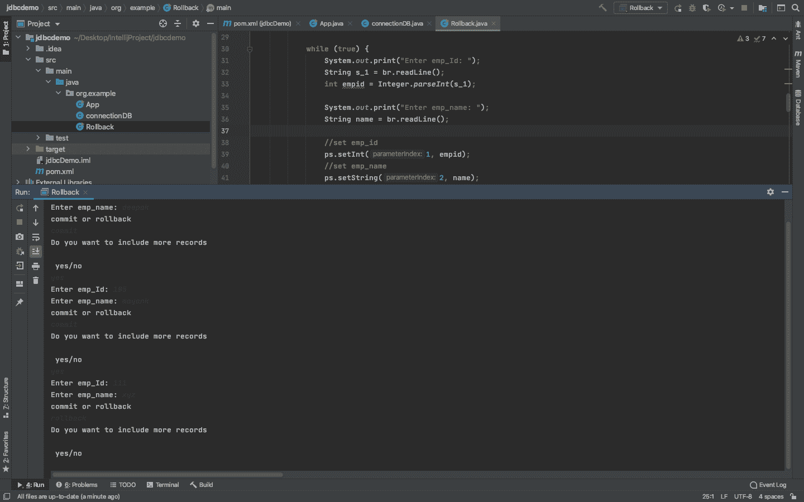

# 进行回滚的 Java 程序

> 原文:[https://www . geesforgeks . org/Java-program-to-make-a-roll back/](https://www.geeksforgeeks.org/java-program-to-make-a-rollback/)

调用回滚操作会撤消事务(T <sub>i</sub> )已经完成的所有效果或修改，并终止 T <sub>i</sub> ，所有变量都将存储它们以前的值。回滚主要是当在 Transaction(T <sub>i</sub> 的语句中得到一个或多个 SQL 异常时调用，然后 T <sub>i</sub> 被中止，从头重新开始。这是知道已经犯了什么和没有犯什么的唯一方法。
一个 SQL 异常只是表明你写的语句有问题，但没有提到哪里做错了什么。所以留给你的唯一选择就是调用回滚方法。

**程序:**主要涉及两个步骤。首先，创建一个数据库，然后处理事务。

1.  **创建数据库**
2.  **执行事务进行回滚**
    *   导入数据库
    *   必要时加载和注册驱动程序
    *   创建新连接
    *   创建提交/回滚语句
    *   执行提交/回滚查询
    *   处理结果
    *   关闭连接，否则之前的处理可能会丢失。

**步骤 1:** 我们还可以将数据库中的修改回滚到特定的标志或保存点，只需将所需的保存点名称作为参数传递到下面的方法中

```
// Set the Flag or Save point 
con.rollback("MysavePoint");
```

**第二步。要回滚事务:**使用类的名称(字符串类名) 加载 JDBC 驱动程序。在这个例子中，我们使用的是甲骨文

*   使用[Register driver()](https://www.geeksforgeeks.org/establishing-jdbc-connection-in-java/)方法注册所需的驱动程序

```
 // To register the needed Driver
 DriverManager.registerDriver(new com.mysql.jdbc.Driver());
```

*   使用驱动管理器的 getConnection() API 方法获取连接信息:

```
 // For getting the connection
 String url = "jdbc:mysql://localhost/mydatabase/icpc";
 Connection conn = DriverManager.getConnection(string url, String user, String password);
```

*   使用关闭连接的 API 方法设置自动提交(布尔自动提交)方法禁用自动提交，如下所示:

```
   // Set the auto commit false. This will execute all
   // SQL statements as individual transactions
   con.setAutoCommit(false);
```

*   现在，使用设置保存点()设置保存点，或者使用连接的 API 方法 commit()提交事务，如下所示

```
 Savepoint savePoint = con.setSavepoint("MysavePoint");
 Con.commit();
```

*   如果发现任何 SQL 异常，那么在这种情况下，调用 rollback( ) API 方法来处理整个事务，直到之前设置的保存点:

```
 con.rollback() Or,
 con. rollback(my_Savepoint);
```

**实现:**演示 rollback()和 commit()程序的 Java 程序如下

## Java 语言(一种计算机语言，尤用于创建网站)

```
// Importing generic java libraries
import java.io.*;

// Retrieving SQL DB
// javaconnector-linkage for JDBC
import java.sql.*;
import java.sql.SQLException;
import java.sql.DriverManager;
import java.sql.Connection;
import java.sql.ResultSet;
import java.sql.Statement;
import java.sql.PreparedStatement;
import java.sql.Date;
// Importing drivers(if necessarily)

// GFG class only to illustrate JDBC
// not illustrating connection class
class GFG {

    /* Step 1: Importing DB */

    // Database URL so as to create/fetch data from DB
    static String DB_URL
        = "jdbc:oracle:thin:@localhost/my_database_";

    // DB userID
    static String DB_USER = "local";

    // Remember randomly self createdDB password
    // to deal with above DB root
    static String DB_PASSWORD = "test";

    // Main driver method
    public static void main(String args[])
    {
        // Try block to check exceptions  if occurs
        try {

            /* Step 2: Loading and registering drivers*/

            Class.forName(
                "oracle.jdbc.driver.OracleDriver");

            /* Step 3: Create the new connection */
            Connection conn = DriverManager.getConnection(
                DB_URL, DB_USER, DB_PASSWORD);

            // set auto commit of the connection to false
            conn.setAutoCommit(false);

            /* Step 4: Create a statement */

            // Input the info into record
            String sql_
                = "INSERT INTO Employee (empid, empname) VALUES (?, ?)";

            // Create a Statement_object
            PreparedStatement ps
                = conn.prepareStatement(sql_);

            /* Step 5: Execute a query */

            // Take user input
            BufferedReader br = new BufferedReader(
                new InputStreamReader(System.in));

            while (true) {

                // Asking user to enter data(EmpID)
                System.out.print("Enter emp_Id: ");

                // Reading above user entered EmpID
                String s_1 = br.readLine();
                int empid = Integer.parseInt(s_1);

                // Asking user to enter data(EmpName)
                System.out.print("Enter emp_name: ");

                // Reading above user entered EmpName
                String name = br.readLine();

                // Creating entry in table

                // Set emp_id
                ps.setInt(1, empid);

                // Set emp_name
                ps.setString(2, name);

                // Execute the updation operation
                ps.executeUpdate();

                /* Step 6: Process the results */

                /* Displaying choice what user wants to do
                   with updation, either Commit() or
                   rollback() */
                System.out.println("commit or rollback");

                // Reading choice from user
                String answer = br.readLine();

                /* Asking user's choice for condition
                 * check*/

                /* Checking if users want to commit or
                 * rollback */

                // If user wants to commit
                if (answer.equals("commit")) {
                    conn.commit();
                }

                // If user wants to rollback
                if (answer.equals("rollback")) {

                    // Rollback the update in case if some
                    // flaw in your record
                    conn.rollback();
                }

                /* Display message to user for inputing next
                   record if user wants to add */
                System.out.println(
                    "Do you want to include more records");

                /* Asking choice */
                System.out.println("\n yes/no");

                // Read user's choice
                String answ = br.readLine();
                if (answ.equals("no")) {
                    break;
                }
            }
            conn.commit();

            // Print message
            System.out.println(
                "record is successfully saved");

            /* Step 7: Close the connection */

            // calling commit() before closing connection
            // else updation would be lost
            conn.close();
        }

        // Exception handled if occured by catch block
        catch (Exception exc) {

            // Highlighting line where exception occured
            // as execution is equal
            exc.printStackTrace();
        }
    }
}
```

**输出:**有两个示例输出图像涵盖了两种情况:提交和回滚或简单的直接回滚，如下图所示。

