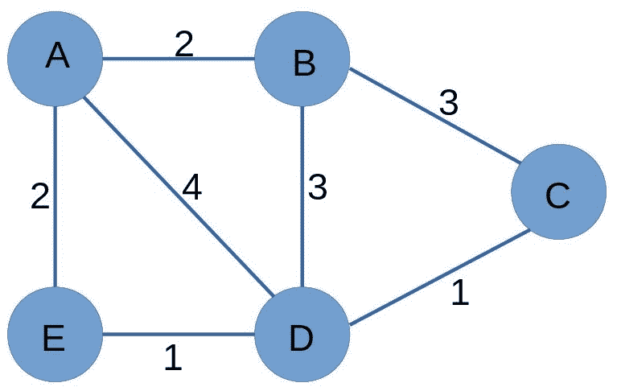
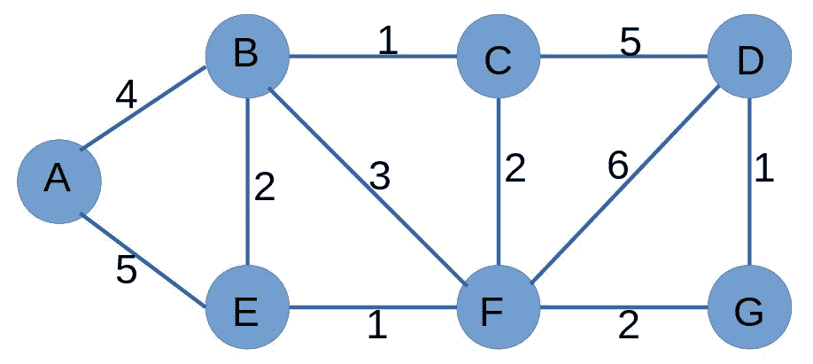

# 优化电路中导线长度的 Java 程序

> 原文:[https://www . geesforgeks . org/Java-程序优化电路中的线长/](https://www.geeksforgeeks.org/java-program-to-optimize-wire-length-in-electrical-circuit/)

给定 **n** 个电气元件和 **m** 根电线，在每根电线都有长度的地方连接它们。找出两个元件之间的最佳导线长度。

**例**:



> **输入**:来源= A
> 
> 目的地= C
> 
> **输出** : 4
> 
> **说明**:从节点 A 到节点 C 有五种不同的路径，即 A- > B- > C、A- > B- > D- > C、A- > D- > C、A- > E- > D- > C、A- > D- > B- > C，但长度最小或优化的路径是 A- > E- >

**接近**:

给定 n 个分量和 m 条线，构成一个无向加权图。任务是计算两个组件之间的最佳长度，即两个组件之间的最小长度。问题是[迪克斯特拉算法](https://www.geeksforgeeks.org/java-program-for-dijkstras-shortest-path-algorithm-greedy-algo-7/)的一个应用。由于源是可用的，从源到所有节点的最短长度可以使用 Dijkstra 算法来计算。这将给出给定节点源和作为数组的所有其他节点之间的最短可能长度。现在，使用这个数组可以给出从源到目标的最短长度。让我们借助一个例子来理解这一点。

**例**:



> **输入:**来源= A
> 
> 目的地= D
> 
> **输出:** 9
> 
> **说明:**使用 Dijkstra 算法计算从源 A 到所有其他节点的最短长度。
> 
> **距离源的顶点距离**
> 
> 0
> 
> B 4
> 
> C 5
> 
> D 9
> 
> E 5
> 
> F 6
> 
> G 8
> 
> 对于来源 A 的任何组件，可以找到最短的长度。最终答案将是从 A 到 D 的最短长度，即 9。

下面是上述方法的实现:

## Java 语言(一种计算机语言，尤用于创建网站)

```java
// Java program for implementation
// of above approach
import java.util.*;

class GFG {

    // n is no. of nodes and m is no. of edges
    public static int n, m;

    // adjacency list representation of graph
    public static List<List<Node> > graph
        = new ArrayList<List<Node> >();

    // source and destination points for shortest path
    public static int src, dest;

    static class Node {

        // node's label
        public int label;

        // length of edge to this node
        public int length;

        public Node(int v, int w)
        {
            label = v;
            length = w;
        }
    }

    // Driver program
    public static void main(String[] args) throws Exception
    {
        n = 5;
        m = 7;

        // Initialize adjacency list structure
        // to empty lists:
        for (int i = 0; i <= n; i++) {
            List<Node> item = new ArrayList<Node>();
            graph.add(item);
        }

        graph.get(1).add(new Node(2, 2));
        graph.get(2).add(new Node(1, 2));

        graph.get(1).add(new Node(4, 4));
        graph.get(4).add(new Node(1, 4));

        graph.get(1).add(new Node(5, 2));
        graph.get(5).add(new Node(1, 2));

        graph.get(4).add(new Node(5, 1));
        graph.get(5).add(new Node(4, 1));

        graph.get(2).add(new Node(4, 3));
        graph.get(4).add(new Node(2, 3));

        graph.get(2).add(new Node(3, 3));
        graph.get(3).add(new Node(2, 3));

        graph.get(4).add(new Node(3, 1));
        graph.get(3).add(new Node(4, 1));

        // Source node
        src = 1;

        // Destination node
        dest = 3;

        dijkstra();
    }

    // Function to implement Dijkstra's algorithm
    public static void dijkstra()
    {

        // array to keep track of unvisited nodes
        boolean[] done = new boolean[n + 1];

        // node array to keep track of path
        // from source to all other nodes
        Node[] table = new Node[n + 1];

        // initialise all nodes
        for (int i = 1; i <= n; i++)
            table[i] = new Node(-1, Integer.MAX_VALUE);

        // source to source length is 0
        table[src].length = 0;

        // Dijkstra's algorithm implementation
        for (int count = 1; count <= n; count++) {
            int min = Integer.MAX_VALUE;
            int minNode = -1;

            // find the minimum length node
            // from unvisited nodes
            for (int i = 1; i <= n; i++) {
                if (!done[i] && table[i].length < min) {
                    min = table[i].length;
                    minNode = i;
                }
            }

            // visit the minNode
            done[minNode] = true;

            // iterator to traverse all connected
            // nodes to minNode
            ListIterator iter
                = graph.get(minNode).listIterator();
            while (iter.hasNext()) {
                Node nd = (Node)iter.next();
                int v = nd.label;
                int w = nd.length;

                // update the distance from minNode
                // of unvisited nodes
                if (!done[v]
                    && table[minNode].length + w
                           < table[v].length) {
                    table[v].length
                        = table[minNode].length + w;
                    table[v].label = minNode;
                }
            }
        }

        // length is now available rom source to all nodes
        System.out.println("Wire froms " + dest + " to "
                           + src + " with length "
                           + table[dest].length);
        int next = table[dest].label;
        System.out.print("Path is : " + dest + " ");

        // path from destination to source via all
        // intermediate nodes with minimum length
        while (next >= 0) {
            System.out.print(next + " ");
            next = table[next].label;
        }
        System.out.println();
    }
}
```

**Output**

```java
Wire froms 3 to 1 with length 4
Path is : 3 4 5 1 
```

**时间复杂度**:上述 Dijkstra 算法实现的时间复杂度为 O(n^2).