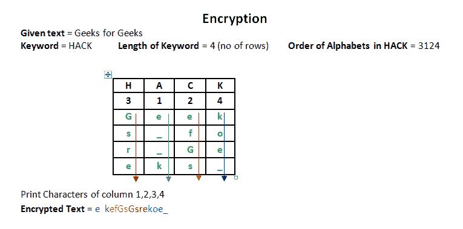

# 使用换位技术执行加密的 Java 程序

> 原文:[https://www . geesforgeks . org/Java-程序-执行-加密-使用-转置-技术/](https://www.geeksforgeeks.org/java-program-to-perform-cryptography-using-transposition-technique/)

使用转置技术的加密可以通过使用[转置密码](https://www.geeksforgeeks.org/columnar-transposition-cipher/)来完成，转置密码使用明文消息的字母，然后它们改变字母的顺序。柱状换位密码是一种换位密码，就像 [围栏密码](https://www.geeksforgeeks.org/rail-fence-cipher-encryption-decryption/) 一样。列转置包括逐行写出明文，然后逐列读出密文。

发现一个换位密码应该很容易，因为字母频率应该模仿英语的常用频率——a、e、I、n、o、r、s、t 的高频。但是，换位密码的密码分析可能很困难。最基本的技术是语法分析，即重新排列密文字母以“有意义”。密码的关键是重新排列的模式。用数学术语来说，可以简单地假设在字符位置上使用双射函数来加密，使用反函数来解密。



插图:

> 例 1
> 
> ```java
> Input  : Plaintext  : how are you
> Output : Ciphertext : a e oowu hyr
> ```
> 
> 例 2
> 
> ```java
> Input  : Plaintext  : you are a champion
> Output : Ciphertext : h aa ep o nuc i yaorm
> ```

**实现:** 给定一条纯文本消息和一个数字密钥，使用柱状换位密码对给定文本进行加密/解密。“你好，极客”是纯文本的自定义输入！

**例**

## Java 语言(一种计算机语言，尤用于创建网站)

```java
// Java Program to Perform Cryptography
// using Transposition Technique

// Importing all classes from
// java.util package
// Importing input output classes
import java.io.*;
import java.util.*;

// Class
// For transposition cipher
public class GFG {

    // Member variables of this class
    public static String selectedKey;
    public static char sortedKey[];
    public static int sortedKeyPos[];

    // Constructor 1 of this class
    // Default constructor defining the default key
    public GFG()
    {
        selectedKey = "megabuck";
        sortedKeyPos = new int[selectedKey.length()];
        sortedKey = selectedKey.toCharArray();
    }

    // Constructor 2 of this class
    // Parameterized constructor defining the custom key
    public GFG(String GeeksForGeeks)
    {
        selectedKey = GeeksForGeeks;
        sortedKeyPos = new int[selectedKey.length()];
        sortedKey = selectedKey.toCharArray();
    }

    // Method 1 - doProcessOnKey()
    // To reorder data do the sorting on selected key
    public static void doProcessOnKey()
    {
        // Find position of each character in selected key
        // and arranging it in alphabetical order
        int min, i, j;
        char orginalKey[] = selectedKey.toCharArray();
        char temp;

        // Step 1: Sorting the array of selected key
        // using nested for loops
        for (i = 0; i < selectedKey.length(); i++) {
            min = i;
            for (j = i; j < selectedKey.length(); j++) {
                if (sortedKey[min] > sortedKey[j]) {
                    min = j;
                }
            }

            if (min != i) {
                temp = sortedKey[i];
                sortedKey[i] = sortedKey[min];
                sortedKey[min] = temp;
            }
        }

        // Step 2: Filling the position of array
        // according to alphabetical order
        // using nested for loops
        for (i = 0; i < selectedKey.length(); i++) {
            for (j = 0; j < selectedKey.length(); j++) {
                if (orginalKey[i] == sortedKey[j])
                    sortedKeyPos[i] = j;
            }
        }
    }

    // Method 2 - doEncryption()
    // To encrypt the targeted string
    public static String doEncryption(String plainText)
    {
        int min, i, j;
        char orginalKey[] = selectedKey.toCharArray();
        char temp;
        doProcessOnKey();

        // Step 3: Generating the encrypted message by
        // doing encryption using Transpotion Cipher
        int row = plainText.length() / selectedKey.length();
        int extrabit
            = plainText.length() % selectedKey.length();
        int exrow = (extrabit == 0) ? 0 : 1;
        int rowtemp = -1, coltemp = -1;
        int totallen = (row + exrow) * selectedKey.length();
        char pmat[][] = new char[(row + exrow)]
                                [(selectedKey.length())];
        char encry[] = new char[totallen];

        int tempcnt = -1;
        row = 0;

        for (i = 0; i < totallen; i++) {
            coltemp++;
            if (i < plainText.length()) {
                if (coltemp == (selectedKey.length())) {
                    row++;
                    coltemp = 0;
                }
                pmat[row][coltemp] = plainText.charAt(i);
            }

            else {

                // Padding can be added between two
                // consecutive alphabets or a group of
                // alphabets of the resultant cipher text
                pmat[row][coltemp] = '-';
            }
        }

        int len = -1, k;

        for (i = 0; i < selectedKey.length(); i++) {
            for (k = 0; k < selectedKey.length(); k++) {
                if (i == sortedKeyPos[k]) {
                    break;
                }
            }
            for (j = 0; j <= row; j++) {
                len++;
                encry[len] = pmat[j][k];
            }
        }

        String p1 = new String(encry);
        return (new String(p1));
    }

    // Method 3 - doEncryption()
    // To decrypt the targeted string
    public static String doDecryption(String s)
    {
        int min, i, j, k;
        char key[] = selectedKey.toCharArray();
        char encry[] = s.toCharArray();
        char temp;

        doProcessOnKey();

        // Step 4: Generating a plain message
        int row = s.length();
        selectedKey.length();
        char pmat[][]
            = new char[row][(selectedKey.length())];
        int tempcnt = -1;

        for (i = 0; i < selectedKey.length(); i++) {
            for (k = 0; k < selectedKey.length(); k++) {
                if (i == sortedKeyPos[k]) {
                    break;
                }
            }

            for (j = 0; j < row; j++) {
                tempcnt++;
                pmat[j][k] = encry[tempcnt];
            }
        }

        // Step 5: Storing matrix character in
        // to a single string
        char p1[] = new char[row * selectedKey.length()];

        k = 0;
        for (i = 0; i < row; i++) {
            for (j = 0; j < selectedKey.length(); j++) {
                if (pmat[i][j] != '*') {
                    p1[k++] = pmat[i][j];
                }
            }
        }

        p1[k++] = '\0';
        return (new String(p1));
    }

    @SuppressWarnings("static-access")

    // Method 4 - main()
    // Main driver method
    public static void main(String[] args)
    {
        // Creating object of class in main method
        GFG tc = new GFG();

        // Printing the ciphere text
        // Custom input - Hello Geek
        System.out.println("Cipher Text : "
                           + tc.doEncryption("Hello Geek"));
    }
}
```

**Output**

```java
Cipher Text : l-o-G-ekl-e-He -

```