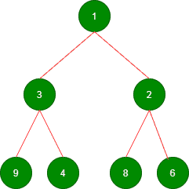
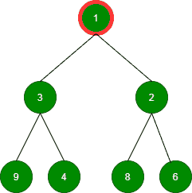
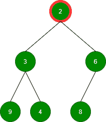
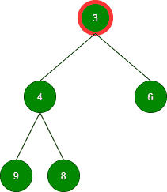
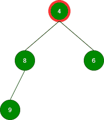
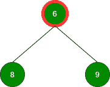
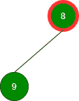

# 使用优先级队列执行两个链表合并的 Java 程序

> 原文:[https://www . geesforgeks . org/Java-程序执行-两个链表的并集-使用优先级-队列/](https://www.geeksforgeeks.org/java-program-to-perform-union-of-two-linked-lists-using-priority-queue/)

给定两个链表，你的任务是完成函数 make union()，返回两个链表的并集。这个联合应该只包括所有不同的元素。形成的新列表应该按非递减顺序排列。

```
Input: L1 = 9->6->4->2->3->8
       L2 = 1->2->8->6->2
Output: 1 2 3 4 6 8 9
```

**进场:**

堆有[两种类型](https://www.geeksforgeeks.org/difference-between-min-heap-and-max-heap/)大家都知道是最小堆和最大堆

*   最小堆–以升序存储所有元素
*   最大堆–以降序存储所有元素

让我们首先使用 min heap 可视化，以便解释两个链表的并集是如何进行的程序执行，因此我们将列出两个操作来可视化:

1.  插入
2.  搬迁

**插入:**插入两个链表的所有不同元素后，



**移除:**移除根，直到 minheap 为空

移除值为 1 的根:



删除值为 2 的根:



删除值为 3 的根:



移除值为 4 的根:



移除值为 6 的根:



移除值为 8 的根:



删除值为 9 的根:


> 因此，我们可以得出结论，在最小堆中，最小的元素将位于堆的根，而在最大堆中，最大的元素将位于堆的根。在堆上实现 remove()函数时，根元素将被移除。因为输出应该是递增的，所以可以使用最小堆。优先级队列用于在 java 中实现最小堆。

**例**

## Java 语言(一种计算机语言，尤用于创建网站)

```
// JAva Program toIllustrate Union of Two Linked Lists
// Using Priority Queue

// Importing basic required classes
import java.io.*;
import java.util.*;

// Class 1
// Helper class
// Node creation
class Node {

    // Data and addressing variable of node
    int data;
    Node next;

    // Constructor to initialize node
    Node(int a)
    {
        data = a;
        next = null;
    }
}

// Class 2
// Main class
public class GfG {
    // Reading input via Scanner class
    static Scanner sc = new Scanner(System.in);

    // Method 1
    // To create the input list1
    public static Node inputList1()
    {
        // Declaring node variables that is
        // Head and tail
        Node head, tail;

        // Custom input node elements

        head = tail = new Node(9);

        tail.next = new Node(6);
        // Fetching for next node
        // using next() method
        tail = tail.next;

        // Similarly for node 3
        tail.next = new Node(4);
        tail = tail.next;

        // Similarly for node 4
        tail.next = new Node(2);
        tail = tail.next;

        //  Similarly for node 5
        tail.next = new Node(3);
        tail = tail.next;

        // Similarly for node 6
        tail.next = new Node(8);
        tail = tail.next;

        // Returning the head
        return head;
    }

    // Method 2
    // To create the input List2
    // Similar to method 1 but for List2
    public static Node inputList2()
    {
        Node head, tail;

        head = tail = new Node(1);

        tail.next = new Node(2);
        tail = tail.next;

        tail.next = new Node(8);
        tail = tail.next;

        tail.next = new Node(6);
        tail = tail.next;

        tail.next = new Node(2);
        tail = tail.next;

        return head;
    }

    // Method 3
    // To print the union list
    public static void printList(Node n)
    {
        // Till there is a node
        // condition holds true
        while (n != null) {
            // Print the node
            System.out.print(n.data + " ");
            // Moving onto next node
            n = n.next;
        }
    }

    // Method 4
    // main driver method
    public static void main(String args[])
    {
        // Taking input for List 1 and List 2
        Node head1 = inputList1();
        Node head2 = inputList2();

        // Calling
        Union obj = new Union();
        printList(obj.findUnion(head1, head2));
    }
}

// Class 3
// To make the union of two linked list
class Union {
    public static Node findUnion(Node head1, Node head2)
    {
        // Creating a priority queue where
        // declaring elements of integer type
        PriorityQueue<Integer> minheap
            = new PriorityQueue<Integer>();
        // Setting heads
        Node l1 = head1, l2 = head2;

        // For List 1
        // Inserting elements from linked list1 into
        // priority queue
        while (l1 != null) {
            if (!minheap.contains(l1.data)) {
                minheap.add(l1.data);
            }
            // Move to next element
            l1 = l1.next;
        }

        // For List 2
        // Inserting elements from linked list2 into
        // priority queue
        while (l2 != null) {
            if (!minheap.contains(l2.data)) {
                minheap.add(l2.data);
            }

            // Move to next element
            l2 = l2.next;
        }

        Node union = new Node(0), start = union;

        // Removing until heap is empty
        while (!minheap.isEmpty()) {
            Node temp = new Node(minheap.remove());

            // Using temp to stoe start
            start.next = temp;
            start = start.next;
        }

        // Returning node
        return union.next;
    }
}
```

**Output**

```
1 2 3 4 6 8 9 
```

> 时间复杂度:0(n)，空间复杂度:0(n)