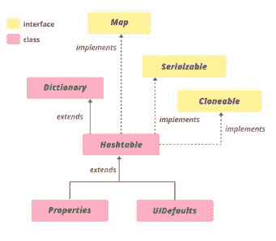

# 在哈希表中使用枚举读取元素的 Java 程序

> 原文:[https://www . geesforgeks . org/Java-程序-读取-元素-使用-枚举-在-哈希表/](https://www.geeksforgeeks.org/java-program-to-read-elements-using-enumeration-in-hashtable/)

java 中的[枚举](https://www.geeksforgeeks.org/enum-in-java/) 是预定义的接口之一，其对象用于从集合框架变量(如堆栈、向量、哈希表等)中检索数据。)仅在向前的方向，而不在向后的方向。

[哈希表](https://www.geeksforgeeks.org/hashtable-in-java/)是一个类哈希表类实现了一个映射，将键映射到值。它将键/值对存储在哈希表中。在这个数据结构中，我们指定了一个用作键的对象，以及我们想要与该键关联的值。然后对该键进行哈希运算，得到的哈希代码用作该值在表中存储的索引。哈希表不提供任何枚举，而哈希表不提供快速枚举。哈希表的层次结构如下:



**语法:**

```java
public class Hashtable<K,V> extends Dictionary<K,V> implements Map<K,V>, Cloneable, Serializable
```

**参数:**

*   克:钥匙插入。
*   v:分配给键的值。

为了创建哈希表，从 java.util.Hashtable 中导入哈希表，其中，K、V 是整数、字符串、浮点数等数据类型。

**语法:**创建哈希表

```java
Hashtable<K, V> ht = new Hashtable<K, V>();
```

**实施:**大学生信息

**例**

## Java 语言(一种计算机语言，尤用于创建网站)

```java
// Java Program to read elements
// using enumeration in hashtable

// Importing enumeration class
import java.util.Enumeration;
// Importing hash table
import java.util.Hashtable;

// Class
public class GFG {

    // Main driver method
    public static void main(String a[])
    {

        // Creating hash table
        Hashtable<String, String> hm
            = new Hashtable<String, String>();

        // Add key-value pair to Hashtable
        // Custom inputs
        hm.put("Name", "Bahubali");
        hm.put("College", "Amarnath");
        hm.put("Department", "Vedics");

        // enum
        Enumeration<String> keys = hm.keys();

        // Condition check whether element(K,V) is present
        // using hasMoreElements()
        while (keys.hasMoreElements()) {
            String key = keys.nextElement();

            // Print corresponding key-value pair
            System.out.println("Value of " + key
                               + " is: " + hm.get(key));
        }

        System.out.println();

        // Creating a new Hashtable
        Hashtable<String, String> hm1
            = new Hashtable<String, String>();

        // Adding key-value pair to Hashtable
        // Custom inputs
        hm1.put("Name", "Ravaan");
        hm1.put("College", "SriLanka");
        hm1.put("Department", "CS");

        // Enum
        Enumeration<String> keys1 = hm1.keys();

        // Condition check whether element(K,V) is present
        // using hasMoreElements()
        while (keys1.hasMoreElements()) {
            String key = keys1.nextElement();

            // Print corresponding key-value pair
            System.out.println("Value of " + key
                               + " is: " + hm1.get(key));
        }

        System.out.println();

        // Creating a new Hashtable
        Hashtable<String, String> hm2
            = new Hashtable<String, String>();

        // Adding key-value pair to Hashtable
        // Custom inputs
        hm2.put("Name", "Kattappa");
        hm2.put("College", "Beardo");
        hm2.put("Department", "War");

        /// enum
        Enumeration<String> keys2 = hm2.keys();

        // Condition check whether element(K,V) is present
        // using hasMoreElements()
        while (keys2.hasMoreElements()) {
            String key = keys2.nextElement();

            // Print corresponding key-value pair
            System.out.println("Value of " + key
                               + " is: " + hm2.get(key));
        }
    }
}
```

**Output**

```java
Value of Name is: Bahubali
Value of College is: Amarnath
Value of Department is: Vedics

Value of Name is: Ravaan
Value of College is: SriLanka
Value of Department is: CS

Value of Name is: Kattappa
Value of College is: Beardo
Value of Department is: War
```