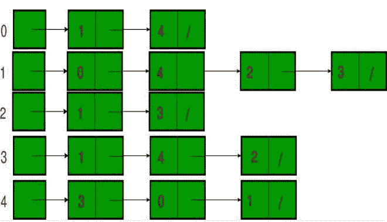
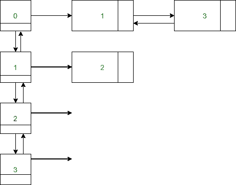

# 使用链表表示图形的 Java 程序

> 原文:[https://www . geesforgeks . org/Java-程序-用链表表示图形/](https://www.geeksforgeeks.org/java-program-to-represent-graphs-using-linked-list/)

[数据结构](https://www.geeksforgeeks.org/data-structures/)分为线性数据结构和非线性数据结构两类。线性数据结构的主要缺点是我们不能以层次方式排列线性数据结构的数据，这就是为什么在计算机领域我们使用非线性数据结构。最常用的非线性数据结构是图和树，这两种数据结构都可以使用线性数据结构来实现。在本文中，我们将讨论如何使用链表来表示图。

[图](https://www.geeksforgeeks.org/data-structures/)由一组有限的顶点(或节点)和一组连接一对节点的边组成。图形有两种不同的表示方式。一种方法是使用邻接表表示，第二种是邻接矩阵表示。使用邻接表表示法是因为使用列表表示法进行动态内存分配。

图形有两种类型:

*   有向图:在这种图的排列中，每个节点都指向一个顶点，称为有向图。
*   无向图:在图的这种排列中，用双向顶点连接的两个节点称为无向图。

**无向图表示:**无向图中顶点的最大数量是 **n*(n-1)** ，其中 n 是无向图中存在的节点总数。


[链接列表](https://www.geeksforgeeks.org/linked-list-in-java/)无向图的表示如下:

在无向图中，两个节点在双向顶点上相连。我们可以使用数组列表和链表集合来表示无向图。在链表中，对数据的操作比数组列表快，因为数组列表在内部使用动态数组来存储数据，而链表使用双向链表，这种链表在操作上更快，但在访问元素上却不太快。



**实现:**这里我们将讨论两种类型的图，以便实现相同的图。

**例 1**

## Java 语言(一种计算机语言，尤用于创建网站)

```java
// Java Program to Implement the Unidirectional Graph
// Using Linked List

// Importing required classes from packages
import java.io.*;
import java.util.*;

// Main class
class GFG {

    // Method 1
    // To make pair of nodes
    static void
    addEdge(LinkedList<LinkedList<Integer> > Adj, int u,
            int v)
    {
        // Creating bi-directional vertex
        Adj.get(u).add(v);
        Adj.get(v).add(u);
    }

    // Method 2
    // To print the adjacency list
    static void
    printadjacencylist(LinkedList<LinkedList<Integer> > adj)
    {
        for (int i = 0; i < adj.size(); ++i) {

            // Printing the head
            System.out.print(i + "->");

            for (int v : adj.get(i)) {
                // Printing the nodes
                System.out.print(v + " ");
            }

            // Now a new lin eis needed
            System.out.println();
        }
    }

    // Method 3
    // Main driver method
    public static void main(String[] args)
    {

        // Creating vertex
        int V = 5;

        LinkedList<LinkedList<Integer> > adj
            = new LinkedList<LinkedList<Integer> >();
        for (int i = 0; i < V; ++i) {
            adj.add(new LinkedList<Integer>());
        }

        // Inserting nodes
        // Custom input node elements
        addEdge(adj, 0, 1);
        addEdge(adj, 0, 4);
        addEdge(adj, 1, 2);
        addEdge(adj, 1, 3);
        addEdge(adj, 1, 4);
        addEdge(adj, 2, 3);
        addEdge(adj, 3, 4);

        // Printing adjacency list
        printadjacencylist(adj);
    }
}
```

**Output**

```java
0->1 4 
1->0 2 3 4 
2->1 3 
3->1 2 4 
4->0 1 3 
```

现在跳到下一种类型的图，即我们使用链表**表示的有向图。**在有向图中，两个节点在单向顶点上相连。



**例 2**

## Java 语言(一种计算机语言，尤用于创建网站)

```java
// Java Program to Implement the Directed Graph
// Using Linked List

// Importing standard classes from respectively packages
import java.io.*;
import java.util.*;

// Main class
class GFG {

    // Method 1
    // To make pair of nodes
    static void
    addEdge(LinkedList<LinkedList<Integer> > Adj, int u,
            int v)
    {
        // Creating unidirectional vertex
        Adj.get(u).add(v);
    }

    // Method 2
    // To print the adjacency List
    static void
    printadjacencylist(LinkedList<LinkedList<Integer> > adj)
    {
        for (int i = 0; i < adj.size(); ++i) {

            // Printing the head
            if (adj.get(i).size() != 0) {
                System.out.print(i + "->");
                for (int v : adj.get(i)) {

                    // Printing the nodes
                    System.out.print(v + " ");
                }

                // A new line is needed
                System.out.println();
            }
        }
    }

    // Method 3
    // Main driver method
    public static void main(String[] args)
    {
        // Creating vertex
        int V = 5;

        LinkedList<LinkedList<Integer> > adj
            = new LinkedList<LinkedList<Integer> >();

        for (int i = 0; i < V; ++i) {
            adj.add(new LinkedList<Integer>());
        }
        // Inserting nodes
        // Custom input elements
        addEdge(adj, 0, 1);
        addEdge(adj, 0, 4);
        addEdge(adj, 1, 2);

        // Printing adjacency List
        printadjacencylist(adj);
    }
}
```

**Output**

```java
0->1 4 
1->2 
```