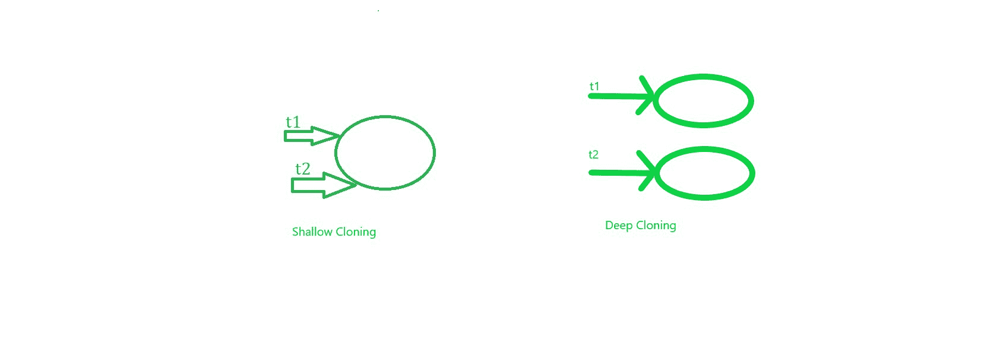
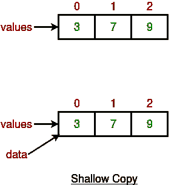

# Java 程序展示浅克隆和深克隆

> 原文:[https://www . geesforgeks . org/Java-program-to-show-浅层克隆-深层克隆/](https://www.geeksforgeeks.org/java-program-to-show-shallow-cloning-and-deep-cloning/)

克隆方法的默认版本创建对象的浅拷贝。在面向对象的 java 中，对象复制是创建现有对象的副本，因此复制的对象可以是复制对象的精确副本的相似副本。复制对象有两种方法，如下所示:

在 C/C++那里

**复制方法**

现在，复制可以有以下三种类型:

1.  浅拷贝
2.  深度复制
3.  克隆

一般来说[、](https://www.geeksforgeeks.org/clone-method-in-java-2/)深度复制和克隆被称为相同的深度克隆，因为它们之间的区别是一条细线，焦点放在该细线上，以便于使用[克隆()](https://www.geeksforgeeks.org/clone-method-in-java-2/)方法手动复制对象。



**1。浅拷贝/克隆**

*   默认实现使用 clone()方法时，会创建对象的浅拷贝。这意味着它会创建一个新实例，并将对象的所有字段复制到该新实例中，其中两者都引用堆内存中的同一内存。
*   [*克隆()*](https://www.geeksforgeeks.org/clone-method-in-java-2/) 方法的对象类支持对象的浅拷贝。如果对象在浅拷贝中包含基元以及非基元或引用类型变量，则克隆的对象也引用原始对象引用的同一对象，因为只有对象引用被拷贝，而不是被引用的对象本身。简单来说，这里创建了一个对象，而堆栈内存中有两个引用。
*   它以对象类型返回，我们需要显式地将其转换回原始对象。这是对象的浅拷贝。

插图:浅复制对象' t2 '

```
class GFG 
  {
  int i,j;
  }
main(String[] args) 
  {
  // Copying
  GFG object1 = new GFG() ; 
  object.i = 5;
  object.j = 6;
 GFG object2 = object1 ; // shallow copying object
 } 
```



**例 1**

## Java 语言(一种计算机语言，尤用于创建网站)

```
// Java Program to show shallow cloning

// Importing java input/output classes
import java.io.*;

// Class
class GFG {

    // Main driver method
    public static void main(String[] args)
    {
        // t1 and t2 objects are used to
        // illustrate shallow copy

        // t1 is first object created in heap memory
        GFG t1 = new GFG();

        // Creating only one object(t1) and
        // both objects (t1,t2) are pointing to only one
        // object
        GFG t2 = t1;

      // Display message
        // return true if reference is same that is shallow copy
        // false if different
        // Should be returning - true
        System.out.print(
                "Output: False if Deepcopy & True if shallow : ");
                System.out.println(t1 == t2);
    }
}
```

**Output**

```
Output: False if Deepcopy & True if shallow : true
```