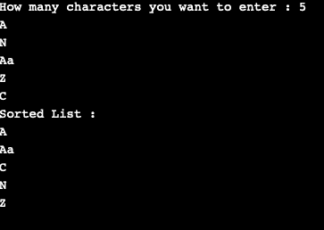

# 按属性对自定义对象的数组列表进行排序的 Java 程序

> 原文:[https://www . geesforgeks . org/Java-程序到排序-按属性排列的自定义对象数组列表/](https://www.geeksforgeeks.org/java-program-to-sort-arraylist-of-custom-objects-by-property/)

这里我们将看一下通过使用属性对自定义对象的[数组列表](https://www.geeksforgeeks.org/arraylist-in-java/)进行排序的方法。

**进场:**

1.创建一个 getter 函数，返回存储在类变量中的值。

2.创建一个列表，并使用 sort()函数，该函数将列表的值作为参数，并用 **compareTo()** 方法进行比较。

3.如果第一个参数的属性大于第二个参数的属性，那么这个函数将返回一个正数，如果第一个参数小于第二个参数，则返回负数，如果两个参数相等，则返回零。

**实施**

## Java 语言(一种计算机语言，尤用于创建网站)

```
// Java Program to Sort ArrayList of Custom Objects By
// Property

import java.util.*;

public class Main {
    private String value;

    public Main(String val) { this.value = val; }

    // Defining a getter method
    public String getValue() { return this.value; }

    // list of Main objects
    static ArrayList<Main> list = new ArrayList<>();

    public static void sortList(int length)
    {
        // Sorting the list using lambda function
        list.sort(
            (a, b) -> a.getValue().compareTo(b.getValue()));
        System.out.println("Sorted List : ");

        // Printing the sorted List
        for (Main obj : list) {
            System.out.println(obj.getValue());
        }
    }

    public static void main(String[] args)
    {
        // take input
        Scanner sc = new Scanner(System.in);
        System.out.print(
            "How many characters you want to enter : ");
        int l = sc.nextInt();

        // Taking value of list as input
        for (int i = 0; i < l; i++) {
            list.add(new Main(sc.next()));
        }

        sortList();
    }
}
```

**输出**

