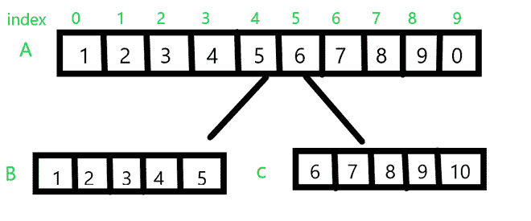

# 从指定位置分割数组的 Java 程序

> 原文:[https://www . geesforgeks . org/Java-程序-从指定位置拆分数组/](https://www.geeksforgeeks.org/java-program-to-split-an-array-from-specified-position/)

给定一个大小为 **N** 的数组，我们的工作是在用户指定的特定位置拆分数组。也会讨论边界的情况。

考虑下面的例子。



从上面的例子让 **A** 成为我们要拆分的原始数组。让 **N** 为数组 A 的长度(N = 10)，让 **pos** 为我们要拆分的位置。在上例中 **pos = 5** 。该位置之前的所有元素，即:来自索引 0–4 的元素将被拆分为一个数组，而来自索引 5–10 的元素将被拆分为后面的部分，分别标记为 **B** 和 **C** 。但如果位置为 0 或大于 **N** ，则无法拆分数组，并显示无效位置信息。

**示例:**

> **输入** : A[] = {1，2，3，4，5，6，7，8，9，0}
> 
> pos = 5
> 
> **输出** : B[] = { 1，2，3，4，5}
> 
> C[] = { 6，7，8，9，0}
> 
> **输入:** A[] = {1，2，3，4，5，6，7，8，9，0}
> 
> pos = -1
> 
> **输出:**无效位置
> 
> **输入:** A[] = {1，2，3，4，5，6，7，8，9，0}
> 
> pos = 20
> 
> **输出:**无效位置

**方法 1:** 在第一个方法中，我们将使用两个 for 循环。这种方法相当直接。

*   **第一步:**首先我们从用户那里接受 **pos** 的值
*   **步骤 2:** 我们声明两个数组 **B** 和 **C** 分别具有大小 **pos** 和**N–pos**。
*   **步骤 3:** 然后我们有两个循环第一个循环从**0–位置**初始化数组 **B** 开始，第二个循环从 **0 至 N–位置**初始化数组 **C** 结束。

我们还添加了一个助手方法 **pprint()** ，它接受一个数组并打印它。我们还有一个 if 语句来检查有效的 pos 值。

**示例:**

## Java 语言(一种计算机语言，尤用于创建网站)

```
import java.util.*;

public class SplittingArray1 {

    // this method accepts a array and prints the value
    static void pprint(int arr[])
    {
        for (int var : arr) {
            System.out.print(var + " ");
        }

        System.out.println();
    }

    public static void main(String args[])
    {
        // original array
        int a[] = { 1, 2, 3, 4, 5, 6, 7, 8, 9, 0 };

        // size of array
        int n = a.length;

        // accepting the value of position from the user

        Scanner scanner = new Scanner(System.in);

        System.out.println("Enter position to split.");

        int pos = scanner.nextInt();

        // validating the position for invalid values.
        if (pos > 0 && pos < n) {
            // method  1 : using two for loops

            // declaring array B and C
            int b[] = new int[pos];
            int c[] = new int[n - pos];

            // initializing array B
            for (int i = 0; i < pos; i++) {
                b[i] = a[i];
            }

            // initializing array C
            for (int i = 0; i < n - pos; i++) {
                c[i] = a[i + pos];
            }

            // printing the array b and c

            pprint(b);
            pprint(c);
        }

        else {
            System.out.println("Invalid position.");
        }
    }
}
```

**Output**

```
Enter position to split.
Invalid position.
```

**方法 2:** 在这种方法中，我们尝试使用一个循环来实现同一个程序，而不是使用两个循环。

*   **第一步****第二步**与方法一相似
*   **步骤 3:** 我们运行一个从 0 到 N–1 的 for 循环

```
 if index < pos 
   we initialize array B 
 else if pos >index 
   we initialize array C 
```

**示例:**

## Java 语言(一种计算机语言，尤用于创建网站)

```
import java.util.Arrays;
import java.util.Scanner;

public class SplittingArray2 {

    // this method accepts a array and prints the value
    static void pprint(int arr[])
    {
        for (int var : arr) {
            System.out.print(var + " ");
        }

        System.out.println();
    }

    public static void main(String args[])
    {

        // original array A
        int a[] = { 1, 2, 3, 4, 5, 6, 7, 8, 9, 0 };

        int n = a.length;

        Scanner scanner = new Scanner(System.in);

        System.out.println("Enter position to split.");

        int pos = scanner.nextInt();

        if (pos > 0 && pos < n) {
            // method  2 : using only one forloop

            int b[] = new int[pos];
            int c[] = new int[n - pos];

            // only using one for loop to solve the problem.
            for (int i = 0; i < n; i++) {

                if (i < pos)
                    b[i] = a[i];
                else
                    c[i - pos] = a[i];
            }

            // printing the array b and c

            pprint(b);
            pprint(c);
        }

        else {
            System.out.println("Invalid position.");
        }
    }
}
```

**Output**

```
Enter position to split.
Invalid position.
```

**方法 3:**

这是最短的方法。在这个方法中，我们使用内置的 **Arrays.copyOfRange()** 方法。

> 公共静态 short[]copy for range(short[]original，int from，int to)
> 
> **原件**—这是要从中复制一个范围的数组。
> 
> **从**开始-这是要复制的范围的初始索引，包括在内。
> 
> **至**:这是要复制的范围的最终索引，不包括在内。

**示例:**

## Java 语言(一种计算机语言，尤用于创建网站)

```
import java.util.Arrays;
import java.util.Scanner;

public class SplittingArray3 {

    static void pprint(int arr[])
    {
        for (int var : arr) {
            System.out.print(var + " ");
        }

        System.out.println();
    }

    public static void main(String args[])
    {
        int a[] = { 1, 2, 3, 4, 5, 6, 7, 8, 9, 0 };

        int n = a.length;

        Scanner scanner = new Scanner(System.in);

        System.out.println("Enter position to split.");

        int pos = scanner.nextInt();

        if (pos > 0 && pos < n) {

            // method  3 : using  Arrays.copyOfRange()

            int b[] = new int[pos];
            int c[] = new int[n - pos];

            // initializing array B by copying values from
            // index 0  to pos - 1
            b = Arrays.copyOfRange(a, 0, pos);

            // initializing array B by copying values from
            // index pos  to n - 1
            c = Arrays.copyOfRange(a, pos, n);

            // printing the array b and c

            pprint(b);
            pprint(c);
        }

        else {
            System.out.println("Invalid position.");
        }
    }
}
```

**Output**

```
Enter position to split.
Invalid position.
```

**时间复杂度:** O(n)

**空间复杂度:** O(n)