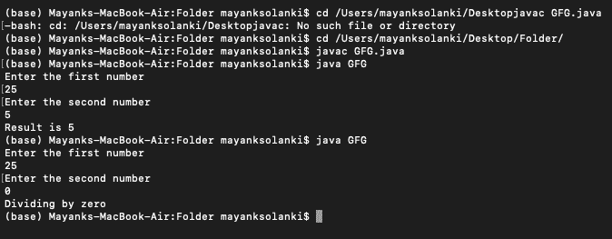

# 使用 Catch 处理异常的 Java 程序

> 原文:[https://www . geesforgeks . org/Java-程序-使用-捕获-处理-异常/](https://www.geeksforgeeks.org/java-program-to-use-catch-to-handle-the-exception/)

[异常](https://www.geeksforgeeks.org/exceptions-in-java/)是程序执行时发生的事件。由于这个异常，程序的正常流程将被中断。每当方法中发生异常时，方法都会创建一个对象并将该对象发送到运行时系统。比如需要打开的文件找不到、类找不到异常、算术异常、SQL 异常等。

要处理这些异常，有 4 种标准技术:

*   试捕
*   扔
*   投
*   使用 HandlerExceptionResolver 接口(仅在 Spring 框架中)

下面描述了 Catch 的用法:

**语法:**

```
try {

    // Put the code in the try block which may occur any
    // kind of exception
}
catch (ExceptionName e) {

    // handle the exception
}

```

下面讨论两个例子:

1.  使用预定义的异常类
2.  使用定义自己的异常类

**示例 1:使用带有预定义异常类的 catch】**

这是一个由 try 和 catch 块处理的预定义异常的示例。

## Java 语言(一种计算机语言，尤用于创建网站)

```
// Importing Classes/Files
import java.io.*;
import java.util.*;

// Importing Scanner Class for user input
import java.util.Scanner;

class GFG {

    // Main driver method
    public static void main(String[] args)
    {
        // Taking input from user
        Scanner input = new Scanner(System.in);

        // Taking input of first number
        System.out.println("Enter the first number");
        Integer number1 = input.nextInt();

        // Taking input of second number
        System.out.println("Enter the second number");
        Integer number2 = input.nextInt();

        // Considering values in order to show execution
        // number1 = 30; number2 = 10;

        try {

            // Dividing both the numbers
            int result = number1 / number2;

            // If number2 = 0, method will create the object
            // of ArithmeticException class and throw it
            System.out.println("Result is " + result);
            // Printing the result
        }

        // If there is any  exception in the try block
        // then catch will handle the exception
        catch (ArithmeticException e) {

            // Message printed after catching the exception
            System.out.println("Dividing by zero");
        }
    }
}
```

**输出:**



**示例 2:通过定义异常类**来使用 catch

在本例中，异常是用户定义的，其中异常类编写如下:

## Java 语言(一种计算机语言，尤用于创建网站)

```
// Java Program to Use catch to handle the exception

// Importing generic Classes/Files
import java.io.*;
import java.util.*;

class GFG {

    // Main driver method
    public static void main(String[] args)
    {

        // Taking input from keyboard/user
        Scanner input = new Scanner(System.in);

        // Enter any name
        System.out.println("Enter the name");
        String name = input.next();
        try {
            // Enter age
            System.out.println("Enter the age");

            // Using nextInt function to read integer
            Integer age = input.nextInt();
            if (age <= 18) {
                MyException me = new MyException();
                throw me;
                // If age is less then equal to 18 then the
                // object of MyException class will be throw
                // here
            }
            else

            // If age is greater then 18 i.e no exception is
            // there then try block will execute
            {
                System.out.println("name:" + name);
                System.out.println("age:" + age);
            }
        }
        catch (MyException e)
        // If the exception will occur then the object that
        // throw in the try block will be copied in to this
        // object
        {
            System.out.println(e);
        }
    }
}
// User defined MyException class
class MyException extends RuntimeException {
    public String toString()
    {
        // toString method will get Override here
        return "Age must be greater then 18";
    }
}
```

```
Input 1:
Enter the name : Geek
Enter the age: 18

Output: 
Age must be greater then 18  // Age is equal to 18 so the exception is occured

Input 2:
Enter the name : Geek
Enter the age: 20

Output:
name: Geek
age:20                      // Age is greater then 18 so no exception.

```