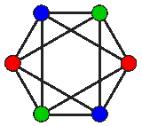

# Java 程序使用颜色互换法进行图的顶点着色

> 原文:[https://www . geesforgeks . org/Java-程序-使用-颜色-交换-方法-执行-图的顶点着色/](https://www.geeksforgeeks.org/java-program-to-use-color-interchange-method-to-perform-vertex-coloring-of-graph/)

图着色是为图的某些元素分配颜色的方法。最常见的方法是顶点着色法。我们将被赋予 m 种颜色，我们将把每种颜色应用到顶点。我们在这里使用“回溯”算法。



插图:

> **输入:** V = 4，C = 2
> 
> ```java
> Here V denotes colour and C denotes color
> ```
> 
> 图表:
> 
> ```java
> {
> { 0, 1, 0, 0, 0, 1, 0, 0, 0, 0 },
> { 1, 0, 1, 0, 0, 0, 1, 0, 0, 0 },
> { 0, 1, 0, 1, 0, 0, 0, 1, 0, 0 },
> { 0, 0, 1, 0, 1, 0, 0, 0, 1, 0 } 
> };               
> ```
> 
> **输出:**解存在
> 
> 颜色:1 2 1 2

**进场:**

1.  isPossible()方法通过检查“v”的相邻顶点的颜色是否具有我们想要分配给该顶点的颜色“c ”,来检查我们是否可以将颜色保持在该特定顶点。
2.  Graphcoloring()方法是我们借助 *isPossible()* 函数为顶点 v 尝试不同的颜色。
3.  main()函数只是初始化 colors[]数组，其用法与贪婪算法相同，然后调用顶点 0 的 graphcoloring()函数。
4.  当算法成功时，它会打印解决方案，否则不存在解决方案。

**实施:**

**例**

## Java 语言(一种计算机语言，尤用于创建网站)

```java
// Java Program to Use Color Interchange Method to
// Perform Vertex Coloring of Graph

// Importing input output classes
import java.io.*;
// Importing Scanner class to take input from the user
import java.util.Scanner;

// Main class
// GraphColouring
public class GFG {

    // Declaring variables for
    // vertices, Number of colours,
    // colour array, graph array
    private int vert, numCol;
    private int[] colour;
    private int[][] graph;

    // Method 1
    // To colour the graph by
    // Taking vertices to be size of graph array
    public void graphcolour(int[][] g, int c)
    {
        vert = g.length;

        // Taking the number of colour
        numCol = c;

        // Taking colour array with size vertices
        colour = new int[vert];

        // Here graph is g
        graph = g;

        // Now let us implement the try catch exception
        // If the graph is empty it shows no solution

        // Try block to check for exception
        try {

            solve(0);
            System.out.println("No solution");
        }

        // Catch block to handle the exception
        catch (Exception e) {

            // If the graph has something
            // It shows solution exists
            System.out.println("\nSolution exists ");

            // It displays the output
            display();
        }
    }

    // Method 2
    // To siolve the solve function
    public void solve(int ve) throws Exception
    {

        // If vertices on both the cases are equal
        // Then we print the solution
        if (ve == vert)
            throw new Exception("Solution found");

        // Now when we iterate the loop from i till colours.
        for (int i = 1; i <= numCol; i++) {

            // Now to check the is Possible function
            // we check if there is any such possible
            // solution if we find one then..
            if (isPossible(ve, i)) {

                // The index of the colour array is set to
                // the index of i and sent for rescurrsion
                // The function again takes solve function
                // and solves until we find all the suitable
                // outcomes Then we set the colour of that
                // index to 0
                colour[ve] = i;
                solve(ve + 1);
                colour[ve] = 0;
            }
        }
    }

    // Method 3
    // is Possible function
    public boolean isPossible(int ve, int c)
    {

        // Now it iterates from i till vert
        for (int i = 0; i < vert; i++)

            // Now if graph value at any matrix index is
            // equal to 1 and so is the colour equal to the
            // colour index then We return false else true
            if (graph[ve][i] == 1 && c == colour[i])
                return false;

        return true;
    }

    // Method 4
    // Display function
    public void display()
    {

        // Display message only 
        System.out.println("\nColours: ");

        // Now iterating the ith function
        for (int i = 0; i < vert; i++)

            // The colour will be displayed
            System.out.print(colour[i] + " ");

        // New line
        System.out.println();
    }

    // Method 5
    // Main driver method
    public static void main(String[] args)
    {

        // Display message only
        System.out.println("Test");

        // Creating an object of main class
        // in the main() method
        GFG gc = new GFG();

        // The vertices of the array are 4
        int vert = 4;

        // The graph array is declared below
        int[][] graph
            = { { 0, 1, 0, 0, 0, 1, 0, 0, 0, 0 },
                { 1, 0, 1, 0, 0, 0, 1, 0, 0, 0 },
                { 0, 1, 0, 1, 0, 0, 0, 1, 0, 0 },
                { 0, 0, 1, 0, 1, 0, 0, 0, 1, 0 } };

        // Number of colours totally are 2
        int c = 2;

        // Calling the method 1 to colour
        // graph array declared and initialized above
        gc.graphcolour(graph, c);
    }
}
```

**Output**

```java
Test

Solution exists 

Colours: 
1 2 1 2 

```