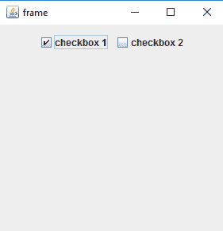
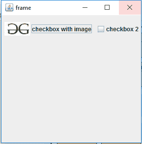
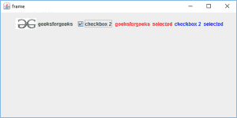

# Java Swing | JCheckBox 带示例

> 原文:[https://www . geesforgeks . org/Java-swing-jcheckbox-examples/](https://www.geeksforgeeks.org/java-swing-jcheckbox-examples/)

JCheckBox 是 Java Swing 包的一部分。可以选择或取消选择 JCheckBox。它向用户显示它的状态。JCheckBox 是 CheckBox 的一个实现。JCheckBox 继承了 JToggleButton 类。

**该类的构造函数为:**

1.  **JCheckBox()** :创建一个没有文本或图标的新复选框
2.  **JCheckBox(图标 i)** :用指定的图标创建新的复选框
3.  **JCheckBox(图标图标，布尔值)**:创建一个新的复选框，指定图标，布尔值指定它是否被选中。
4.  **JCheckBox(字符串 t)** :用指定的字符串创建一个新的复选框
5.  **JCheckBox(字符串文本，布尔值选中)**:用指定的字符串创建一个新的复选框，布尔值指定它是否被选中。
6.  **JCheckBox(字符串文本，图标图标)**:用指定的字符串和图标创建一个新的复选框。
7.  **JCheckBox(字符串文本，图标图标，布尔值选中)**:创建一个新的复选框，指定字符串和图标，布尔值指定是否选中。

**向复选框添加项目监听器的方法。**

1.  **添加动作侦听器(ItemListener l)** :向组件添加项目侦听器
2.  **item state changed(item event e)**:当应用侦听器的项的状态发生变化时调用的抽象函数
3.  **getItem()** :返回与状态发生变化的项目关联的组件特定对象
4.  **getStateChange()** :返回项目的新状态。ItemEvent 类定义了两种状态:选定和取消选定。
5.  **getSource()** :返回触发项目事件的组件。

**常用方法:**

1.  **设置图标(图标一)**:将复选框的图标设置为给定的图标
2.  **设置文本(字符串)**:将复选框的文本设置为给定文本
3.  **设置选定(布尔值 b)** :如果传递的布尔值为真，则将复选框设置为选定，反之亦然
4.  **getIcon()** :返回复选框的图像
5.  **getText()** :返回复选框的文本
6.  **updateUI()** :用当前观感的值重置 UI 属性。
7.  **getUI()** :返回渲染此组件的观感对象。
8.  **ParaString()**:返回此 JCheckBox 的字符串表示形式。
9.  **getUIClassID()** :返回渲染此组件的外观类的名称。
10.  **getAccessibleContext()** :获取与此 JCheckBox 关联的 AccessibleContext。
11.  **isBorderPaintedFlat()** :获取 BorderPaintedFlat 属性的值。
12.  **设置 BorderPaintedFlat(布尔 b)** :设置 borderPaintedFlat 属性，

**以下程序将说明 JCheckBox** 的使用

**1。程序使用 JCheckBox** 创建一个简单的复选框

```
// java Program to create a simple checkbox using JCheckBox
import java.awt.event.*;
import java.awt.*;
import javax.swing.*;
class solve extends JFrame {

    // frame
    static JFrame f;

    // main class
    public static void main(String[] args)
    {
        // create a new frame
        f = new JFrame("frame");

        // set layout of frame
        f.setLayout(new FlowLayout());

        // create checkbox
        JCheckBox c1 = new JCheckBox("checkbox 1");
        JCheckBox c2 = new JCheckBox("checkbox 2");

        // create a new panel
        JPanel p = new JPanel();

        // add checkbox to panel
        p.add(c1);
        p.add(c2);

        // add panel to frame
        f.add(p);

        // set the size of frame
        f.setSize(300, 300);

        f.show();
    }
}
```

**输出:**


**2。程序创建一个带有图标的复选框。**

```
// java Program to create a checkbox with a icon .
import java.awt.event.*;
import java.awt.*;
import javax.swing.*;
class solve extends JFrame {

    // frame
    static JFrame f;

    // main class
    public static void main(String[] args)
    {
        // create a new frame
        f = new JFrame("frame");

        // set layout of frame
        f.setLayout(new FlowLayout());

        // create checkbox
        JCheckBox c1 = new JCheckBox("checkbox with image", new ImageIcon("f:/gfg.jpg"), true);
        JCheckBox c2 = new JCheckBox("checkbox 2");

        // create a new panel
        JPanel p = new JPanel();

        // add checkbox to panel
        p.add(c1);
        p.add(c2);

        // add panel to frame
        f.add(p);

        // set the size of frame
        f.setSize(300, 300);

        f.show();
    }
}
```

**输出:**


**3。程序创建一个复选框和它的项目监听器。**

```
// java Program to create a checkbox and ItemListener to it.
import java.awt.event.*;
import java.awt.*;
import javax.swing.*;
class solve extends JFrame implements ItemListener {

    // frame
    static JFrame f;

    // label
    static JLabel l, l1;

    // checkbox
    static JCheckBox c1, c2;

    // main class
    public static void main(String[] args)
    {
        // create a new frame
        f = new JFrame("frame");

        // create a object
        solve s = new solve();

        // set layout of frame
        f.setLayout(new FlowLayout());

        // create checkbox
        c1 = new JCheckBox("geeksforgeeks", new ImageIcon("f:/gfg.jpg"), false);
        c2 = new JCheckBox("checkbox 2", false);

        // add ItemListener
        c1.addItemListener(s);
        c2.addItemListener(s);

        // create labels
        l = new JLabel("geeksforgeeks not selected");
        l1 = new JLabel("checkbox2 not selected");

        // set color of text
        l.setForeground(Color.red);
        l1.setForeground(Color.blue);

        // create a new panel
        JPanel p = new JPanel();

        // add checkbox to panel
        p.add(c1);
        p.add(c2);
        p.add(l);
        p.add(l1);

        // add panel to frame
        f.add(p);

        // set the size of frame
        f.setSize(600, 300);

        f.show();
    }
    public void itemStateChanged(ItemEvent e)
    {
        // if the state of checkbox1 is changed
        if (e.getSource() == c1) {
            if (e.getStateChange() == 1)
                l.setText("geeksforgeeks  selected");
            else
                l.setText("geeksforgeeks  not selected");
        }

        // if the state of checkbox2 is changed
        else {
            if (e.getStateChange() == 1)
                l1.setText("checkbox 2  selected");
            else
                l1.setText("checkbox 2 not selected");
        }
    }
}
```

**输出:**

**注意:以上程序可能无法在在线编译器中运行，请使用离线 IDE**