# Java 摇摆| JFileChooser

> 哎哎哎:# t0]https://www . geeksforgeeks . org/Java-swing-jfile chooser/

JFileChooser 是 java Swing 包的一部分。java Swing 包是 JavaTM 基础类(JFC)的一部分。JFC 包含许多有助于用 java 构建图形用户界面的特性。Java Swing 提供了按钮、面板、对话框等组件。JFileChooser 是提示用户选择文件或目录的一种简单有效的方法。
在本文中，我们将看到如何在 java swing 中使用 JFileChooser。
**JFileChooser 的构造函数为:**

**1。JFileChooser()**–指向用户默认目录
的空构造函数

## Java 语言(一种计算机语言，尤用于创建网站)

```java
// Using this process to invoke the constructor,
// JFileChooser points to user's default directory
JFileChooser j = new JFileChooser();

// Open the save dialog
j.showSaveDialog(null);
```

**代码片段的输出:**


**2。JFileChooser(字符串)**–使用给定的路径

## Java 语言(一种计算机语言，尤用于创建网站)

```java
// Using this process to invoke the constructor,
// JFileChooser points to the mentioned path
JFileChooser j = new JFileChooser("d:");

// Open the save dialog
j.showSaveDialog(null);
```

**代码片段的输出:**


**3。JFileChooser(文件)**–使用给定的文件作为路径

## Java 语言(一种计算机语言，尤用于创建网站)

```java
// Using this process to invoke the constructor,
// JFileChooser points to the mentioned path
// of the file passed
JFileChooser j = new JFileChooser(new File("C:\\Users\\pc\\Documents\\New folder\\"));

// Open the save dialog
j.showSaveDialog(null);
```

**代码片段的输出:**


**4。jfilesystemview(文件系统视图)**–使用给定的文件系统视图

## Java 语言(一种计算机语言，尤用于创建网站)

```java
// In this process argument passed
// is an object of File System View
JFileChooser j = new JFileChooser(FileSystemView.getFileSystemView());

// Open the save dialog
j.showSaveDialog(null);
```

**代码片段的输出:**


**5。JFileChooser(字符串，文件系统视图)**–使用给定的路径和文件系统视图

## Java 语言(一种计算机语言，尤用于创建网站)

```java
// In this process argument passed is an object
// of File System View, and a path
JFileChooser j = new JFileChooser("d:", FileSystemView.getFileSystemView());

// Open the save dialog
j.showSaveDialog(null);
```

**代码片段的输出:**


**6。JFileChooser(文件，文件系统视图)**–使用给定的当前目录和文件系统视图

## Java 语言(一种计算机语言，尤用于创建网站)

```java
// In this process argument passed is an object
// of File System View and a object of
// File class
File f = new File("C:\\Users\\pc\\Documents\\New folder\\");
JFileChooser j = new JFileChooser(f, FileSystemView.getFileSystemView());

// Open the save dialog
j.showSaveDialog(null);
```

**代码片段的输出:**


**注意:**上面给出的代码是代码片段，不是完整的代码，上面给出的代码片段应该根据程序员的需要和判断来调用构造函数，上面提到的路径是任意的。用户应该根据自己的需要设置路径。

**JFileChooser 的实际应用**

以下代码不会在联机编译器中执行。请使用离线 IDE
**1。使用 JFileChooser**
创建打开或保存对话框

## Java 语言(一种计算机语言，尤用于创建网站)

```java
// Java program to create open or
// save dialog using JFileChooser
import java.io.*;
import javax.swing.*;
import java.awt.event.*;
import javax.swing.filechooser.*;
class filechooser extends JFrame implements ActionListener {

    // Jlabel to show the files user selects
    static JLabel l;

    // a default constructor
    filechooser()
    {
    }

    public static void main(String args[])
    {
        // frame to contains GUI elements
        JFrame f = new JFrame("file chooser");

        // set the size of the frame
        f.setSize(400, 400);

        // set the frame's visibility
        f.setVisible(true);

        f.setDefaultCloseOperation(JFrame.EXIT_ON_CLOSE);

        // button to open save dialog
        JButton button1 = new JButton("save");

        // button to open open dialog
        JButton button2 = new JButton("open");

        // make an object of the class filechooser
        filechooser f1 = new filechooser();

        // add action listener to the button to capture user
        // response on buttons
        button1.addActionListener(f1);
        button2.addActionListener(f1);

        // make a panel to add the buttons and labels
        JPanel p = new JPanel();

        // add buttons to the frame
        p.add(button1);
        p.add(button2);

        // set the label to its initial value
        l = new JLabel("no file selected");

        // add panel to the frame
        p.add(l);
        f.add(p);

        f.show();
    }
    public void actionPerformed(ActionEvent evt)
    {
        // if the user presses the save button show the save dialog
        String com = evt.getActionCommand();

        if (com.equals("save")) {
            // create an object of JFileChooser class
            JFileChooser j = new JFileChooser(FileSystemView.getFileSystemView().getHomeDirectory());

            // invoke the showsSaveDialog function to show the save dialog
            int r = j.showSaveDialog(null);

            // if the user selects a file
            if (r == JFileChooser.APPROVE_OPTION)

            {
                // set the label to the path of the selected file
                l.setText(j.getSelectedFile().getAbsolutePath());
            }
            // if the user cancelled the operation
            else
                l.setText("the user cancelled the operation");
        }

        // if the user presses the open dialog show the open dialog
        else {
            // create an object of JFileChooser class
            JFileChooser j = new JFileChooser(FileSystemView.getFileSystemView().getHomeDirectory());

            // invoke the showsOpenDialog function to show the save dialog
            int r = j.showOpenDialog(null);

            // if the user selects a file
            if (r == JFileChooser.APPROVE_OPTION)

            {
                // set the label to the path of the selected file
                l.setText(j.getSelectedFile().getAbsolutePath());
            }
            // if the user cancelled the operation
            else
                l.setText("the user cancelled the operation");
        }
    }
}
```

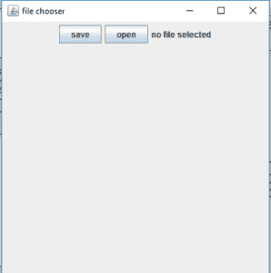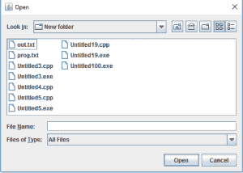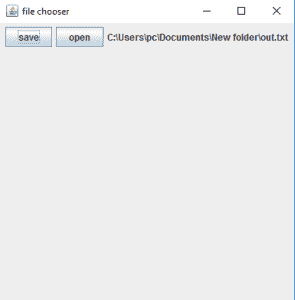

**2。使用 JFileChooser 仅选择目录**

## Java 语言(一种计算机语言，尤用于创建网站)

```java
// Java program to use JFileChooser
// to select  directory only
import java.io.*;
import javax.swing.*;
import java.awt.event.*;
import javax.swing.filechooser.*;
class filechooser extends JFrame implements ActionListener {
    // Jlabel to show the files user selects
    static JLabel l;

    // a default constructor
    filechooser()
    {
    }

    public static void main(String args[])
    {
        // frame to contains GUI elements
        JFrame f = new JFrame("file chooser to select directories");

        // set the size of the frame
        f.setSize(400, 400);

        // set the frame's visibility
        f.setVisible(true);

        f.setDefaultCloseOperation(JFrame.EXIT_ON_CLOSE);

        // button to open save dialog
        JButton button1 = new JButton("save");

        // button to open open dialog
        JButton button2 = new JButton("open");

        // make an object of the class filechooser
        filechooser f1 = new filechooser();

        // add action listener to the button to capture user
        // response on buttons
        button1.addActionListener(f1);
        button2.addActionListener(f1);

        // make a panel to add the buttons and labels
        JPanel p = new JPanel();

        // add buttons to the frame
        p.add(button1);
        p.add(button2);

        // set the label to its initial value
        l = new JLabel("no file selected");

        // add panel to the frame
        p.add(l);
        f.add(p);

        f.show();
    }
    public void actionPerformed(ActionEvent evt)
    {
        // if the user presses the save button show the save dialog
        String com = evt.getActionCommand();

        if (com.equals("save")) {
            // create an object of JFileChooser class
            JFileChooser j = new JFileChooser(FileSystemView.getFileSystemView().getHomeDirectory());

            // set the selection mode to directories only
            j.setFileSelectionMode(JFileChooser.DIRECTORIES_ONLY);

            // invoke the showsSaveDialog function to show the save dialog
            int r = j.showSaveDialog(null);

            if (r == JFileChooser.APPROVE_OPTION) {
                // set the label to the path of the selected directory
                l.setText(j.getSelectedFile().getAbsolutePath());
            }
            // if the user cancelled the operation
            else
                l.setText("the user cancelled the operation");
        }
        // if the user presses the open dialog show the open dialog
        else {
            // create an object of JFileChooser class
            JFileChooser j = new JFileChooser(FileSystemView.getFileSystemView().getHomeDirectory());

            // set the selection mode to directories only
            j.setFileSelectionMode(JFileChooser.DIRECTORIES_ONLY);

            // invoke the showsOpenDialog function to show the save dialog
            int r = j.showOpenDialog(null);

            if (r == JFileChooser.APPROVE_OPTION) {
                // set the label to the path of the selected directory
                l.setText(j.getSelectedFile().getAbsolutePath());
            }
            // if the user cancelled the operation
            else
                l.setText("the user cancelled the operation");
        }
    }
}
```

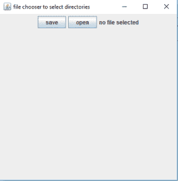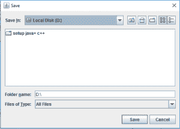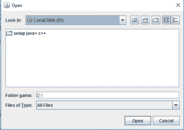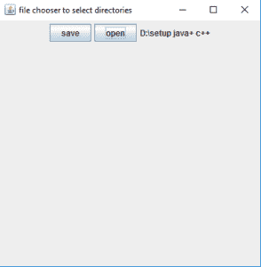

**3。使用 JFileChooser 允许多重选择文件**

## Java 语言(一种计算机语言，尤用于创建网站)

```java
// Java program to use JFileChooser to allow multiple selection of files
import java.io.*;
import javax.swing.*;
import java.awt.event.*;
import javax.swing.filechooser.*;
class filechooser extends JFrame implements ActionListener {
    // Jlabel to show the files user selects
    static JLabel l;

    // a default constructor
    filechooser()
    {
    }

    public static void main(String args[])
    {
        // frame to contains GUI elements
        JFrame f = new JFrame("file chooser to select multiple files at a time");

        // set the size of the frame
        f.setSize(400, 400);

        // set the frame's visibility
        f.setVisible(true);

        f.setDefaultCloseOperation(JFrame.EXIT_ON_CLOSE);

        // button to open save dialog
        JButton button1 = new JButton("save");

        // button to open open dialog
        JButton button2 = new JButton("open");

        // make an object of the class filechooser
        filechooser f1 = new filechooser();

        // add action listener to the button to capture user
        // response on buttons
        button1.addActionListener(f1);
        button2.addActionListener(f1);

        // make a panel to add the buttons and labels
        JPanel p = new JPanel();

        // add buttons to the frame
        p.add(button1);
        p.add(button2);

        // set the label to its initial value
        l = new JLabel("no file selected");

        // add panel to the frame
        p.add(l);
        f.add(p);

        f.show();
    }
    public void actionPerformed(ActionEvent evt)
    {
        // if the user presses the save button show the save dialog
        String com = evt.getActionCommand();

        if (com.equals("save")) {
            // create an object of JFileChooser class
            JFileChooser j = new JFileChooser(FileSystemView.getFileSystemView().getHomeDirectory());

            // allow multiple file selection
            j.setMultiSelectionEnabled(true);

            // invoke the showsSaveDialog function to show the save dialog
            int r = j.showSaveDialog(null);

            if (r == JFileChooser.APPROVE_OPTION) {
                // get the selelcted files
                File files[] = j.getSelectedFiles();

                int t = 0;
                // set text to blank
                l.setText("");

                // set the label to the path of the selected files
                while (t++ < files.length)
                    l.setText(l.getText() + " " + files[t - 1].getName());
            }
            // if the user cancelled the operation
            else
                l.setText("the user cancelled the operation");
        }

        // if the user presses the open dialog show the open dialog
        else {
            // create an object of JFileChooser class
            JFileChooser j = new JFileChooser(FileSystemView.getFileSystemView().getHomeDirectory());

            // allow multiple file selection
            j.setMultiSelectionEnabled(true);

            // invoke the showsOpenDialog function to show the save dialog
            int r = j.showOpenDialog(null);

            if (r == JFileChooser.APPROVE_OPTION) {
                // get the selelcted files
                File files[] = j.getSelectedFiles();

                // set text to blank
                l.setText("");

                int t = 0;
                // set the label to the path of the selected files
                while (t++ < files.length)
                    l.setText(l.getText() + " " + files[t - 1].getName());
            }
            // if the user cancelled the operation
            else
                l.setText("the user cancelled the operation");
        }
    }
}
```

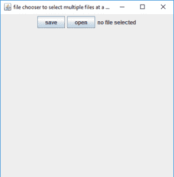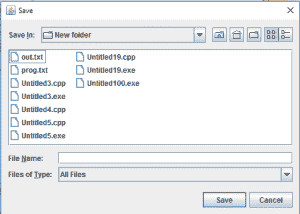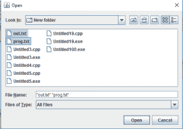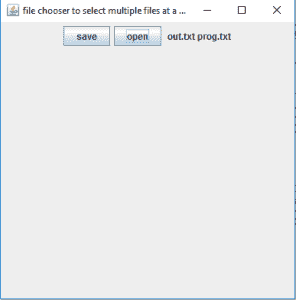

**4。使用 JFileChooser 限制显示给用户的文件类型**

## Java 语言(一种计算机语言，尤用于创建网站)

```java
// Java program to use JFileChooser to restrict
// the type of files shown to the user
import java.io.*;
import javax.swing.*;
import java.awt.event.*;
import javax.swing.filechooser.*;
class filechooser extends JFrame implements ActionListener {
    // Jlabel to show the files user selects
    static JLabel l;

    // a default constructor
    filechooser()
    {
    }

    public static void main(String args[])
    {
        // frame to contains GUI elements
        JFrame f = new JFrame("file chooser");

        // set the size of the frame
        f.setSize(400, 400);

        // set the frame's visibility
        f.setVisible(true);

        f.setDefaultCloseOperation(JFrame.EXIT_ON_CLOSE);

        // button to open save dialog
        JButton button1 = new JButton("save");

        // button to open open dialog
        JButton button2 = new JButton("open");

        // make an object of the class filechooser
        filechooser f1 = new filechooser();

        // add action listener to the button to capture user
        // response on buttons
        button1.addActionListener(f1);
        button2.addActionListener(f1);

        // make a panel to add the buttons and labels
        JPanel p = new JPanel();

        // add buttons to the frame
        p.add(button1);
        p.add(button2);

        // set the label to its initial value
        l = new JLabel("no file selected");

        // add panel to the frame
        p.add(l);
        f.add(p);

        f.show();
    }
    public void actionPerformed(ActionEvent evt)
    {
        // if the user presses the save button show the save dialog
        String com = evt.getActionCommand();

        if (com.equals("save")) {
            // create an object of JFileChooser class
            JFileChooser j = new JFileChooser(FileSystemView.getFileSystemView().getHomeDirectory());

            // resctrict the user to select files of all types
            j.setAcceptAllFileFilterUsed(false);

            // set a title for the dialog
            j.setDialogTitle("Select a .txt file");

            // only allow files of .txt extension
            FileNameExtensionFilter restrict = new FileNameExtensionFilter("Only .txt files", "txt");
            j.addChoosableFileFilter(restrict);

            // invoke the showsSaveDialog function to show the save dialog
            int r = j.showSaveDialog(null);

            // if the user selects a file
            if (r == JFileChooser.APPROVE_OPTION)

            {
                // set the label to the path of the selected file
                l.setText(j.getSelectedFile().getAbsolutePath());
            }
            // if the user cancelled the operation
            else
                l.setText("the user cancelled the operation");
        }
        // if the user presses the open dialog show the open dialog

        else {
            // create an object of JFileChooser class
            JFileChooser j = new JFileChooser(FileSystemView.getFileSystemView().getHomeDirectory());

            // resctrict the user to select files of all types
            j.setAcceptAllFileFilterUsed(false);

            // set a title for the dialog
            j.setDialogTitle("Select a .txt file");

            // only allow files of .txt extension
            FileNameExtensionFilter restrict = new FileNameExtensionFilter("Only .txt files", "txt");
            j.addChoosableFileFilter(restrict);

            // invoke the showsOpenDialog function to show the save dialog
            int r = j.showOpenDialog(null);

            // if the user selects a file
            if (r == JFileChooser.APPROVE_OPTION) {
                // set the label to the path of the selected file
                l.setText(j.getSelectedFile().getAbsolutePath());
            }
            // if the user cancelled the operation
            else
                l.setText("the user cancelled the operation");
        }
    }
}
```

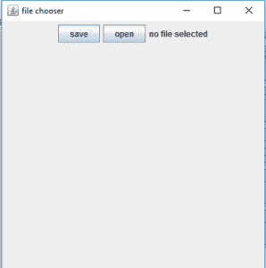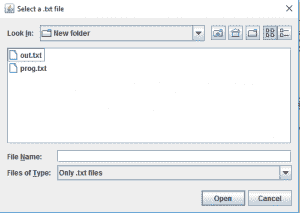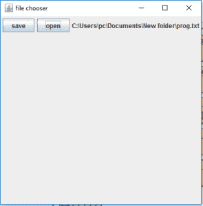

**注意:**
也可以使用 setApproveButtonText(字符串)功能自定义审批按钮。这将把批准按钮
的文本设置为所需的文本。