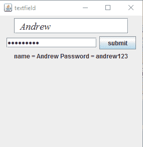
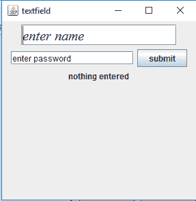
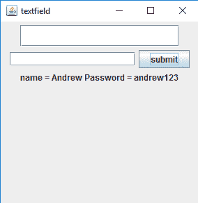

# Java swing | jppassword field

> 原文:[https://www.geeksforgeeks.org/java-swing-jpasswordfield/](https://www.geeksforgeeks.org/java-swing-jpasswordfield/)

PasswordField 是 javax.swing 包的一部分。类 JPasswordField 是一个允许编辑单行文本的组件，其中视图指示输入的内容没有显示实际的字符。JPasswordField 继承了 javax.swing 包中的 JTextField 类。
**类的构造函数有:**

1.  **JPasswordField()** :创建新密码字段的构造函数

2.  **JPasswordField(int columns)**:用指定的列数创建新的空 PasswordField 的构造函数。

3.  **JPasswordField(字符串密码)**:创建一个新的空密码字段的构造函数，该字段用给定的字符串初始化。

4.  **JPasswordField(String Password，int columns)** :用给定的字符串和指定的列数创建新的空 PasswordField 的构造函数。

5.  **JPasswordField(Document doc，String Password，int columns)** :使用给定的文本存储模型和给定的列数创建 PasswordField 的构造函数。

**JPasswordField 常用方法:**

1.  **char getEchoChar()** :返回 JPasswordField 中用于回显的字符。

2.  **设置回声字符(char c)** :设置 JPasswordField 的回声字符。

3.  **String getPassword()** :返回 JPasswordField 中包含的文本。

4.  **String getText()** :返回 JPasswordField 中包含的文本。

**1。使用 JTextField 和 JPasswordField**
输入姓名和密码的程序

## Java 语言(一种计算机语言，尤用于创建网站)

```
// Java Program to enter name and password
// using JTextField and JPasswordField
import java.awt.event.*;
import java.awt.*;
import javax.swing.*;
class text extends JFrame implements ActionListener {
    // JTextField
    static JTextField t;

    // JPasswordField
    static JPasswordField pass;

    // JFrame
    static JFrame f;

    // JButton
    static JButton b;

    // label to display text
    static JLabel l;

    // default constructor
    text()
    {
    }

    // main class
    public static void main(String[] args)
    {
        // create a new frame to store text field and button
        f = new JFrame("textfield");

        // create a label to display text
        l = new JLabel("nothing entered");

        // create a new button
        b = new JButton("submit");

        // create a object of the text class
        text te = new text();

        // addActionListener to button
        b.addActionListener(te);

        // create a object of JTextField with 16 columns and initial text
        t = new JTextField("enter name", 16);

        // create a object of passwordField with 16 columns
        pass = new JPasswordField(16);

        // create an object of font type
        Font fo = new Font("Serif", Font.ITALIC, 20);

        // set the font of the textfield
        t.setFont(fo);

        // create a panel to add buttons and textfield
        JPanel p = new JPanel();

        // add buttons and textfield to panel
        p.add(t);
        p.add(pass);
        p.add(b);
        p.add(l);

        // add panel to frame
        f.add(p);

        // set the size of frame
        f.setSize(300, 300);

        f.show();
    }

    // if the button is pressed
    public void actionPerformed(ActionEvent e)
    {
        String s = e.getActionCommand();
        if (s.equals("submit")) {
            // set the text of the label to the text of the field
            l.setText("name = " + t.getText() + "\t Password = " + pass.getText());

            // set the text of field to blank
            t.setText("  ");

            // set the text of password field to blank
            pass.setText("");
        }
    }
}
```

**输出:**



**2。更改 JPasswordField 的回显字符并为密码字段**
设置初始文本的程序

## Java 语言(一种计算机语言，尤用于创建网站)

```
// Java Program to change the echo character of
// JPasswordField and set initial text for password field
import java.awt.event.*;
import java.awt.*;
import javax.swing.*;
class text extends JFrame implements ActionListener, FocusListener {
    // JTextField
    static JTextField t;

    // JPasswordField
    static JPasswordField pass;

    // JFrame
    static JFrame f;

    // JButton
    static JButton b;

    // label to display text
    static JLabel l;

    // default constructor
    text()
    {
    }

    // main class
    public static void main(String[] args)
    {
        // create a new frame to store text field and button
        f = new JFrame("textfield");

        // create a label to display text
        l = new JLabel("nothing entered");

        // create a new button
        b = new JButton("submit");

        // create a object of the text class
        text te = new text();

        // addActionListener to button
        b.addActionListener(te);

        // create a object of JTextField with 16 columns and initial text
        t = new JTextField("enter name", 16);

        // create a object of passwordField with 16 columns
        pass = new JPasswordField(16);

        // add FocusListener to passwordField
        pass.addFocusListener(te);

        // set the echo character of the password field
        pass.setEchoChar((char)0);

        // set initial text for password field
        pass.setText("enter password");

        // set the echo character of the password field
        // create an object of font type
        Font fo = new Font("Serif", Font.ITALIC, 20);

        // set the font of the textfield
        t.setFont(fo);

        // create a panel to add buttons and textfield
        JPanel p = new JPanel();

        // add buttons and textfield to panel
        p.add(t);
        p.add(pass);
        p.add(b);
        p.add(l);

        // add panel to frame
        f.add(p);

        // set the size of frame
        f.setSize(300, 300);

        f.show();
    }
    // flag to set the text to blank for the first time when the component gets focus
    boolean flag = true;

    // events of focus listener
    // when focus is gained
    public void focusGained(FocusEvent e)
    {
        if (flag) {
            // set a definite echo char
            pass.setEchoChar('*');

            // only set the text to blank for 1st time
            // set the text to blank
            pass.setText("");
            flag = false;
        }
    }

    // when the focus is lost
    public void focusLost(FocusEvent e)
    {
    }

    // if the button is pressed
    public void actionPerformed(ActionEvent e)
    {
        String s = e.getActionCommand();
        if (s.equals("submit")) {
            // set the text of the label to the text of the field
            l.setText("name = " + t.getText() + "\t, Password = " + pass.getText());

            // set the text of field to blank
            t.setText("  ");

            // set the text of password field to blank
            pass.setText("");
        }
    }
}
```



**注意:**上述程序可能无法在使用离线 IDE 的在线编译器中运行。
程序员可以根据需要更改密码的默认文本和列数。