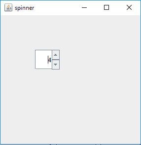
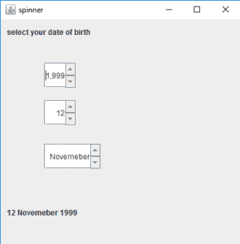

# Java 摇摆| JSpinner

> 原文:[https://www.geeksforgeeks.org/java-swing-jspinner/](https://www.geeksforgeeks.org/java-swing-jspinner/)

JSpinner 是 javax.swing 包的一部分。JSpinner 包含一行输入，可能是一个有序序列中的数字或对象。用户可以手动将合法数据键入微调器的文本字段。微调器有时是首选的，因为它们不需要下拉列表。微调器包含一个向上箭头和一个向下箭头，以显示按下时的上一个和下一个元素。

**JSpinner 的构造函数为:**

1.  **JSpinner():** 创建一个空微调器，初始值设置为零，没有约束。
2.  **JSpinner( SpinnerModel 模型):**用作为参数传递的指定微调器模型创建微调器。

**常用的方法有:**

1.  **SpinnerListModel(列表 l):** 用列表 l 的元素创建一个 spinner 模型。这个 spinner 模型可以用来设置为 spinner 的模型。
2.  **SpinnerNumberModel(int value，int max，int min，int step):** 返回一个 spinner 模型，其初始值设置为 value，有最小值和最大值，以及一个确定的 step 值。
3.  **设置值(对象 v):** 将微调器的值设置为作为参数传递的对象。
4.  **getValue():** 返回微调器的当前值。
5.  **getPreviousValue():** 返回微调器的前一个值。
6.  **getNextValue():** 返回微调器的下一个值。

**1。程序创建一个简单的 JSpinner**

## Java 语言(一种计算机语言，尤用于创建网站)

```
// java Program to create a
// simple JSpinner
import java.awt.event.*;
import javax.swing.*;
import java.awt.*;
class spinner extends JFrame {
    // frame
    static JFrame f;

    // default constructor
    spinner()
    {
    }

    // main class
    public static void main(String[] args)
    {
        // create  a new frame
        f = new JFrame("spinner");

        // create a JSpinner
        JSpinner s = new JSpinner();

        // set Bounds for spinner
        s.setBounds(70, 70, 50, 40);

        // set layout for frame
        f.setLayout(null);

        // add panel to frame
        f.add(s);

        // set frame size
        f.setSize(300, 300);

        f.show();
    }
}
```

**输出:**



**2。程序创建一个 JSpinner，并向其中添加 ChangeListener 使用 JSpinner 程序选择您的出生日期。**

## Java 语言(一种计算机语言，尤用于创建网站)

```
// Java program to select your
// date of birth using JSpinner
import java.awt.event.*;
import javax.swing.*;
import java.awt.*;
import javax.swing.event.*;
class spinner1 extends JFrame implements ChangeListener {
    // frame
    static JFrame f;

    // label
    static JLabel l, l1;

    // spinner
    static JSpinner s, s1, s2;

    // default constructor
    spinner1()
    {
    }

    // main class
    public static void main(String[] args)
    {
        // create an object of the class
        spinner1 sp1 = new spinner1();

        // create  a new frame
        f = new JFrame("spinner");

        // create a label
        l = new JLabel("select your date of birth");
        l1 = new JLabel("1 January 2000");

        // create a JSpinner with a minimum, maximum and step value
        s = new JSpinner();
        s1 = new JSpinner(new SpinnerNumberModel(1, 1, 31, 1));

        // setvalue of year
        s.setValue(2000);

        // store the months
        String months[] = { "January", "February", "March",
        "April", "May", "June", "July", "August",
        "September", "October", "Novemeber", "December" };

        // create a JSpinner with list values
        s2 = new JSpinner(new SpinnerListModel(months));

        // add change listener to spinner
        s.addChangeListener(sp1);
        s1.addChangeListener(sp1);
        s2.addChangeListener(sp1);

        // set Bounds for spinner
        s.setBounds(70, 70, 50, 40);
        s1.setBounds(70, 130, 50, 40);
        s2.setBounds(70, 200, 90, 40);

        // setbounds for label
        l.setBounds(10, 10, 150, 20);
        l1.setBounds(10, 300, 150, 20);

        // set layout for frame
        f.setLayout(null);

        // add label
        f.add(l);
        f.add(l1);
        f.add(s);
        f.add(s1);
        f.add(s2);

        // add panel to frame
        f.add(s);

        // set frame size
        f.setSize(400, 400);

        f.show();
    }

    // if the state is changed
    public void stateChanged(ChangeEvent e)
    {
        l1.setText(s1.getValue() + " " + s2.getValue() + " " + s.getValue());
    }
}
```

**输出:**



**注意:这个程序不会在在线编译器中运行，请使用离线 IDE。**