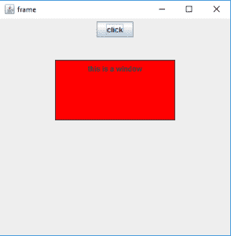
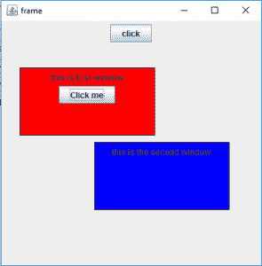

# Java Swing | JWindow 带示例

> 原文:[https://www.geeksforgeeks.org/java-swing-jwindow-examples/](https://www.geeksforgeeks.org/java-swing-jwindow-examples/)

JWindow 是 Java Swing 的一部分，它可以出现在用户桌面的任何部分。与 JFrame 不同的是，JWindow 没有 JFrame 有的标题栏或窗口管理按钮，如最小化、最大化和关闭。JWindow 可以包含几个组件，如按钮和标签。
**类的建造师有:**

1.  **JWindow()** :创建一个没有任何指定所有者的空窗口
2.  **JWindow(框架 o)** :创建一个空窗口，指定一个框架作为它的所有者
3.  **JWindow(框架 o)** :创建一个空窗口，指定一个框架作为它的所有者
4.  **JWindow(Window o)** :创建一个空窗口，指定窗口作为其所有者
5.  **JWindow(Window o，GraphicsConfiguration g)** :创建一个空窗口，指定窗口为其所有者，指定图形配置。
6.  **JWindow(Graphics Configuration g)**:用指定的图形配置 g 创建一个空窗口

**常用方法**

1.  **设置布局(布局管理器 m)** :将窗口的布局设置为指定的布局管理器
2.  **设置内容窗格(容器 c)** :设置窗口的内容窗格属性
3.  **获取内容窗格()**:获取容器，该容器是此窗口的内容窗格
4.  **添加(组件 c)** :向窗口添加组件
5.  **是可见的(布尔值 b)** :设置窗口的可见性，如果布尔值为真，则可见，否则不可见
6.  **更新(Graphics g)** :调用 paint(g)函数
7.  **移除(组件 c)** :移除组件 c
8.  **getGraphics()** :返回组件的图形上下文。
9.  **getLayeredPane()** :返回窗口的分层窗格
10.  **设置内容窗格(容器 c)** :设置窗口的内容窗格
11.  **设置分层窗格(JLayeredPane l)** :设置窗口的分层窗格
12.  **设置根窗格(JRootPane r)** :设置窗口的根窗格
13.  **setTransferHandler(TransferHandler n)**:设置 transfer handler 属性，这是一种支持将数据传输到该组件的机制。
14.  **setRootPaneCheckingEnabled(布尔使能)**:设置是否将添加和设置布局的调用转发到 contentPane。
15.  **设置根窗格(JRootPane 根目录)**:设置窗口的根窗格属性。
16.  **设置玻璃面板(组件玻璃)**:设置窗口的玻璃面板属性。
17.  **重画(长时间，int x，int y，int width，int height)** :在时间毫秒内重画这个组件的指定矩形。
18.  **移除(组件 c)** :从窗口中移除指定的组件。
19.  **isRootPaneCheckingEnabled()**:返回是否将添加和设置布局的调用转发到内容窗格。
20.  **getTransferHandler()** :返回 TransferHandler 属性。
21.  **getRootPane()** :返回该窗口的 RootPane 对象。
22.  **getGlassPane()** :返回该窗口的 GlassPane 对象。
23.  **createRootPane()** :由构造函数方法调用，创建默认的 RootPane。
24.  **添加组件(组件 co，对象 c，int i)** :将指定的子组件添加到窗口中。

**以下程序将说明 JWindow** 的使用

**1。程序创建一个简单的 JWindow**

```
// java Program to create a simple JWindow
import java.awt.event.*;
import java.awt.*;
import javax.swing.*;

class solveit extends JFrame implements ActionListener {

    // frame
    static JFrame f;

    // main class
    public static void main(String[] args)
    {
        // create a new frame
        f = new JFrame("frame");

        // create a object
        solveit s = new solveit();

        // create a panel
        JPanel p = new JPanel();

        JButton b = new JButton("click");

        // add actionlistener to button
        b.addActionListener(s);

        // add button to panel
        p.add(b);

        f.add(p);

        // set the size of frame
        f.setSize(400, 400);

        f.show();
    }

    // if button is pressed
    public void actionPerformed(ActionEvent e)
    {
        String s = e.getActionCommand();
        if (s.equals("click")) {
            // create a window
            JWindow w = new JWindow(f);

            // set panel
            JPanel p = new JPanel();

            // create a label
            JLabel l = new JLabel("this is a window");

            // set border
            p.setBorder(BorderFactory.createLineBorder(Color.black));

            p.add(l);
            w.add(p);

            // set background
            p.setBackground(Color.red);

            // setsize of window
            w.setSize(200, 100);

            // set visibility of window
            w.setVisible(true);

            // set location of window
            w.setLocation(100, 100);
        }
    }
}
```

**输出:**


**1。程序来创建一个多 JWindow。(其中一个窗口是另一个窗口的所有者)**

```
// java program to create a multiple  JWindow .( where one window is the owner of the other )<
import java.awt.event.*;
import java.awt.*;
import javax.swing.*;
class solveit extends JFrame implements ActionListener {

    // frame
    static JFrame f;

    // windows
    JWindow w, w1;

    // object of class
    static solveit s;

    // main class
    public static void main(String[] args)
    {
        // create a new frame
        f = new JFrame("frame");

        // create a object
        s = new solveit();

        // create a panel
        JPanel p = new JPanel();

        JButton b = new JButton("click");

        // add actionlistener to button
        b.addActionListener(s);

        // add button to panel
        p.add(b);

        f.add(p);

        // set the size of frame
        f.setSize(400, 400);

        f.show();
    }

    // if button is pressed
    public void actionPerformed(ActionEvent e)
    {
        String s1 = e.getActionCommand();
        if (s1.equals("click")) {
            // create a window
            w = new JWindow(f);

            // set panel
            JPanel p = new JPanel();

            // create a label
            JLabel l = new JLabel("this is first window");

            // create a button
            JButton b = new JButton("Click me");

            // add Action listener
            b.addActionListener(s);

            // set border
            p.setBorder(BorderFactory.createLineBorder(Color.black));

            p.add(l);
            p.add(b);
            w.add(p);

            // set background
            p.setBackground(Color.red);

            // setsize of window
            w.setSize(200, 100);

            // set visibility of window
            w.setVisible(true);

            // set location of window
            w.setLocation(100, 100);
        }
        else {
            // create a window
            w1 = new JWindow(w);

            // set panel
            JPanel p = new JPanel();

            // create a label
            JLabel l = new JLabel("this is the second window");

            // set border
            p.setBorder(BorderFactory.createLineBorder(Color.black));

            p.add(l);

            w1.add(p);

            // set background
            p.setBackground(Color.blue);

            // setsize of window
            w1.setSize(200, 100);

            // set visibility of window
            w1.setVisible(true);

            // set location of window
            w1.setLocation(210, 210);
        }
    }
}
```

**输出:**


**注意:以上程序可能无法在在线编译器中运行，请使用离线 IDE**