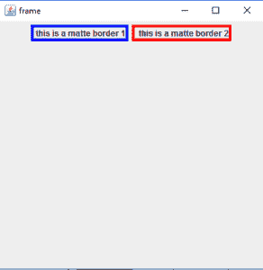
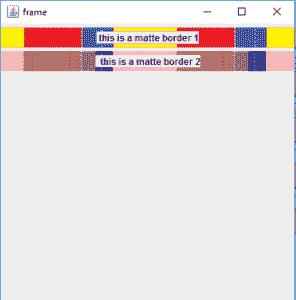
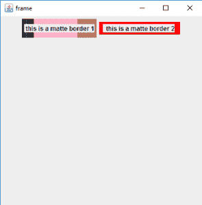

# Java 摇摆|物质边界

> 原文:[https://www.geeksforgeeks.org/java-swing-matteborder/](https://www.geeksforgeeks.org/java-swing-matteborder/)

MatteBorder 是一个类，用于制作纯色或平铺图标的类似哑光的边框。它是 javax.swing.border 包的一部分，包含不同样式的组件边框。这个类帮助我们设置一个图标或纯色作为边框，边框的插页也可以用这个类来应用。
**类的构造函数有:**

1.  **遮罩边框(图标平铺图标)**:使用指定的平铺图标创建遮罩边框。
2.  **哑光边框(插图边框插图，颜色哑光颜色)**:用指定的插图和颜色创建哑光边框。
3.  **哑光边框(插图边框插图，图标平铺图标)**:使用指定的插图和平铺图标创建哑光边框。
4.  **哑光边框(int top，int left，int bottom，int right，Color matter Color)**:创建具有指定插图和颜色的哑光边框。
5.  **哑光边框(int top，int left，int bottom，int right，Icon tileIcon)** :用指定的插页和平铺图标创建一个哑光边框。

**常用的方法有:**

<figure class="table">

| 方法 | 说明 |
| --- | --- |
| 补边集() | 返回边框的插页。 |
| **getborderrinsets(组件 c，Insets insets)** | 用此边框的当前 insets 重新初始化 Insets 参数。 |
| **get attcolor()**
 | 返回用于平铺边框的颜色，如果正在使用平铺图标，则返回 null。 |
| ・T 0️ getTileIcon（） ・T 1️ | 返回边框的标题图标 |
| **【is order OPAC()** | 返回边框是否不透明 |

</figure>

下面的程序说明了 MatteBorder 类:

1.  **使用纯色应用哑光边框的程序**:我们将创建一个名为“框架”的框架 *f* ，并将创建一个充当容器的面板。我们将创建两个标签 l1 和 l。我们将使用 setborder()函数将两个框架的边框设置为无光泽边框。一个标签将有红色边框，另一个标签将有蓝色边框。我们将标签添加到面板，面板添加到框架。我们将使用 setSize(400，400)将框架的大小设置为 400，400，并使用 show()显示框架。

## Java 语言(一种计算机语言，尤用于创建网站)

```java
// java Program to apply matte border using solid colors
import java.awt.event.*;
import java.awt.*;
import javax.swing.*;
import javax.swing.border.*;
class matte1 extends JFrame {

    // frame
    static JFrame f;

    // main class
    public static void main(String[] args)
    {
        // create a new frame
        f = new JFrame("frame");

        // create a object
        matte1 s = new matte1();

        // create a panel
        JPanel p = new JPanel();

        // create a label
        JLabel l = new JLabel("  this is a matte border 2");

        // create a label
        JLabel l1 = new JLabel(" this is a matte border 1");

        // set border for panel
        l.setBorder(new MatteBorder(4, 4, 4, 4, Color.red));

        // set border for label
        l1.setBorder(new MatteBorder(4, 4, 4, 4, Color.blue));

        // add button to panel
        p.add(l1);
        p.add(l);

        f.add(p);

        // set the size of frame
        f.setSize(400, 400);

        f.show();
    }
}
```

1.  **输出** :



1.  **使用图标**应用无光泽边框的程序:我们将创建一个标题为“框架”的框架 f，并将创建一个面板，作为一个容器。我们将创建两个标签 l1 和 l。我们将使用 setborder()函数将两个框架的边框设置为无光泽边框。一个标签将有一个图像图标作为边框，另一个标签将有另一个图像图标。我们将使用新的 ImageIcon()函数导入图像。我们将标签添加到面板，面板添加到框架。我们将使用 setSize(400，400)将框架的大小设置为 400，400，并使用 show()显示框架。

## Java 语言(一种计算机语言，尤用于创建网站)

```java
// java Program to apply matte border using  icons
import java.awt.event.*;
import java.awt.*;
import javax.swing.*;
import javax.swing.border.*;
class matte extends JFrame {

    // frame
    static JFrame f;

    // main class
    public static void main(String[] args)
    {
        // create a new frame
        f = new JFrame("frame");

        // create a object
        matte s = new matte();

        // create a panel
        JPanel p = new JPanel();

        // create a label
        JLabel l = new JLabel("  this is a matte border 2");

        // create a label
        JLabel l1 = new JLabel(" this is a matte border 1");

        // set border for panel
        l.setBorder(new MatteBorder(new ImageIcon("f:\\gfg.png")));

        // set border for label
        l1.setBorder(new MatteBorder(new ImageIcon("f:\\gfg.jpg")));

        // add button to panel
        p.add(l1);
        p.add(l);

        f.add(p);

        // set the size of frame
        f.setSize(400, 400);

        f.show();
    }
}
```

1.  **输出** :



1.  **通过指定插图**使用纯色和图像应用无光泽边框的程序:我们将创建一个标题为“框架”的框架 f，并将创建一个面板，该面板将充当容器。我们将创建两个标签 l1 和 l。我们将使用 setborder()函数将两个框架的边框设置为无光泽边框。一个标签将有一个图像图标作为边框，另一个标签将有另一个图像图标。我们将使用新的 ImageIcon()函数导入图像。我们将使用新的 inset()函数指定边框的 inset 或宽度。我们将标签添加到面板，面板添加到框架。我们将使用 setSize(400，400)将框架的大小设置为 400，400，并使用 show()显示框架。

## Java 语言(一种计算机语言，尤用于创建网站)

```java
// java Program to apply matte border using
// solid color and image by specifying insets
import java.awt.event.*;
import java.awt.*;
import javax.swing.*;
import javax.swing.border.*;
class matte3 extends JFrame {

    // frame
    static JFrame f;

    // main class
    public static void main(String[] args)
    {
        // create a new frame
        f = new JFrame("frame");

        // create a object
        matte3 s = new matte3();

        // create a panel
        JPanel p = new JPanel();

        // create a label
        JLabel l = new JLabel("  this is a matte border 2");

        // create a label
        JLabel l1 = new JLabel(" this is a matte border 1");

        // set border for panel
        l.setBorder(new MatteBorder(new Insets(4, 7, 4, 10), Color.red));

        // set border for label
        l1.setBorder(new MatteBorder(new Insets(10, 4, 10, 4), new ImageIcon("f:\\gfg.png")));

        // add button to panel
        p.add(l1);
        p.add(l);

        f.add(p);

        // set the size of frame
        f.setSize(400, 400);

        f.show();
    }
}
```

1.  **输出** :

