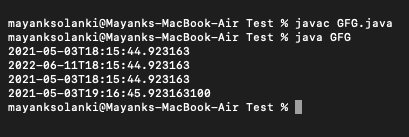
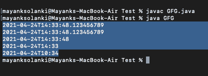

# java 中的 java.time.LocalDateTime 类

> 原文:[https://www . geesforgeks . org/Java-time-local datetime-class-in-Java/](https://www.geeksforgeeks.org/java-time-localdatetime-class-in-java/)

[Java 8 中引入的 java.time.LocalDateTime 类](https://www.geeksforgeeks.org/java-time-localdate-class-in-java/)，代表一个没有时区信息的本地日期时间对象。Java 中的 LocalDateTime 类是一个不可变的日期时间对象，它以***yyyy-MM-DD-HH-MM-ss . zzz***格式表示日期。它实现了[ChronalDatetime](https://www.geeksforgeeks.org/chronolocaldatetime-from-method-in-java-with-examples/)接口，继承了对象类。

无论我们需要在没有时区引用的情况下表示时间，我们都可以使用 LocalDateTime 实例。例如，LocalDateTime 可用于在任何应用程序中启动批处理作业。作业将在服务器所在时区的固定时间运行。请注意，LocalDateTime 实例是不可变的，并且是线程化的。

**语法:**类声明

> 公共最终类 LocalDateTime
> 
> 对象扩展
> 
> 实现时态、时态调整、时间位置日期时间<localdate>，可序列化</localdate>

该类的方法如下:

<figure class="table">

| 方法 | 描述 |
| --- | --- |
| [格式()](https://www.geeksforgeeks.org/localdatetime-format-method-in-java/) | 它用于使用指定的格式化程序格式化此日期时间。 |
| get() | 它用于从该日期时间中获取指定字段的值作为 int。 |
| [分钟()](https://www.geeksforgeeks.org/localtime-minusminutes-method-in-java-with-examples/) | 返回减去指定分钟数后的本地日期时间的副本。 |
| [稳定年份()](https://www.geeksforgeeks.org/localdate-minusyears-method-in-java-with-examples/) | 返回减去指定年数后的本地日期时间的副本。 |
| [不稳定天数()](https://www.geeksforgeeks.org/localdate-minusdays-method-in-java-with-examples/) | 返回减去指定天数后的本地日期时间的副本。 |
| 现在() | 它用于从默认时区的系统时钟获取当前日期时间。 |
| [plus shours()](https://www.geeksforgeeks.org/localdatetime-plushours-method-in-java-with-examples/) | 返回添加了指定小时数的本地日期时间的副本。 |
| [多年()](https://www.geeksforgeeks.org/localdate-plusyears-method-in-java-with-examples/) | 返回添加了指定年数的本地日期时间的副本。 |
| [plusDays()](https://www.geeksforgeeks.org/localdate-plusdays-method-in-java-with-examples/) | 返回添加了指定天数的本地日期时间的副本。 |

</figure>

还有一些修改本地时间的方法如下:LocalDateTime 中的可以用来获取相对于现有 localdatetime 实例的新 localdatetime 实例。具体如下:

plusYears()、plusMonths()、plusDays()、plusHours()、plusMinutes()、plusSeconds()、plusNanos()、minusDays 年()、minusDays 月()、minusDays 日()、minusDays 小时()、minusDays 分钟()、minusDays 秒()

**实施例 1:**

## Java 语言(一种计算机语言，尤用于创建网站)

```
// Java Program to illustrate LocalDateTime Class of java.time package 

// Importing LocalDateTime class from java.time package
import java.time.LocalDateTime;

// Main class for LocalDateTime
public class GFG {

    // Main driver method
    public static void main(String[] args)
    {
        // Creating an object of LocalDateTime class
        // in the main() method
        LocalDateTime now = LocalDateTime.now();

        // Print statement
        System.out.println(now);

        // Adding 1 year, 1 month, 1 week and 1 day
        LocalDateTime localDateTime1 = now.plusYears(1)
                                           .plusMonths(1)
                                           .plusWeeks(1)
                                           .plusDays(1);
        // Print statement
        System.out.println(localDateTime1);

        // Subtracting 1 year, 1 month, 1 week and 1 day
        LocalDateTime localDateTime2
            = localDateTime1.minusYears(1)
                  .minusMonths(1)
                  .minusWeeks(1)
                  .minusDays(1);
        // Print statement
        System.out.println(localDateTime2);

        // Adding 1 hour, 1 minute, 1 second and 100
        // nanoseconds
        LocalDateTime localDateTime3
            = localDateTime2.plusHours(1)
                  .plusMinutes(1)
                  .plusSeconds(1)
                  .plusNanos(100);
        // Print statement
        System.out.println(localDateTime3);

        // Subtracting 1 hour, 1 minute, 1 second and 100
        // nanoseconds
        LocalDateTime localDateTime4
            = localDateTime3.minusHours(1)
                  .minusMinutes(1)
                  .minusSeconds(1)
                  .minusNanos(100);
        // Print statement
        System.out.println(localDateTime4);
    }
}
```

**输出:**



**示例 2:** 创建指定时间

## Java 语言(一种计算机语言，尤用于创建网站)

```
// Java Program to illustrate LocalDateTime Class
// of java.time package by creating specific time

// Importing required classes from resp packages
import java.time.*;
import java.time.format.*;

// main class
class GFG {

    // Main driver method
    public static void main(String[] args)
    {

        // Milliseconds
        LocalDateTime localDateTime1 = LocalDateTime.of(
            2021, 04, 24, 14, 33, 48, 123456789);
        // Print statement
        System.out.println(localDateTime1);

        // Month
        LocalDateTime localDateTime2 = LocalDateTime.of(
            2021, Month.APRIL, 24, 14, 33, 48, 123456789);
        // Print statement
        System.out.println(localDateTime2);

        // Seconds
        LocalDateTime localDateTime3 = LocalDateTime.of(
            2021, Month.APRIL, 24, 14, 33, 48);
        // Print statement
        System.out.println(localDateTime3);

        // Minutes
        LocalDateTime localDateTime4 = LocalDateTime.of(
            2021, Month.APRIL, 24, 14, 33);
        // Print statement
        System.out.println(localDateTime4);

        // Local date + Local time
        LocalDate date = LocalDate.of(2021, 04, 24);
        LocalTime time = LocalTime.of(10, 34);

        LocalDateTime localDateTime5
            = LocalDateTime.of(date, time);
        // Print statement
        System.out.println(localDateTime5);
    }
}
```

**输出:**



**示例 3** :将本地日期时间格式化为字符串

若要将本地时间格式化为所需的字符串表示形式，请使用 LocalDateTiME . format(DateTiME formatter)方法。

## Java 语言(一种计算机语言，尤用于创建网站)

```
// Java Program to illustrate LocalDateTime Class by
// Formatting LocalDateTime to string

// Importing all classes from java.time package
import java.time.LocalDateTime;
import java.time.format.*;
import java.util.*;

// Main class
class GFG {

    // Main driver method
    public static void main(String[] args)
    {

        // Creating an object of DateTimeFormatter class
        DateTimeFormatter formatter
            = DateTimeFormatter.ofPattern(
                "yyyy-MM-dd HH:mm:ss a");

        // Creating an object of LocalDateTime class
        // and getting local date and time using now()
        // method
        LocalDateTime now = LocalDateTime.now();

        // Formatting LocalDateTime to string
        String dateTimeString = now.format(formatter);

        // Print and Display
        System.out.println(dateTimeString);
    }
}
```

**输出:**


> **注意:**为了将字符串解析为 LocalDateTime，将字符串中的时间转换为本地时间实例，LocalDateTime 类有两个重载的 parse()方法。
> 
> *   解析(字符序列文本)
> *   解析(字符序列文本，日期时间格式化程序格式化程序)