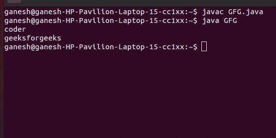
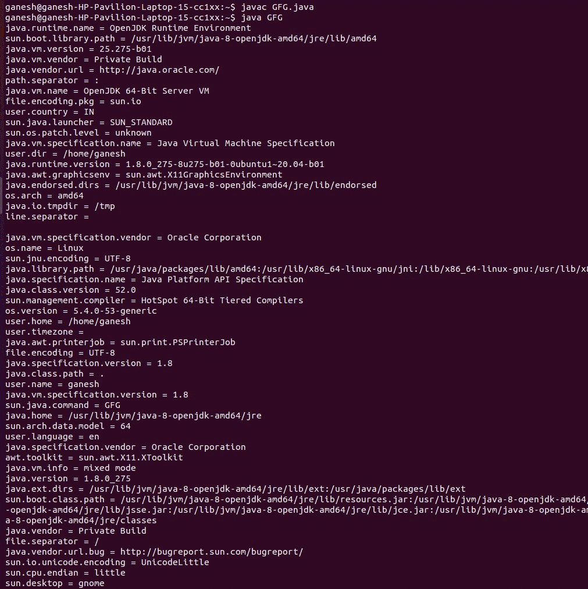
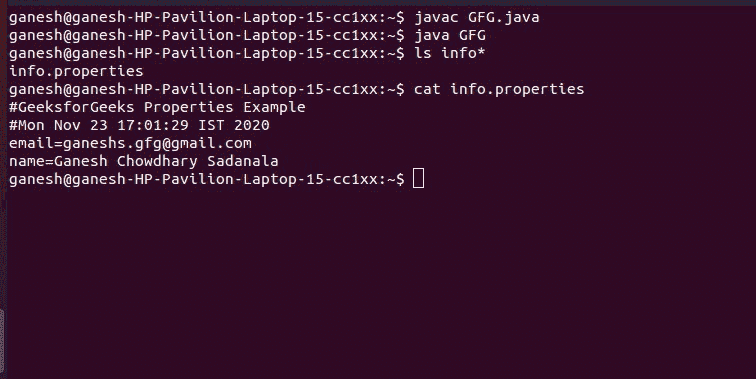

# Java 中的属性类

> 原文:[https://www . geesforgeks . org/Java-util-properties-class-Java/](https://www.geeksforgeeks.org/java-util-properties-class-java/)

属性类表示一组持久的属性。属性可以保存到流中，也可以从流中加载。属于 **java.util** 包。**属性**定义以下实例变量。该变量保存与**属性**对象相关联的默认属性列表。

> **属性默认值:**该变量保存与属性对象相关联的默认属性列表。

**属性类特征:**

*   **属性**是[哈希表](https://www.geeksforgeeks.org/hashtable-in-java/)的子类。
*   它用于维护一个值列表，其中键是字符串，值也是字符串，即:它可用于存储和检索属性文件中的字符串类型数据。
*   属性类可以指定默认的其他属性列表。如果原始属性列表中不存在特定的键属性，将搜索默认属性。
*   属性对象不需要外部同步，多个线程可以共享一个属性对象。
*   此外，它还可以用来检索系统的属性。

**优势一** **属性文件**

如果属性记录中的任何数据被更改，您不必重新编译 java 类。它用于存储要习惯性更改的数据。

**注意:**Properties 类没有从它的超类**哈希表**继承负载因子的概念。

**申报**

```java
public class Properties extends Hashtable<Object,​Object>
```

### 属性的构造函数

**1。属性():**这将创建一个没有默认值的**属性**对象。

> 属性 p =新属性()；

**2。属性(属性属性默认值):**第二个创建一个使用**属性默认值**作为默认值的对象。

> 属性 p =新属性(属性属性默认值)；

**示例 1:** 下面的程序展示了如何使用 Properties 类从属性文件中获取信息。

让我们创建一个属性文件，并将其命名为 **db.properties** 。

**数据库属性**

```java
username = coder
password = geeksforgeeks
```

**代码**

## Java 语言(一种计算机语言，尤用于创建网站)

```java
// Java program to demonstrate Properties class to get
// information from the properties file

import java.util.*;
import java.io.*;
public class GFG {
    public static void main(String[] args) throws Exception
    {
        // create a reader object on the properties file
        FileReader reader = new FileReader("db.properties");

        // create properties object
        Properties p = new Properties();

        // Add a wrapper around reader object
        p.load(reader);

        // access properties data
        System.out.println(p.getProperty("username"));
        System.out.println(p.getProperty("password"));
    }
}
```

**输出**



**示例 2:** 下面的程序展示了如何使用 Properties 类获取所有的系统属性。使用 System.getProperties()方法，我们可以得到系统的所有属性。

## Java 语言(一种计算机语言，尤用于创建网站)

```java
// Java program to demonstrate Properties class to get all
// the system properties

import java.util.*;
import java.io.*;

public class GFG {
    public static void main(String[] args) throws Exception
    {
        // get all the system properties
        Properties p = System.getProperties();

        // stores set of properties information
        Set set = p.entrySet();

        // iterate over the set
        Iterator itr = set.iterator();
        while (itr.hasNext()) {

            // print each property
            Map.Entry entry = (Map.Entry)itr.next();
            System.out.println(entry.getKey() + " = "
                               + entry.getValue());
        }
    }
}
```

**输出**



**示例 3:** 下面的程序展示了如何使用 Properties 类创建属性文件。

## Java 语言(一种计算机语言，尤用于创建网站)

```java
// Java program to demonstrate Properties class to create
// the properties file

import java.util.*;
import java.io.*;

public class GFG {
    public static void main(String[] args) throws Exception
    {
        // create an instance of Properties
        Properties p = new Properties();

        // add properties to it
        p.setProperty("name", "Ganesh Chowdhary Sadanala");
        p.setProperty("email",
                      "ganeshs.gfg@gmail.com");

        // store the properties to a file
        p.store(new FileWriter("info.properties"),
                "GeeksforGeeks Properties Example");
    }
}
```

**输出**



### 属性的方法

<figure class="table">

| 

方法

 | 

描述

 |
| --- | --- |
| [获取属性(字符串键)](https://www.google.com/url?client=internal-element-cse&cx=009682134359037907028:tj6eafkv_be&q=https://www.geeksforgeeks.org/properties-getpropertykey-method-in-java-with-examples/&sa=U&ved=2ahUKEwjbn9fP-ufrAhUU8XMBHWoQAw8QFjADegQICRAC&usg=AOvVaw10mRBpCJZsuXHuXOrHjask) | 在此属性列表中搜索具有指定键的属性。 |
| getProperty（String key， String defaultValue） | 在此属性列表中搜索具有指定键的属性。 |
| 列表(打印输出) | 将此属性列表打印到指定的输出流。 |
| [列表(PrintWriter out)](https://www.geeksforgeeks.org/properties-listprintwriter-method-in-java-with-examples/) | 将此属性列表打印到指定的输出流。 |
| 加载(输入流输入流) | 从输入字节流中读取属性列表(键和元素对)。 |
| 加载(阅读器阅读器) | 以简单的面向行的格式从输入字符流中读取属性列表(键和元素对)。 |
| loadFromXML（InputStream in） | 将指定输入流上由 XML 文档表示的所有属性加载到该属性表中。 |
| propertyNames() | 返回此属性列表中所有键的枚举，如果尚未从主属性列表中找到同名键，则包括默认属性列表中的不同键。 |
| 保存(输出流输出，字符串注释) | **弃用**。如果在保存属性列表时出现输入/输出错误，此方法不会引发 IOException。 |
| 设置属性(字符串键，字符串值) | 调用 Hashtable 方法 put。 |
| 存储(输出流输出，字符串注释) | 将此属性表中的属性列表(键和元素对)以适合使用 load(InputStream)方法加载到属性表中的格式写入输出流。 |
| 存储(编写器编写器，字符串注释) | 将此属性表中的属性列表(键和元素对)以适合使用 load(Reader)方法的格式写入输出字符流。 |
| 存储输出流操作系统，字符串注释 | 发出表示此表中包含的所有属性的 XML 文档。 |
| 存储输出流操作系统、字符串注释、字符串编码 | 使用指定的编码发出表示此表中包含的所有属性的 XML 文档。 |
| 存储输出流操作系统，字符串注释，字符集 | 使用指定的编码发出表示此表中包含的所有属性的 XML 文档。 |
| stringPropertyNames() | 从该属性列表中返回一组不可修改的键，其中键及其对应的值是字符串，如果尚未从主属性列表中找到同名的键，则在默认属性列表中包括不同的键。 |

</figure>

### java.util.Hashtable 类中声明的方法

<figure class="table">

| 

方法

 | 

描述

 |
| --- | --- |
| 清除() | 清除此哈希表，使其不包含键。 |
| 克隆() | 创建该哈希表的浅拷贝。 |
| 计算(组合键，双功能 super K,​? super V,​? extends V>恢复功能) | 尝试计算指定键及其当前映射值的映射(如果没有当前映射，则为空)。 |
| 计算不存在(K 键，功能 super K,​? extends V>映射功能) | 如果指定的键尚未与值相关联(或映射为 null)，会尝试使用给定的映射函数计算其值，并将其输入到此映射中，除非为 null。 |
| 计算当前(K 键，双功能 super K,​? super V,​? extends V>恢复功能) | 如果指定键的值存在且不为空，将尝试计算给定键及其当前映射值的新映射。 |
| 包含(对象值) | 测试某些键是否映射到该哈希表中的指定值。 |
| 包含密钥(对象密钥) | 测试指定的对象是否是该哈希表中的键。 |
| 包含值(对象值) | 如果该哈希表将一个或多个键映射到该值，则返回 true。 |
| 元素() | 返回此哈希表中值的枚举。 |
| entrySet() | 返回此映射中包含的映射的[集合](https://www.geeksforgeeks.org/set-in-java/)视图。 |
| 等于(对象 0) | 根据地图界面中的定义，将指定的对象与此地图进行相等比较。 |
| 获取(对象键) | 返回指定键映射到的值，如果此映射不包含键映射，则返回 null。 |
| hashCode() | 根据映射接口中的定义，返回此映射的哈希代码值。 |
| isEmpty() | 测试该哈希表是否没有将键映射到值。 |
| 按键() | 返回此哈希表中键的枚举。 |
| 密钥集() | 返回此地图中包含的键的集合视图。 |
| 合并(K 键，V 值，双功能 super V,​? super V,​? extends V>重映射功能) | 如果指定的键尚未与值相关联或与 null 相关联，则将其与给定的非 null 值相关联。 |
| 放(K 键，V 值) | 将指定的键映射到该哈希表中的指定值。 |
| putAll(地图 extends K,​? extends V> t) | 将指定映射中的所有映射复制到该哈希表。 |
| rehash() | 增加哈希表的容量并在内部重组哈希表，以便更有效地容纳和访问其条目。 |
| 移除(对象键) | 从此哈希表中移除键(及其对应的值)。 |
| 大小() | 返回该哈希表中的键的数量。 |
| toString() | 以一组条目的形式返回哈希表对象的字符串表示形式，用大括号括起来，并用 ASCII 字符“，”(逗号和空格)分隔。 |
| 值() | 返回此地图中包含的值的集合视图。 |

</figure>

### 接口 java.util.Map 中声明的方法

<figure class="table">

| 

方法

 | 

描述

 |
| --- | --- |
| forEach(双消费者〔t0〕行动) | 对此映射中的每个条目执行给定的操作，直到所有条目都已处理完毕或该操作引发异常。 |
| getOrDefault（Object key， V defaultValue） | 返回指定键映射到的值，如果此映射不包含键映射，则返回默认值。 |
| 莆田(K key，V value) | 如果指定的键还没有与值相关联(或者被映射为 null)，则将它与给定值相关联并返回 null，否则返回当前值。 |
| 移除(对象键，对象值) | 仅当指定项当前映射到指定值时，才移除该项。 |
| 更换(K 键，V 值) | 仅当指定键当前映射到某个值时，才替换该项。 |
| 更换(K 键、旧值、新值) | 仅当当前映射到指定值时，替换指定键的条目。 |
| 替换全部(双功能 super K,​? super V,​? extends V>功能) | 将每个条目的值替换为对该条目调用给定函数的结果，直到所有条目都已处理完毕或函数引发异常。 |

</figure>