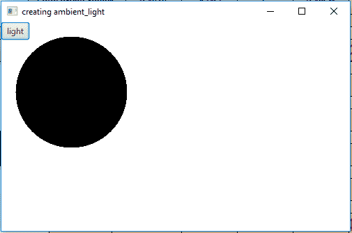
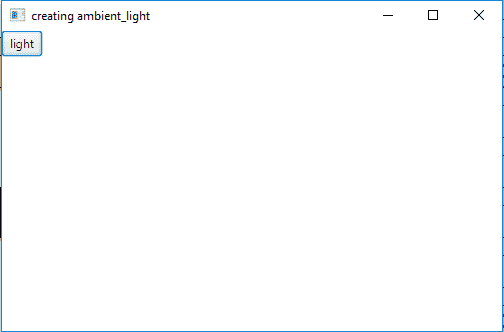
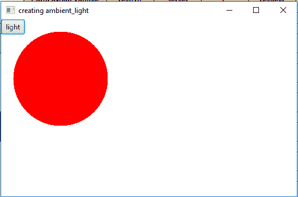
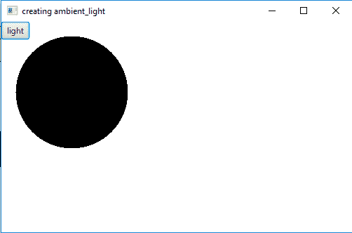

# JavaFX | AmbientLight 类

> 原文:[https://www.geeksforgeeks.org/javafx-ambientlight-class/](https://www.geeksforgeeks.org/javafx-ambientlight-class/)

AmbientLight 类是 JavaFX 的一部分。这个类定义了一个环境光对象。AmbientLight 类创建一个似乎来自所有方向的光源。

**该类的构造函数为:**

1.  **环境光()**:创建默认为白色的环境光源
2.  **环境光(颜色 c)** :创建指定颜色的环境光源

**以下方法继承自 LightBase :**

| 方法 | 说明 |
| --- | --- |
| 获得颜色 （） | 返回光线的颜色 |
| isLightOn() | 返回灯是否亮着 |
| 设置颜色(颜色值) | 设置灯光的颜色 |
| setLightOn(布尔值) | 设置 lightOn 属性的值。 |

下面的程序将说明 AmbientLight 类的使用:

1.  **Java program to create a ambient light of default color:** This program creates a Sphere indicated by the name sphere(radius is passed as arguments). A AmbientLight is created named *ambient_light* of default white color. A Button named button will be created which will be used to turn the ambient light on or off. The Sphere will be created inside a scene, which in turn will be hosted inside a stage. The function *setTitle()* is used to provide title to the stage. Then a Group is created, and the sphere, button and ambient light is attached.The group is attached to the scene. Finally, the *show()* method is called to display the final results.

    ```
    // Java program to create a ambient light of default color
    import javafx.application.Application;
    import javafx.scene.Scene;
    import javafx.scene.shape.DrawMode;
    import javafx.scene.layout.*;
    import javafx.event.ActionEvent;
    import javafx.scene.AmbientLight;
    import javafx.scene.shape.Sphere;
    import javafx.scene.control.*;
    import javafx.stage.Stage;
    import javafx.scene.Group;
    import javafx.scene.PerspectiveCamera;
    import javafx.scene.paint.Color;
    import javafx.event.ActionEvent;
    import javafx.event.EventHandler;

    public class ambient_light_1 extends Application {

        // launch the application
        public void start(Stage stage)
        {

            // set title for the stage
            stage.setTitle("creating ambient_light");

            // create a sphere
            Sphere sphere = new Sphere(80.0f);

            // create a ambient light
            AmbientLight ambient_light = new AmbientLight();

            // create a button
            Button button = new Button("light");

            // create a Group
            Group group = new Group(sphere, ambient_light, button);

            // translate the sphere to a position
            sphere.setTranslateX(100);
            sphere.setTranslateY(100);

            // action event
            EventHandler<ActionEvent> event = 
            new EventHandler<ActionEvent>() {

                public void handle(ActionEvent e)
                {
                    ambient_light.setLightOn(!ambient_light.isLightOn());
                }
            };

            // set on action
            button.setOnAction(event);

            // create a scene
            Scene scene = new Scene(group, 500, 300);

            // set the scene
            stage.setScene(scene);

            stage.show();
        }

        // Main Method
        public static void main(String args[])
        {

            // launch the application
            launch(args);
        }
    }
    ```

    **输出:**
    

    

2.  **Java program to create a ambient light of a specified color:** This program creates a Sphere indicated by the name sphere(radius is passed as arguments). A AmbientLight is created named *ambient_light* of a specified color(RED). A Button named button will be created which will be used to turn the ambient light on or off. The Sphere will be created inside a scene, which in turn will be hosted inside a stage. The function *setTitle()* is used to provide title to the stage. Then a Group is created, and the sphere, button and ambient light is attached.The group is attached to the scene. Finally, the *show()* method is called to display the final results.

    ```
    // Java program to create a ambient light 
    // of a specified color
    import javafx.application.Application;
    import javafx.scene.Scene;
    import javafx.scene.shape.DrawMode;
    import javafx.scene.layout.*;
    import javafx.event.ActionEvent;
    import javafx.scene.AmbientLight;
    import javafx.scene.shape.Sphere;
    import javafx.scene.control.*;
    import javafx.stage.Stage;
    import javafx.scene.Group;
    import javafx.scene.PerspectiveCamera;
    import javafx.scene.paint.Color;
    import javafx.event.ActionEvent;
    import javafx.event.EventHandler;

    public class ambient_light_2 extends Application {

        // launch the application
        public void start(Stage stage)
        {

            // set title for the stage
            stage.setTitle("creating ambient_light");

            // create a sphere
            Sphere sphere = new Sphere(80.0f);

            // create a ambient light
            AmbientLight ambient_light = new AmbientLight(Color.RED);

            // create a button
            Button button = new Button("light");

            // create a Group
            Group group = new Group(sphere, ambient_light, button);

            // translate the sphere to a position
            sphere.setTranslateX(100);
            sphere.setTranslateY(100);

            // action event
            EventHandler<ActionEvent> event = 
            new EventHandler<ActionEvent>() {

                public void handle(ActionEvent e)
                {
                    ambient_light.setLightOn(!ambient_light.isLightOn());
                }
            };

            // set on action
            button.setOnAction(event);

            // create a scene
            Scene scene = new Scene(group, 500, 300);

            // set the scene
            stage.setScene(scene);

            stage.show();
        }

        // Main Method
        public static void main(String args[])
        {

            // launch the application
            launch(args);
        }
    }
    ```

    **输出:**

    

    

**注意:**上述程序可能无法在在线 IDE 中运行。请使用离线编译器。

**参考:**[https://docs . Oracle . com/javase/8/JavaFX/API/JavaFX/scene/ambientlight . html](https://docs.oracle.com/javase/8/javafx/api/javafx/scene/AmbientLight.html)