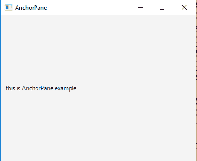
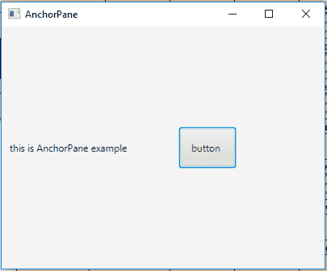

# JavaFX | AnchorPane 类

> 原文:[https://www.geeksforgeeks.org/javafx-anchorpane-class/](https://www.geeksforgeeks.org/javafx-anchorpane-class/)

AnchorPane 类是 JavaFX 的一部分。锚定窗格允许子节点的边缘锚定到锚定窗格边缘的偏移处。如果锚定窗格设置了边框和/或填充，偏移量将从这些嵌入的内边缘开始测量。AnchorPane 继承 *Pane* 类。

**类的构造函数:**

1.  **锚定面板()**:创建新的锚定面板。
2.  **锚定面板(节点… c)** :创建具有指定节点的锚定面板。

**常用方法:**

| 方法 | 说明 |
| --- | --- |
| getbottomanchor(节点 c) | 返回子级的底部锚点。 |
| getLeftAnchor（Node c） | 返回子级的左锚点。 |
| getRightAnchor(节点 c) | 返回子级的右锚点。 |
| 节点 c | 返回子级的顶部锚点。 |
| setbottomanchor(节点 c，双 v) | 设置孩子的底部锚点。 |
| 设置左锚(节点 c，双 v) | 设置孩子的左锚点。 |
| 设置右锚(节点 c，双 v) | 设置孩子的右锚点。 |
| setTopAnchor(节点 c，双 v) | 设置孩子的顶部锚点。 |

以下程序说明了锚定面板类的使用:

1.  **Java Program to create a AnchorPane and add label to it and add label to the stage:** In this program we will create a AnchorPane named *anchor_pane*. Add a Label named *label* to the anchor_pane and set the top, bottom, left, right using the *setTopAnchor()*, *setBottomAnchor()*, *setLeftAnchor()*, *setRightAnchor()* functions respectively. Now add the anchor_pane to the Scene. Then finally add the scene to the stage and call the *show()* function to display the results.

    ```java
    // Java Program to create a AnchorPane and
    // add label to it and add label to the 
    // stage
    import javafx.application.Application;
    import javafx.scene.Scene;
    import javafx.scene.control.*;
    import javafx.scene.layout.*;
    import javafx.stage.Stage;
    import javafx.event.ActionEvent;
    import javafx.event.EventHandler;
    import javafx.scene.canvas.*;
    import javafx.scene.web.*;
    import javafx.scene.layout.AnchorPane;
    import javafx.scene.shape.*;

    public class AnchorPane_1 extends Application {

        // launch the application
        public void start(Stage stage)
        {

            try {

                // set title for the stage
                stage.setTitle("AnchorPane");

                // create a label
                Label label = new Label("this is AnchorPane example");

                // create a AnchorPane
                AnchorPane anchor_pane = new AnchorPane(label);

                // anchor to the label
                AnchorPane.setTopAnchor(label, 10.0);
                AnchorPane.setLeftAnchor(label, 10.0);
                AnchorPane.setRightAnchor(label, 10.0);
                AnchorPane.setBottomAnchor(label, 10.0);

                // create a scene
                Scene scene = new Scene(anchor_pane, 400, 300);

                // set the scene
                stage.setScene(scene);

                stage.show();
            }

            catch (Exception e) {

                System.out.println(e.getMessage());
            }
        }

        // Main Method
        public static void main(String args[])
        {

            // launch the application
            launch(args);
        }
    }
    ```

    **输出:**

    

2.  **Java Program to create a AnchorPane, adding label and button to it and also setting the min height and width of AnchorPane then add it to the stage:** In this program we will create a AnchorPane named *anchor_pane*. Add a Label named *label* to the *anchor_pane*. Also add a Button named *button* and set the top, bottom, left, right anchor using the *setTopAnchor()*, *setBottomAnchor()*, *setLeftAnchor()*, *setRightAnchor()* functions respectively. Set the min height and width using the *setMinHeight()* and *setMinWidth()* function. Add the *anchor_pane* to the Scene. Finally, add the scene to the stage and call the show() function to display the results.

    ```java
    // Java Program to create a AnchorPane, adding
    // label and button to it and also setting the 
    // min height and width of AnchorPane then add
    // it to the stage
    import javafx.application.Application;
    import javafx.scene.Scene;
    import javafx.scene.control.*;
    import javafx.scene.layout.*;
    import javafx.stage.Stage;
    import javafx.event.ActionEvent;
    import javafx.event.EventHandler;
    import javafx.scene.canvas.*;
    import javafx.scene.web.*;
    import javafx.scene.layout.AnchorPane;
    import javafx.scene.shape.*;

    public class AnchorPane_2 extends Application {

        // launch the application
        public void start(Stage stage)
        {

            try {

                // set title for the stage
                stage.setTitle("AnchorPane");

                // create a label
                Label label = new Label("this is AnchorPane example");

                // create a AnchorPane
                AnchorPane anchor_pane = new AnchorPane(label);

                // anchor to the label
                AnchorPane.setTopAnchor(label, 120.0);
                AnchorPane.setLeftAnchor(label, 10.0);
                AnchorPane.setRightAnchor(label, 230.0);
                AnchorPane.setBottomAnchor(label, 120.0);

                Button button = new Button("button ");

                // anchor to the button
                AnchorPane.setTopAnchor(button, 125.0);
                AnchorPane.setLeftAnchor(button, 220.0);
                AnchorPane.setRightAnchor(button, 110.0);
                AnchorPane.setBottomAnchor(button, 125.0);

                anchor_pane.getChildren().add(button);

                anchor_pane.setMinHeight(400);
                anchor_pane.setMinWidth(400);

                // create a scene
                Scene scene = new Scene(anchor_pane, 400, 300);

                // set the scene
                stage.setScene(scene);

                stage.show();
            }

            catch (Exception e) {

                System.out.println(e.getMessage());
            }
        }

        // Main Method
        public static void main(String args[])
        {

            // launch the application
            launch(args);
        }
    }
    ```

    **输出:**

    

**注意:**上述程序可能无法在联机 IDE 中运行，请使用脱机编译器。

**参考:**[https://docs . Oracle . com/javase/8/JavaFX/API/JavaFX/scene/layout/anchorpane . html](https://docs.oracle.com/javase/8/javafx/api/javafx/scene/layout/AnchorPane.html)