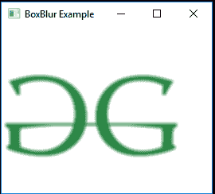
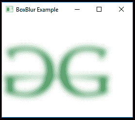

# JavaFX | BoxBlur 类

> 原文:[https://www.geeksforgeeks.org/javafx-boxblur-class/](https://www.geeksforgeeks.org/javafx-boxblur-class/)

BoxBlur 类是 JavaFX 的一部分。框模糊使用简单的框过滤器来模糊节点。BoxBlur 用于在 JavaFX 中实现模糊。一种模糊效果，使用一个简单的箱式过滤器内核，在两个维度上都有可单独配置的大小，以及一个控制最终模糊质量的迭代参数。

**box blur 类有三个组件:**

1.  **高度:**效果的垂直维度。
2.  **宽度:**效果的水平维度。
3.  **迭代次数:**模糊效果的迭代次数。

**类的构造函数:**

1.  **BoxBlur()** :创建 BoxBlur 的新对象。
2.  **BoxBlur(double w，double h，int i)** :用指定的宽度、高度和迭代创建一个新的 BoxBlur 对象。

**常用方法:**

| 方法 | 说明 |
| --- | --- |
| getHeight（） | 返回效果的垂直尺寸 |
| getWidth（） | 返回效果的水平尺寸 |
| getIterations() | 返回效果的迭代次数 |
| getInput() | 获取属性输入的值。 |
| 设置输入(效果五) | 设置属性输入的值。 |
| setHeight(双 v) | 设置效果的垂直尺寸 |
| setWidth(双 v) | 设置效果的水平尺寸 |
| 设置迭代(整数) | 设置效果的迭代次数 |

下面的程序说明了 BoxBlur 类的使用:

1.  **Java program to import an image and add Box Blur effect to it:** In this program a *FileInputStream* is created and an image is taken as input from a file. Image named *image* is created using the input from the file input stream. From the image, an *image view object* is created and it is added to the *VBox*. The VBox is then added to the scene and the scene is added to the stage. A BoxBlur effect is created with a specified level passed as parameters and the effect is set to the image view using *setEffect()* function.

    ```
    // Java program to import an image and 
    // add Box Blur effect to it
    import javafx.application.Application;
    import javafx.scene.Scene;
    import javafx.scene.control.*;
    import javafx.scene.layout.*;
    import javafx.stage.Stage;
    import javafx.scene.image.*;
    import javafx.scene.effect.*;
    import java.io.*;
    import javafx.event.ActionEvent;
    import javafx.event.EventHandler;
    import javafx.scene.Group;

    public class box_blur_1 extends Application {

        // launch the application
        public void start(Stage stage) throws Exception
        {

            // set title for the stage
            stage.setTitle("BoxBlur Example");

            // create a input stream
            FileInputStream input = new FileInputStream("D:\\GFG.png");

            // create a image
            Image image = new Image(input);

            // create a image View
            ImageView imageview = new ImageView(image);

            // create a box blur effect
            BoxBlur box_blur = new BoxBlur();

            // set effect
            imageview.setEffect(box_blur);

            // create a VBox
            VBox vbox = new VBox(imageview);

            // create a scene
            Scene scene = new Scene(vbox, 200, 200);

            // set the scene
            stage.setScene(scene);

            stage.show();
        }

        // Main Method
        public static void main(String args[])
        {

            // launch the application
            launch(args);
        }
    }
    ```

    **输入图像:**

    [](https://media.geeksforgeeks.org/wp-content/uploads/GFG-14.png)

    **输出:**

    [](https://media.geeksforgeeks.org/wp-content/uploads/box_blur_1.png)

2.  **Java program to import an image and blur effect to it with separately configurable sizes in both dimensions, and an iteration parameter:** In this program a *FileInputStream* is created and an image is taken as input from a file. Image named *image* is created using the input from file input stream. From the image, an *image view object* is created and it is added to the *VBox*. The VBox is then added to the scene and the scene is added to the stage. A BoxBlur effect is created with a specified level passed as parameters and the effect is set to the image view using *setEffect()* function. The width, height and the number of iterations of the effect is set using *setHeight()*, *setWidth()* and *setIterations()* function respectively.

    ```
    // Java program to import an image and blur effect 
    // to it with separately configurable sizes in both
    // dimensions, and an iteration parameter
    import javafx.application.Application;
    import javafx.scene.Scene;
    import javafx.scene.control.*;
    import javafx.scene.layout.*;
    import javafx.stage.Stage;
    import javafx.scene.image.*;
    import javafx.scene.effect.*;
    import java.io.*;
    import javafx.event.ActionEvent;
    import javafx.event.EventHandler;
    import javafx.scene.Group;

    public class box_blur_2 extends Application {

        // launch the application
        public void start(Stage stage) throws Exception
        {

            // set title for the stage
            stage.setTitle("BoxBlur Example");

            // create a input stream
            FileInputStream input = new FileInputStream("D:\\GFG.png");

            // create a image
            Image image = new Image(input);

            // create a image View
            ImageView imageview = new ImageView(image);

            // create a box blur effect
            BoxBlur box_blur = new BoxBlur();

            // set width
            box_blur.setWidth(10.0f);

            // set height
            box_blur.setHeight(10.0f);

            // set Iterations
            box_blur.setIterations(3);

            // set effect
            imageview.setEffect(box_blur);

            // create a VBox
            VBox vbox = new VBox(imageview);

            // create a scene
            Scene scene = new Scene(vbox, 200, 200);

            // set the scene
            stage.setScene(scene);

            stage.show();
        }

        // Main Method
        public static void main(String args[])
        {

            // launch the application
            launch(args);
        }
    }
    ```

    **输入图像:**

    [](https://media.geeksforgeeks.org/wp-content/uploads/GFG-14.png)

    **输出:**

    [](https://media.geeksforgeeks.org/wp-content/uploads/box_blur_2.png)

**注意:**上述程序可能无法在在线 IDE 中运行。请使用离线编译器。

**参考:**[https://docs . Oracle . com/javase/8/JavaFX/API/JavaFX/场景/效果/BoxBlur.html](https://docs.oracle.com/javase/8/javafx/api/javafx/scene/effect/BoxBlur.html)