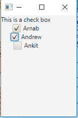
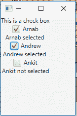

# JavaFX |复选框

> 原文:[https://www.geeksforgeeks.org/javafx-checkbox/](https://www.geeksforgeeks.org/javafx-checkbox/)

CheckBox 是 JavaFX 包的一部分。CheckBox 是一个选中时带有勾号的框，未选中时为空。起初，复选框可能看起来类似于单选按钮，但它们之间存在区别，即复选框不能组合成切换组，这意味着我们不能同时选择多个选项。

复选框的**状态:**

*   **已检查:**不确定时为假，检查时为真*   **未选中:**当不确定为假，选中为假*   **Undefined:** When indeterminate is true

    **类的构造函数有:**

    1.  **复选框()**:创建标签为空字符串的复选框。
    2.  **复选框(字符串 t)** :用给定的文本作为标签创建一个复选框。

    **常用方法**:

    | 方法 | 说明 |
    | --- | --- |
    | **Isincrement()** | 获取不确定属性的值。 |
    | **isSelected()** | 获取选定属性的值。 |
    | **所选属性（）** | 指示是否选中此复选框。 |
    | **【setendiante(boolean v)** | 设置不确定属性的值。 |
    | **设置选定(布尔 v)** | 设置选定属性的值。 |

    以下程序说明了 CheckBox 在 JavaFX 包中的使用:

    1.  **Program to create checkbox and add it to stage**: This program creates a multiple CheckBox indicated by the name c. The CheckBox will be created inside a scene, which in turn will be hosted inside a stage. The indeterminate state of the checkbox would be initially set to true using the setIndeterminate() function. The function setTitle() is used to provide title to the stage. Then a tile pane is created, on which addChildren() method is called to attach the CheckBox and the label inside the scene. Finally the show() method is called to display the final results.

        ```
        import javafx.application.Application;
        import javafx.scene.Scene;
        import javafx.scene.control.*;
        import javafx.scene.layout.*;
        import javafx.event.ActionEvent;
        import javafx.event.EventHandler;
        import javafx.collections.*;
        import javafx.stage.Stage;
        public class Checkbox_1 extends Application {

            // launch the application
            public void start(Stage s)
            {
                // set title for the stage
                s.setTitle("creating CheckBox");

                // create a tile pane
                TilePane r = new TilePane();

                // create a label
                Label l = new Label("This is a check box");

                // string array
                String st[] = { "Arnab", "Andrew", "Ankit" };

                // add label
                r.getChildren().add(l);

                for (int i = 0; i < st.length; i++) {

                    // create a checkbox
                    CheckBox c = new CheckBox(st[i]);

                    // add label
                    r.getChildren().add(c);

                    // set IndeterMinate
                    c.setIndeterminate(true);
                }

                // create a scene
                Scene sc = new Scene(r, 150, 200);

                // set the scene
                s.setScene(sc);

                s.show();
            }

            public static void main(String args[])
            {
                // launch the application
                launch(args);
            }
        }
        ```

        **输出** :
        

    2.  **Java Program to create check box and add event handler to it**: This program creates a multiple CheckBox indicated by the name c. An Event handler will be created to handle the events ( toggle the label associated with textbox to depict the state of checkbox). The event would be set to the checkbox using setOnAction() function. The CheckBox will be created inside a scene, which in turn will be hosted inside a stage. The function setTitle() is used to provide title to the stage. Then a tile pane is created, on which addChildren() method is called to attach the CheckBox and the label inside the scene. Finally, the show() method is called to display the final results.

        ```
        import javafx.application.Application;
        import javafx.scene.Scene;
        import javafx.scene.control.*;
        import javafx.scene.layout.*;
        import javafx.event.ActionEvent;
        import javafx.event.EventHandler;
        import javafx.collections.*;
        import javafx.stage.Stage;
        public class Checkbox_2 extends Application {

            // launch the application
            public void start(Stage s)
            {
                // set title for the stage
                s.setTitle("creating CheckBox");

                // create a tile pane
                TilePane r = new TilePane();

                // create a label
                Label l = new Label("This is a check box");

                // string array
                String st[] = { "Arnab", "Andrew", "Ankit" };

                // add label
                r.getChildren().add(l);

                for (int i = 0; i < st.length; i++) {

                    // create a checkbox
                    CheckBox c = new CheckBox(st[i]);

                    // add checkbox
                    r.getChildren().add(c);

                    Label l1 = new Label(st[i] + " not selected");

                    // create a string
                    String s1 = st[i];

                    // create a event handler
                    EventHandler<ActionEvent> event = new EventHandler<ActionEvent>() {

                        public void handle(ActionEvent e)
                        {
                            if (c.isSelected())
                                l1.setText(s1 + " selected ");
                            else
                                l1.setText(s1 + " not selected ");
                        }

                    };

                    // set event to checkbox
                    c.setOnAction(event);

                    // add label
                    r.getChildren().add(l1);
                }

                // create a scene
                Scene sc = new Scene(r, 150, 200);

                // set the scene
                s.setScene(sc);

                s.show();
            }

            public static void main(String args[])
            {
                // launch the application
                launch(args);
            }
        }
        ```

        **输出** :
        

**参考**:[https://docs . Oracle . com/javase/8/JavaFX/API/JavaFX/scene/control/checkbox . html](https://docs.oracle.com/javase/8/javafx/api/javafx/scene/control/CheckBox.html)