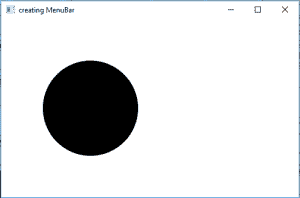
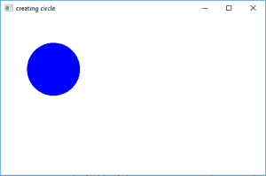

# JavaFX |用例子圈出

> 原文:[https://www.geeksforgeeks.org/javafx-circle-with-examples/](https://www.geeksforgeeks.org/javafx-circle-with-examples/)

Circle 类是 JavaFX 库的一部分。Circle 类创建一个圆，该圆具有指定的圆心 x 和 y 位置、指定的圆半径和指定的填充。
以像素为单位测量圆的半径和圆心。

**类的构造函数有:**

1.  **圆形()**:创建圆形的空实例
2.  **圆(双 r)** :创建一个指定半径的圆
3.  **圆(双 X，双 Y，双 r)** :用给定的圆心 X 和 Y 坐标，以及半径，创建一个圆。
4.  **圆(双 r，画 f)** 创建一个指定半径的圆并填充
5.  **圆(双 X，双 Y，双 r，Paint f)** :用给定的圆心 X 和 Y 坐标、半径以及指定的填充创建一个圆。

**常用方法:**

T5**setcentey(双 c)**

| 方法 | 说明 |
| --- | --- |
| **get enterx()** | 返回圆心的 x 坐标 |
| **get enterx()** | 返回圆心的 y 坐标 |
| **行道()** | 返回圆的半径 |
| **setcentex(双 c)** | 设置圆心的 x 坐标 |
| 设置圆心的 y 坐标 |
| **setRadius(双 c)** | 设置圆心的半径 |
| T22】setFill(Paint p) |

以下程序说明了圆形类的使用:

1.  **Java program to create a circle by passing the coordinates of the center and radius as arguments in constructor:** This program creates a Circle indicated by the name circle( the coordinates of the center and the radius is passed as arguments). The Circle will be created inside a scene, which in turn will be hosted inside a stage. The function setTitle() is used to provide title to the stage. Then a Group is created, and the circle is attached. The group is attached to the scene. Finally, the show() method is called to display the final results.

    ```
    // Java program to create circle by passing the
    // coordinates of the center and radius
    // as arguments in constructor
    import javafx.application.Application;
    import javafx.scene.Scene;
    import javafx.scene.control.Button;
    import javafx.scene.layout.*;
    import javafx.event.ActionEvent;
    import javafx.scene.shape.Circle;
    import javafx.scene.control.*;
    import javafx.stage.Stage;

    import javafx.scene.Group;
    public class circle_0 extends Application {

        // launch the application
        public void start(Stage stage)
        {
            // set title for the stage
            stage.setTitle("creating circle");

            // create a circle
            Circle circle = new Circle(150.0f, 150.0f, 80.f);

            // create a Group
            Group group = new Group(circle);

            // create a scene
            Scene scene = new Scene(group, 500, 300);

            // set the scene
            stage.setScene(scene);

            stage.show();
        }

        public static void main(String args[])
        {
            // launch the application
            launch(args);
        }
    }
    ```

    **输出:**
    

2.  **Java program to create a circle and using the functions setCenterX, setCenterY and setRadius to set the coordinates of center and radius:** This program creates a Circle indicated by the name circle. The coordinates for the center and the radius of the circle is set using setCenterX(), setCenterY(), and setRadius function. The Circle will be created inside a scene, which in turn will be hosted inside a stage. The function setTitle() is used to provide title to the stage. Then a Group is created, and the circle is attached. The group is attached to the scene. Finally, the show() method is called to display the final results.

    ```
    // Java program to create a circle and using 
    // the functions setCenterX, setCenterY and setRadius
    // to set the coordinates of center and radius
    import javafx.application.Application;
    import javafx.scene.Scene;
    import javafx.scene.control.Button;
    import javafx.scene.layout.*;
    import javafx.event.ActionEvent;
    import javafx.scene.shape.Circle;
    import javafx.scene.control.*;
    import javafx.stage.Stage;

    import javafx.scene.Group;
    public class circle_1 extends Application {

        // launch the application
        public void start(Stage stage)
        {
            // set title for the stage
            stage.setTitle("creating circle");

            // create a circle
            Circle circle = new Circle();

            // set the position of center of the  circle
            circle.setCenterX(100.0f);
            circle.setCenterY(100.0f);

            // set Radius of the circle
            circle.setRadius(50.0f);

            // create a Group
            Group group = new Group(circle);

            // create a scene
            Scene scene = new Scene(group, 500, 300);

            // set the scene
            stage.setScene(scene);

            stage.show();
        }

        public static void main(String args[])
        {
            // launch the application
            launch(args);
        }
    }
    ```

    **输出:**
    

3.  **Java program to create a circle with specified radius and coordinates of center and also specified fill**: This program creates a Circle indicated by the name circle.The coordinates for the center and the radius of the circle is set using setCenterX(), setCenterY(), and setRadius function. .The function set Fill() is used to set the fill of the circle The Circle will be created inside a scene, which in turn will be hosted inside a stage. The function setTitle() is used to provide title to the stage. Then a Group is created, and the circle is attached.The group is attached to the scene. Finally, the show() method is called to display the final results.

    ```
    // Java program to create a circle with specified
    // radius and coordinates of center and also specified fill
    import javafx.application.Application;
    import javafx.scene.Scene;
    import javafx.scene.control.Button;
    import javafx.scene.layout.*;
    import javafx.scene.paint.Color;
    import javafx.scene.shape.Circle;
    import javafx.scene.control.*;
    import javafx.stage.Stage;

    import javafx.scene.Group;
    public class circle_2 extends Application {

        // launch the application
        public void start(Stage stage)
        {
            // set title for the stage
            stage.setTitle("creating circle");

            // create a circle
            Circle circle = new Circle();

            // set the position of center of the  circle
            circle.setCenterX(100.0f);
            circle.setCenterY(100.0f);

            // set Radius of the circle
            circle.setRadius(50.0f);

            // set the fill of the circle
            circle.setFill(Color.BLUE);

            // create a Group
            Group group = new Group(circle);

            // create a scene
            Scene scene = new Scene(group, 500, 300);

            // set the scene
            stage.setScene(scene);

            stage.show();
        }

        public static void main(String args[])
        {
            // launch the application
            launch(args);
        }
    }
    ```

    **输出:**
    

    **注意:**上述程序可能无法在联机 IDE 中运行，请使用脱机编译器。

    **参考**:[https://docs . Oracle . com/JavaFX/2/API/JavaFX/scene/shape/circle . html](https://docs.oracle.com/javafx/2/api/javafx/scene/shape/Circle.html)