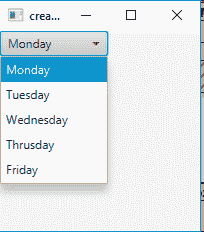
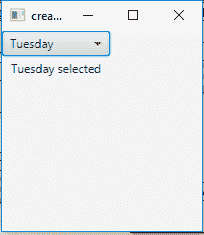
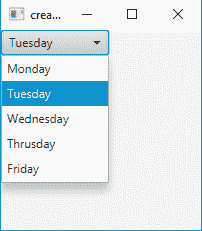

# JavaFX | ComboBox 带示例

> 原文:[https://www . geesforgeks . org/JavaFX-combobox-with-examples/](https://www.geeksforgeeks.org/javafx-combobox-with-examples/)

ComboBox 是 JavaFX 库的一部分。JavaFX ComboBox 是一个简单 ComboBox 的实现，它显示了一个项目列表，用户最多可以从中选择一个项目，它继承了类 ComboBoxBase。

**组合框的构造函数:**

1.  **组合框()**:创建默认的空组合框
2.  **组合框(ObservableList i)** :用给定的项目创建一个组合框

**常用方法:**

<figure class="table">

| 方法 | 说明 |
| --- | --- |
| get editor() | 此方法获取属性编辑器的值 |
| **【getitem()** | 此方法返回组合框的项 |
| get visible rowcount() | 此方法返回 visibleRowCount 属性的值。 |
| **设置项目(观察列表 v)** | 此方法设置组合框的项目 |
| **setVisibleRowCount(int v)** | 此方法设置 VisibleRowCount 属性的值 |

</figure>

下面的程序说明了 JavaFX 的组合框类:

*   **创建组合框并向其中添加项目的程序**:该程序创建一个名为 combo _ box 的组合框，并使用 choice Box(fxcollections . observablearraylist(week _ days))向其中添加字符串列表。我们会将组合框和标签(描述)添加到 tilepane(getChildren()。add()函数)。我们将创建一个舞台(容器)并将 tilepane 添加到场景中，并将场景添加到舞台中。我们将使用 show()函数显示舞台。

## Java 语言(一种计算机语言，尤用于创建网站)

```
// Java Program to create a combo Box and add items to it
import javafx.application.Application;
import javafx.scene.Scene;
import javafx.scene.control.*;
import javafx.scene.layout.*;
import javafx.event.ActionEvent;
import javafx.event.EventHandler;
import javafx.collections.*;
import javafx.stage.Stage;
import javafx.scene.text.Text.*;
import javafx.scene.paint.*;
import javafx.scene.text.*;
public class combo_box_1 extends Application {

    // Launch the application
    public void start(Stage stage)
    {
        // Set title for the stage
        stage.setTitle("creating combo box ");

        // Create a tile pane
        TilePane r = new TilePane();

        // Create a label
        Label description_label =
                     new Label("This is a combo box example ");

        // Weekdays
        String week_days[] =
                   { "Monday", "Tuesday", "Wednesday",
                                    "Thursday", "Friday" };

        // Create a combo box
        ComboBox combo_box =
                     new ComboBox(FXCollections
                                 .observableArrayList(week_days));

        // Create a tile pane
        TilePane tile_pane = new TilePane(combo_box);

        // Create a scene
        Scene scene = new Scene(tile_pane, 200, 200);

        // Set the scene
        stage.setScene(scene);

        stage.show();
    }

    public static void main(String args[])
    {
        // Launch the application
        launch(args);
    }
}
```

**输出:**



*   **程序创建一个组合框，并向其中添加一个事件处理程序**:这个程序创建一个名为 combo _ box 的组合框，并使用(choice box(fxcollections . observablearraylist(week _ days))向其中添加一个字符串列表。我们会将组合框和标签(描述)添加到 tilepane(getChildren()。add()函数)。我们将创建一个舞台(容器)并将 tilepane 添加到场景中，并将场景添加到舞台中。我们将使用 show()函数显示舞台。我们将添加一个事件处理程序事件来处理 combo_box 的事件，这将把所选标签的文本更改为所选项目。我们还会将选定的标签添加到平铺窗格中。

## Java 语言(一种计算机语言，尤用于创建网站)

```
// Java program to create a combo box and add event handler to it
import javafx.application.Application;
import javafx.scene.Scene;
import javafx.scene.control.*;
import javafx.scene.layout.*;
import javafx.event.ActionEvent;
import javafx.event.EventHandler;
import javafx.collections.*;
import javafx.stage.Stage;
import javafx.scene.text.Text.*;
import javafx.scene.paint.*;
import javafx.scene.text.*;
public class combo_box_2 extends Application {

    // Launch the application
    public void start(Stage stage)
    {
        // Set title for the stage
        stage.setTitle("creating combo box ");

        // Create a tile pane
        TilePane r = new TilePane();

        // Create a label
        Label description_label =
                         new Label("This is a combo box example ");

        // Weekdays
        String week_days[] =
                   { "Monday", "Tuesday", "Wednesday",
                                   "Thursday", "Friday" };

        // Create a combo box
        ComboBox combo_box =
                    new ComboBox(FXCollections
                              .observableArrayList(week_days));

        // Label to display the selected menuitem
        Label selected = new Label("default item selected");

        // Create action event
        EventHandler<ActionEvent> event =
                  new EventHandler<ActionEvent>() {
            public void handle(ActionEvent e)
            {
                selected.setText(combo_box.getValue() + " selected");
            }
        };

        // Set on action
        combo_box.setOnAction(event);

        // Create a tile pane
        TilePane tile_pane = new TilePane(combo_box, selected);

        // Create a scene
        Scene scene = new Scene(tile_pane, 200, 200);

        // Set the scene
        stage.setScene(scene);

        stage.show();
    }

    public static void main(String args[])
    {
        // Launch the application
        launch(args);
    }
}
```

**输出:**

 

**注意:**上述程序可能无法在联机 IDE 中运行，请使用脱机转换器。

**参考:**[https://docs . Oracle . com/javase/8/JavaFX/API/JavaFX/scene/control/combobox . html](https://docs.oracle.com/javase/8/javafx/api/javafx/scene/control/ComboBox.html)