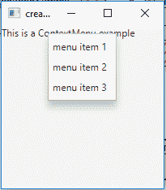
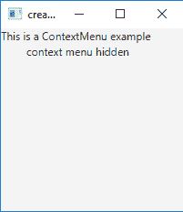
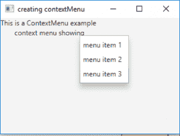

# JavaFX |带示例的上下文菜单

> 原文:[https://www . geesforgeks . org/JavaFX-context menu-with-examples/](https://www.geeksforgeeks.org/javafx-contextmenu-with-examples/)

ContextMenu 是 JavaFX 库的一部分。ContextMenu 可以与标签、textfield 等控件相关联。右键单击相关控件时，上下文菜单被激活。它显示一个包含几个菜单项或子菜单的弹出窗口。

**该类的构造函数为:**

1.  **上下文菜单()**:新建一个空的上下文菜单。
2.  **上下文菜单(MenuItem… i)** :创建包含 MenuItem 的上下文菜单。

**常用方法:**

| 方法 | 说明 |
| --- | --- |
| **【getitem()** | 返回上下文菜单的项目 |
| **getnations()** | 返回操作属性的值 |
| **隐藏()** | 隐藏上下文菜单 |
| **设置动作(事件处理程序 v)** | 设置“动作”属性的值 |
| **显示(节点 a，双 X，双 Y)** | 在屏幕的指定位置显示上下文菜单 |

以下程序说明了上下文菜单的使用:

1.  **Program to create a context menu and add it to label**: A ContextMenu will be created by name ‘contextMenu’ and 3 menuitems: menuItem1, menuItem2, menuItem3 will be added to the menu contextMenu and the menu contextMenu will be associated with a label ‘label’. The label will be created inside a scene, which in turn will be hosted inside a stage. The function setTitle() is used to provide title to the stage. Then a VBox is created, on which addChildren() method is called to attach the menubar inside the scene. Finally, the show() method is called to display the final results.

    ```java
    // Program to create a context menu and add it to label
    import javafx.application.Application;
    import javafx.scene.Scene;
    import javafx.scene.control.*;
    import javafx.scene.layout.*;
    import javafx.event.ActionEvent;
    import javafx.event.EventHandler;
    import javafx.collections.*;
    import javafx.stage.Stage;
    import javafx.scene.text.Text.*;
    import javafx.scene.paint.*;
    import javafx.scene.text.*;
    public class contextMenu_1 extends Application {
        // labels
        Label l;

        // launch the application
        public void start(Stage stage)
        {
            // set title for the stage
            stage.setTitle("creating contextMenu ");

            // create a label
            Label label1 = new Label("This is a ContextMenu example ");

            // create a menu
            ContextMenu contextMenu = new ContextMenu();

            // create menuitems
            MenuItem menuItem1 = new MenuItem("menu item 1");
            MenuItem menuItem2 = new MenuItem("menu item 2");
            MenuItem menuItem3 = new MenuItem("menu item 3");

            // add menu items to menu
            contextMenu.getItems().add(menuItem1);
            contextMenu.getItems().add(menuItem2);
            contextMenu.getItems().add(menuItem3);

            // create a tilepane
            TilePane tilePane = new TilePane(label1);

            // setContextMenu to label
            label1.setContextMenu(contextMenu);

            // create a scene
            Scene sc = new Scene(tilePane, 200, 200);

            // set the scene
            stage.setScene(sc);

            stage.show();
        }

        public static void main(String args[])
        {
            // launch the application
            launch(args);
        }
    }
    ```

    **输出:**
    

2.  **Program to create a context menu and add it to label and associate the context menu with window event listener**: A Contextmenu will be created by name contextMenu and 3 menuitems menuItem1, menuItem2, menuItem3 will be added to the menu contextMenu and the contextMenu will be associated with a label l. The label will be created inside a scene, which in turn will be hosted inside a stage. The function setTitle() is used to provide title to the stage. Then a VBox is created, on which addChildren() method is called to attach the menubar inside the scene. Finally, the show() method is called to display the final results. A Window event will be created that will handle the window events of the context menu and will display the state of the context menu by a Label ‘label’. The window event will be associated with the label using setOnHiding() and setOnShowing() functions.

    ```java
    // Program to create a context menu and add it to label
    // and associate the context menu with window event listener
    import javafx.application.Application;
    import javafx.scene.Scene;
    import javafx.scene.control.*;
    import javafx.scene.layout.*;
    import javafx.stage.WindowEvent;
    import javafx.event.EventHandler;
    import javafx.collections.*;
    import javafx.stage.Stage;
    import javafx.scene.text.Text.*;
    import javafx.scene.paint.*;
    import javafx.scene.text.*;
    public class contextMenu extends Application {
        // labels
        Label label;

        // launch the application
        public void start(Stage stage)
        {
            // set title for the stage
            stage.setTitle("creating contextMenu ");

            // create a label
            Label label1 = new Label("This is a ContextMenu example ");

            // create a menu
            ContextMenu contextMenu = new ContextMenu();

            // create menuitems
            MenuItem menuItem1 = new MenuItem("menu item 1");
            MenuItem menuItem2 = new MenuItem("menu item 2");
            MenuItem menuItem3 = new MenuItem("menu item 3");

            // add menu items to menu
            contextMenu.getItems().add(menuItem1);
            contextMenu.getItems().add(menuItem2);
            contextMenu.getItems().add(menuItem3);

            // label to display events
            Label label = new Label("context menu hidden");

            // create window event
            EventHandler<WindowEvent> event = new EventHandler<WindowEvent>() {
                public void handle(WindowEvent e)
                {
                    if (contextMenu.isShowing())
                        label.setText("context menu showing");
                    else
                        label.setText("context menu hidden");
                }
            };

            // add event
            contextMenu.setOnShowing(event);
            contextMenu.setOnHiding(event);

            // create a tilepane
            TilePane tilePane = new TilePane(label1);

            tilePane.getChildren().add(label);

            // setContextMenu to label
            label.setContextMenu(contextMenu);

            // create a scene
            Scene sc = new Scene(tilePane, 200, 200);

            // set the scene
            stage.setScene(sc);

            stage.show();
        }

        public static void main(String args[])
        {
            // launch the application
            launch(args);
        }
    }
    ```

    **输出:**
    

    

**注意:**上述程序可能无法在在线编译器中运行，请使用离线 IDE。

**参考:**[https://docs . Oracle . com/javase/8/JavaFX/API/JavaFX/scene/control/context menu . html](https://docs.oracle.com/javase/8/javafx/api/javafx/scene/control/ContextMenu.html)