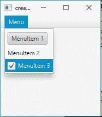
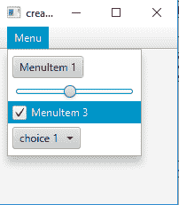

# JavaFX | CustomMenuItem

> 原文:[https://www.geeksforgeeks.org/javafx-custommenuitem/](https://www.geeksforgeeks.org/javafx-custommenuitem/)

CustomMenuItem 是 JavaFX 库的一部分。CustomMenuItem 允许不同类型的节点作为其菜单项。customMenuItem 的一个有用属性是 hideOnClick。此属性说明当用户单击 menuitem 时是否应隐藏菜单。
**custom menuitem 的构造函数:**

1.  **自定义菜单项(节点 n)** :用指定的节点创建一个菜单项
2.  **自定义菜单项(节点 n，布尔 b)** :用指定的点击属性创建一个菜单项并隐藏

**常用方法:**

<figure class="table">

| 方法 | 说明 |
| --- | --- |
| get content() | 获取属性内容的值 |
| **isHideOnClick（）** | 获取 hideOnClick 属性的值 |
| **setHideOnClick(布尔 v)** | 设置 hideOnClick 属性的值 |
| **setContent(节点 v)** | 将节点设置为菜单项的内容 |

</figure>

下面的程序将说明 CustomMenuItem 的使用:

*   **创建自定义菜单项并将其添加到菜单中的程序:**该程序创建一个由菜单栏名称指示的菜单栏。将创建一个名为 m 的菜单，并将 3 个自定义 menuitems menuitem _ 1、menuitem_2、menuitem_3 添加到菜单中，并将菜单添加到菜单栏中。菜单栏将在场景中创建，而场景又将托管在舞台中。函数 setTitle()用于为舞台提供标题。然后创建一个 VBox，在其上调用 addChildren()方法将菜单栏附加到场景中。最后，调用 show()方法显示最终结果。自定义菜单将包含一个按钮、标签和一个复选框。

## Java 语言(一种计算机语言，尤用于创建网站)

```java
// Program to create a custom menu items and add it to the menu
import javafx.application.Application;
import javafx.scene.Scene;
import javafx.scene.control.*;
import javafx.scene.layout.*;
import javafx.event.ActionEvent;
import javafx.event.EventHandler;
import javafx.collections.*;
import javafx.stage.Stage;
import javafx.scene.text.Text.*;
import javafx.scene.paint.*;
import javafx.scene.text.*;

public class CustomMenuItem_1 extends Application {

    // Launch the application
    public void start(Stage stage)
    {
        // Set title for the stage
        stage.setTitle("creating CustomMenuItem ");

        // Create a tile pane
        TilePane r = new TilePane();

        // Create a label
        Label description_label =
                    new Label("This is a CustomMenuItem example ");

        // Create a menu
        Menu menu = new Menu("Menu");

        // Create menuitems
        CustomMenuItem menuitem_1 =
                    new CustomMenuItem(new Button("MenuItem 1"));
        CustomMenuItem menuitem_2 =
                    new CustomMenuItem(new Label("MenuItem 2"));
        CustomMenuItem menuitem_3 =
                    new CustomMenuItem(new CheckBox("MenuItem 3"));

        // Add menu items to menu
        menu.getItems().add(menuitem_1);
        menu.getItems().add(menuitem_2);
        menu.getItems().add(menuitem_3);

        // Create a menubar
        MenuBar menubar = new MenuBar();

        // Add menu to menubar
        menubar.getMenus().add(menu);

        // Create a VBox
        VBox vbox = new VBox(menubar);

        // Create a scene
        Scene scene = new Scene(vbox, 200, 200);

        // Set the scene
        stage.setScene(scene);

        stage.show();
    }

    public static void main(String args[])
    {
        // Launch the application
        launch(args);
    }
}
```

*   **输出:**



*   **程序创建自定义菜单项并将其添加到菜单中，并使用属性 hide 点击**:该程序创建一个由 menubar 名称指示的 menubar。将创建一个名为 m 的菜单，并将 4 个自定义 menuitems menuitem _ 1、menuitem_2、menuitem_3、menuitem_4 添加到菜单中，并将菜单添加到菜单栏中。菜单栏将在场景中创建，而场景又将托管在舞台中。函数 setTitle()用于为舞台提供标题。然后创建一个 VBox，在其上调用 addChildren()方法将菜单栏附加到场景中。最后，调用 show()方法显示最终结果。CustonMenuItems 将包含一个按钮、一个滑块、一个复选框和一个选项框。自定义 menuitems_2 和 menuitems_4 的“单击时隐藏”属性将设置为 false，menuitem_1 和 menuitems_3 的“单击时隐藏”属性将设置为 true。点击 menuitem_2 和 menuitem_4 不会在点击时消失。

## Java 语言(一种计算机语言，尤用于创建网站)

```java
// Program to create custom menu items and
// Add it to the menu and use the property hide on click

import javafx.application.Application;
import javafx.scene.Scene;
import javafx.scene.control.*;
import javafx.scene.layout.*;
import javafx.event.ActionEvent;
import javafx.event.EventHandler;
import javafx.collections.*;
import javafx.stage.Stage;
import javafx.scene.text.Text.*;
import javafx.scene.paint.*;
import javafx.scene.text.*;
public class CustomMenuItem_2 extends Application {

    // Launch the application
    public void start(Stage stage)
    {
        // Set title for the stage
        stage.setTitle("creating CustomMenuItem ");

        // Create a tile pane
        TilePane r = new TilePane();

        // Create a label
        Label description_label =
                   new Label("This is a CustomMenuItem example ");

        // Create a menu
        Menu menu = new Menu("Menu");

        // Create menuitems
        CustomMenuItem menuitem_1 =
                   new CustomMenuItem(new Button("MenuItem 1"));
        CustomMenuItem menuitem_2 =
                   new CustomMenuItem(new Slider());
        CustomMenuItem menuitem_3 =
                   new CustomMenuItem(new CheckBox("MenuItem 3"));
        CustomMenuItem menuitem_4 =
                   new CustomMenuItem(new ChoiceBox(FXCollections
                     .observableArrayList("choice 1",
                                   "choice 2", "choice 3")));

        // Cet hide on click property
        menuitem_2.setHideOnClick(false);
        menuitem_4.setHideOnClick(false);
        menuitem_1.setHideOnClick(true);
        menuitem_3.setHideOnClick(true);

        // Add menu items to menu
        menu.getItems().add(menuitem_1);
        menu.getItems().add(menuitem_2);
        menu.getItems().add(menuitem_3);
        menu.getItems().add(menuitem_4);

        // Create a menubar
        MenuBar menubar = new MenuBar();

        // Add menu to menubar
        menubar.getMenus().add(menu);

        // Create a VBox
        VBox vbox = new VBox(menubar);

        // Create a scene
        Scene scene = new Scene(vbox, 200, 200);

        // Cet the scene
        stage.setScene(scene);

        stage.show();
    }

    public static void main(String args[])
    {
        // Launch the application
        launch(args);
    }
}
```

*   **输出:**



**注意:**上述程序可能无法在联机 IDE 中运行，请使用脱机编译器。
**参考:**[https://docs . Oracle . com/JavaFX/2/API/JavaFX/scene/control/custommenuitem . html](https://docs.oracle.com/javafx/2/api/javafx/scene/control/CustomMenuItem.html)