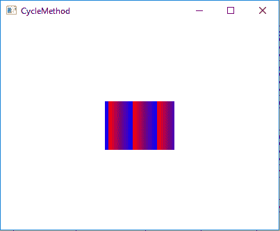
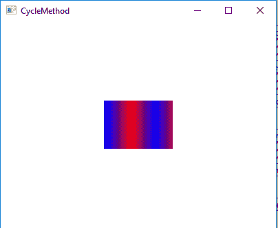
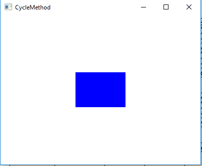

# JavaFX | CycleMethod 类

> 原文:[https://www.geeksforgeeks.org/javafx-cyclemethod-class/](https://www.geeksforgeeks.org/javafx-cyclemethod-class/)

CycleMethod 类是 JavaFX 的一部分。CycleMethod 定义在渐变边界之外绘画时使用的方法。它包含如下 3 个枚举常量:

1.  **NO_CYCLE** :用于定义使用终端颜色填充剩余区域的循环方式。
2.  **REFLECT** :用于定义反映渐变颜色的循环方式，先开始后结束再开始。
3.  **REPEAT** :用于定义重复渐变颜色填充剩余区域的循环方式。

**常用方法:**

| 方法 | 说明 |
| --- | --- |
| valueOf(字符串名称) | 返回指定名称的循环方法。 |
| 值() | 返回一个包含 Cyclemethod 类型值的数组。 |

以下程序说明了 CycleMethod 类的使用:

1.  **Java program to create a LinearGradient object, add stops to it, set the CycleMethod to repeat, set proportional to false and apply it to the rectangle:**
    1.  在这个程序中，我们将创建一个停止对象的数组，它们的偏移值范围从 0 到 1。然后创建一个带有指定停止点的线性渐变对象。
    2.  将循环方法设置为重复，并将比例设置为假。然后用指定的 x，y 位置和半径创建一个圆，并添加线性渐变。
    3.  之后创建一个 VBox 并设置它的对齐方式。
    4.  将圆圈添加到 *vbox* 并将 *vbox* 添加到场景并将场景添加到舞台并调用 *show()* 功能显示结果。

    ```java
    // Java program to create a LinearGradient object,
    // add stops to it, set the CycleMethod to repeat,
    // set proportional to false and apply it to the
    // rectangle
    import javafx.application.Application;
    import javafx.scene.Scene;
    import javafx.scene.control.*;
    import javafx.scene.layout.*;
    import javafx.stage.Stage;
    import javafx.scene.layout.*;
    import javafx.scene.paint.*;
    import javafx.scene.text.*;
    import javafx.geometry.*;
    import javafx.scene.layout.*;
    import javafx.scene.shape.*;
    import javafx.scene.paint.*;

    public class CycleMethod_1 extends Application {

        // launch the application
        public void start(Stage stage)
        {

            try {

                // set title for the stage
                stage.setTitle("CycleMethod");

                // create stops
                Stop[] stop = {new Stop(0, Color.RED), 
                             new Stop(1, Color.BLUE)};

                // create a Linear gradient object
                LinearGradient linear_gradient = new LinearGradient(0, 0,
                                 35, 0, false, CycleMethod.REPEAT, stop);

                // create a rectangle
                Rectangle rectangle = new Rectangle(100, 100, 100, 70);

                // set fill
                rectangle.setFill(linear_gradient);

                // create VBox
                VBox vbox = new VBox(rectangle);

                // ste Alignment
                vbox.setAlignment(Pos.CENTER);

                // create a scene
                Scene scene = new Scene(vbox, 400, 300);

                // set the scene
                stage.setScene(scene);

                stage.show();
            }

            catch (Exception e) {

                System.out.println(e.getMessage());
            }
        }

        // Main Method
        public static void main(String args[])
        {

            // launch the application
            launch(args);
        }
    }
    ```

    **输出:**

    

2.  **Java program to create a LinearGradient object, add stops to it, set the CycleMethod to reflect, set proportional to false and apply it to the circle:**
    1.  在这个程序中，我们将创建一个停止对象的数组，它们的偏移值范围从 0 到 1。
    2.  然后创建一个带有指定停止点的线性渐变对象。将“循环方法”设置为“反射”，将“比例”设置为“假”。
    3.  创建一个具有指定 x，y 位置和半径的圆，并向其中添加线性渐变。创建一个 VBox 并设置它的对齐方式。
    4.  将圆添加到 vbox，将 vbox 添加到场景，并将场景添加到舞台。
    5.  调用 *show()* 功能显示结果。

    ```java
    // Java program to create a LinearGradient object,
    // add stops to it, set the CycleMethod to reflect,
    // set proportional to false and apply it to the 
    // circle
    import javafx.application.Application;
    import javafx.scene.Scene;
    import javafx.scene.control.*;
    import javafx.scene.layout.*;
    import javafx.stage.Stage;
    import javafx.scene.layout.*;
    import javafx.scene.paint.*;
    import javafx.scene.text.*;
    import javafx.geometry.*;
    import javafx.scene.layout.*;
    import javafx.scene.shape.*;
    import javafx.scene.paint.*;

    public class CycleMethod_2 extends Application {

        // launch the application
        public void start(Stage stage)
        {

            try {

                // set title for the stage
                stage.setTitle("CycleMethod");

                // create stops
                Stop[] stop = {new Stop(0, Color.RED),
                             new Stop(1, Color.BLUE)};

                // create a Linear gradient object
                LinearGradient linear_gradient = new LinearGradient(0, 0, 
                                35, 0, false, CycleMethod.REFLECT, stop);

                // create a rectangle
                Rectangle rectangle = new Rectangle(100, 100, 100, 70);

                // set fill
                rectangle.setFill(linear_gradient);

                // create VBox
                VBox vbox = new VBox(rectangle);

                // ste Alignment
                vbox.setAlignment(Pos.CENTER);

                // create a scene
                Scene scene = new Scene(vbox, 400, 300);

                // set the scene
                stage.setScene(scene);

                stage.show();
            }

            catch (Exception e) {

                System.out.println(e.getMessage());
            }
        }

        // Main Method
        public static void main(String args[])
        {

            // launch the application
            launch(args);
        }
    }
    ```

    **输出:**

    

3.  **Java program to create LinearGradient object, add stops to it, set the CycleMethod to no cycle, set proportional to false and apply it to the rectangle:**
    1.  在这个程序中，我们将创建一个停止对象的数组，它们的偏移值范围从 0 到 1。
    2.  创建具有指定停止点的线性渐变对象。
    3.  将循环方法设置为无循环，并将比例设置为假。然后用指定的 x、y 位置和半径创建一个圆，并向其中添加线性渐变。创建一个 VBox 并设置它的对齐方式。
    4.  现在把圆加到 vbox，把 vbox 加到场景，把场景加到舞台，调用 *show()* 函数显示结果。

    ```java
    // Java program to create LinearGradient object,
    // add stops to it, set the CycleMethod to no 
    // cycle, set proportional to false and apply 
    // it to the rectangle
    import javafx.application.Application;
    import javafx.scene.Scene;
    import javafx.scene.control.*;
    import javafx.scene.layout.*;
    import javafx.stage.Stage;
    import javafx.scene.layout.*;
    import javafx.scene.paint.*;
    import javafx.scene.text.*;
    import javafx.geometry.*;
    import javafx.scene.layout.*;
    import javafx.scene.shape.*;
    import javafx.scene.paint.*;

    public class CycleMethod_3 extends Application {

        // launch the application
        public void start(Stage stage)
        {

            try {

                // set title for the stage
                stage.setTitle("CycleMethod");

                // create stops
                Stop[] stop = {new Stop(0, Color.RED),
                             new Stop(1, Color.BLUE)};

                // create a Linear gradient object
                LinearGradient linear_gradient = new LinearGradient(0, 0, 
                               35, 0, false, CycleMethod.NO_CYCLE, stop);

                // create a rectangle
                Rectangle rectangle = new Rectangle(100, 100, 100, 70);

                // set fill
                rectangle.setFill(linear_gradient);

                // create VBox
                VBox vbox = new VBox(rectangle);

                // ste Alignment
                vbox.setAlignment(Pos.CENTER);

                // create a scene
                Scene scene = new Scene(vbox, 400, 300);

                // set the scene
                stage.setScene(scene);

                stage.show();
            }

            catch (Exception e) {

                System.out.println(e.getMessage());
            }
        }

        // Main Method
        public static void main(String args[])
        {

            // launch the application
            launch(args);
        }
    }
    ```

    **输出:**

    

**注意:**上述程序可能无法在联机 IDE 中运行，请使用脱机编译器。

**参考:**[https://docs . Oracle . com/JavaFX/2/API/JavaFX/scene/paint/cyclemethod . html](https://docs.oracle.com/javafx/2/api/javafx/scene/paint/CycleMethod.html)