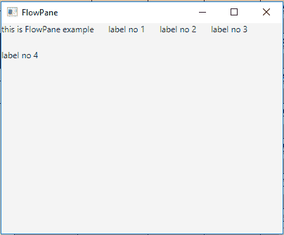
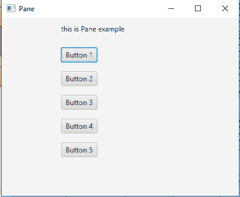
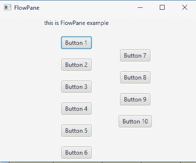

# JavaFX | FlowPane 类

> 原文:[https://www.geeksforgeeks.org/javafx-flowpane-class/](https://www.geeksforgeeks.org/javafx-flowpane-class/)

FlowPane 类是 JavaFX 的一部分。Flowpane 以在 flowpane 的边界处换行的方式布局其子代。水平的 flowpane(默认)将按行布局节点，按照 flowpane 的宽度换行。垂直的 flowpane 以列的形式排列节点，在 flowpane 的高度换行。FlowPane 类继承了 *[Pane](https://www.geeksforgeeks.org/javafx-pane-class/)* 类。

**类的构造函数:**

1.  **流程窗格()**:创建新的水平流程窗格布局。
2.  **流程窗格(双 h，双 v)** :创建新的水平流程窗格布局，具有指定的水平和垂直间隙。
3.  **流程窗格(双 h，双 v，节点… c)** :创建一个新的水平流程窗格布局，具有指定的水平、垂直间隙和节点。
4.  **流程窗格(节点… c)** :用指定的子节点创建流程窗格。
5.  **流程窗格(方向 o)** :创建具有指定方向的流程窗格
6.  **流程窗格(方向 o，双 h，双 v)** :创建具有指定方向和指定水平和垂直间隙的流程窗格。
7.  **流程窗格(方向 o，双 h，双 v，节点… c)** :创建具有指定方向、指定水平和垂直间隙以及指定子级的流程窗格。
8.  **流程窗格(方向 o，节点… c)** :创建具有指定方向和指定节点的流程窗格。

**常用方法:**

| 方法 | 说明 |
| --- | --- |
| getAlignment() | 返回窗格对齐的值。 |
| getHgap() | 返回流动窗格的水平间距。 |
| getOrientation() | 返回窗格的方向。 |
| getRowValignment() | 获取 rowValignment 属性的值。 |
| getVgap() | 返回流窗格的垂直间距。 |
| 设置对齐(位置 v) | 设置窗格的对齐值。 |
| setHgap(双 v) | 设置流动窗格的水平间距。 |
| 设置方向(方向 o) | 设置窗格的方向。 |
| setRowValignment(双 v) | 设置 rowValignment 属性的值。 |
| setVgap(双 v) | 设置流动窗格的垂直间距。 |

以下程序说明了流窗格类的使用:

1.  **Java Program to create a FlowPane, add labels to the flow pane and add it to the stage:** In this program we will create a FlowPane and 5 Label named *label*, *label1*, *label2*, *label3*, *label4*. Add the labels to the *flow_pane* by passing it as the arguments. Set the FlowPane to the scene and add the scene to the stage. Call the *show()* function to display the final results.

    ```
    // Java Program to create a FlowPane,
    // add labels to the flow pane
    // and add it to the stage
    import javafx.application.Application;
    import javafx.scene.Scene;
    import javafx.scene.control.*;
    import javafx.scene.layout.*;
    import javafx.stage.Stage;
    import javafx.event.ActionEvent;
    import javafx.event.EventHandler;
    import javafx.scene.canvas.*;
    import javafx.scene.web.*;
    import javafx.scene.layout.*;
    import javafx.scene.shape.*;

    public class FlowPane_0 extends Application {

        // launch the application
        public void start(Stage stage)
        {

            try {

                // set title for the stage
                stage.setTitle("FlowPane");

                // create a labels
                Label label = new Label("this is FlowPane example");
                Label label1 = new Label("label no 1");
                Label label2 = new Label("label no 2");
                Label label3 = new Label("label no 3");
                Label label4 = new Label("label no 4");

                // create a FlowPane
                FlowPane flow_pane = new FlowPane(20.0, 20.0, label, label1,
                                                    label2, label3, label4);

                // create a scene
                Scene scene = new Scene(flow_pane, 400, 300);

                // set the scene
                stage.setScene(scene);

                stage.show();
            }

            catch (Exception e) {

                System.out.println(e.getMessage());
            }
        }

        // Main Method
        public static void main(String args[])
        {

            // launch the application
            launch(args);
        }
    }
    ```

    **输出:**

    

2.  **Java Program to create a FlowPane set its orientation, add labels and buttons and add it to the stage:** In this program we will create a FlowPane and a Label named *label*. Add the label to the flow_pane by passing it through the argument, orientation and the hgap, and vgap values. Add the buttons using *getChildren().add()*. Set the FlowPane to the scene. Add the scene to the stage. Call the *show()* function to display the final results.

    ```
    // Java Program to create a FlowPane
    // set its orientation, add labels 
    // and buttons and add it to the stage
    import javafx.application.Application;
    import javafx.scene.Scene;
    import javafx.scene.control.*;
    import javafx.scene.layout.*;
    import javafx.stage.Stage;
    import javafx.event.ActionEvent;
    import javafx.geometry.*;
    import javafx.scene.canvas.*;
    import javafx.scene.web.*;
    import javafx.scene.layout.*;
    import javafx.scene.shape.*;

    public class FlowPane_1 extends Application {

    // launch the application
    public void start(Stage stage)
    {

        try {

            // set title for the stage
            stage.setTitle("FlowPane");

            // create a label
            Label label = new Label("this is FlowPane example");

            // create a FlowPane
            FlowPane flow_pane = new FlowPane(Orientation.VERTICAL,
                                                20.0, 20.0, label);

            // add buttons
            for (int i = 0; i < 10; i++) {

                // add nodes to the flow pane
                flow_pane.getChildren().add(new Button("Button " 
                                                + (int)(i + 1)));
            }

            // create a scene
            Scene scene = new Scene(flow_pane, 400, 300);

            // set the scene
            stage.setScene(scene);

            stage.show();
        }

        catch (Exception e) {

            System.out.println(e.getMessage());
        }
    }

    // Main Method
    public static void main(String args[])
    {

        // launch the application
        launch(args);
    }
    }
    ```

    **输出:**

    

3.  **Java Program to create a FlowPane set its orientation, add labels and buttons, set the alignment, column alignment, row alignment of the FlowPane and add it to the stage:** In this program we will create a FlowPane and a Label named label. Add the label to the flow_pane by passing it through the argument, orientation, and the hgap, and vgap values. Now add the buttons using *getChildren().add()*. Set the FlowPane to the scene. Set the alignment of the FlowPane using functions using *setAlignment(), setColumnHalignment(), setRowValignment()*. Add the scene to the stage. Call the *show()* function to display the final results.

    ```
    // Java Program to create a FlowPane set its orientation,
    // add labels and buttons, set the alignment, column 
    // alignment, row alignment of the FlowPane and add it 
    // to the stage
    import javafx.application.Application;
    import javafx.scene.Scene;
    import javafx.scene.control.*;
    import javafx.scene.layout.*;
    import javafx.stage.Stage;
    import javafx.event.ActionEvent;
    import javafx.geometry.*;
    import javafx.scene.canvas.*;
    import javafx.scene.web.*;
    import javafx.scene.layout.*;
    import javafx.scene.shape.*;

    public class FlowPane_2 extends Application {

    // launch the application
    public void start(Stage stage)
    {

        try {

            // set title for the stage
            stage.setTitle("FlowPane");

            // create a label
            Label label = new Label("this is FlowPane example");

            // create a FlowPane
            FlowPane flow_pane = new FlowPane(Orientation.VERTICAL,
                                                20.0, 20.0, label);

            // add buttons
            for (int i = 0; i < 10; i++) {
                // add nodes to the flow pane
                flow_pane.getChildren().add(new Button("Button " 
                                               + (int)(i + 1)));
            }

            // set alignment of flow pane
            flow_pane.setAlignment(Pos.CENTER);
            flow_pane.setColumnHalignment(HPos.CENTER);
            flow_pane.setRowValignment(VPos.CENTER);

            // create a scene
            Scene scene = new Scene(flow_pane, 400, 300);

            // set the scene
            stage.setScene(scene);

            stage.show();
        }

        catch (Exception e) {

            System.out.println(e.getMessage());
        }
    }

    // Main Method
    public static void main(String args[])
    {

        // launch the application
        launch(args);
    }
    }
    ```

    **输出:**

    

**注意:**上述程序可能无法在联机 IDE 中运行，请使用脱机编译器。

**参考:**[https://docs . Oracle . com/javase/8/JavaFX/API/JavaFX/scene/layout/flow pane . html](https://docs.oracle.com/javase/8/javafx/api/javafx/scene/layout/FlowPane.html)