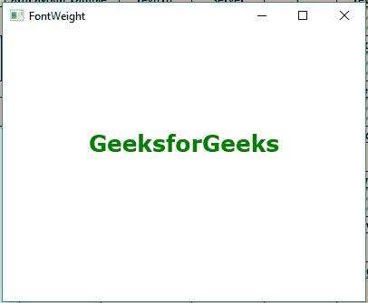
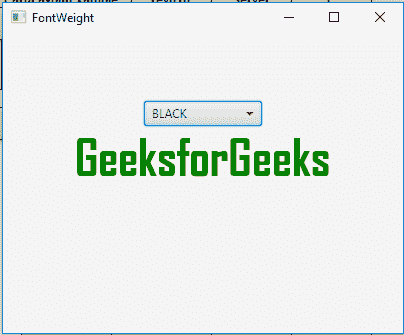
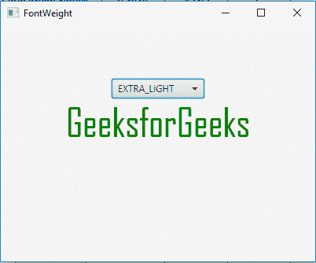

# JavaFX | FontWeight 类

> 原文:[https://www.geeksforgeeks.org/javafx-fontweight-class/](https://www.geeksforgeeks.org/javafx-fontweight-class/)

FontWeight 类是 JavaFX 的一部分。FontWeight 类定义字体的粗细。字体权重类指定在系统上搜索字体时可以使用的不同字体权重。FontWeight 类继承了*枚举*类。

**常用方法:**

| 方法 | 说明 |
| --- | --- |
| findByName（String n） | 按名称返回 FontWeight。 |
| findbywith(int w) | 返回权重值最接近的字体权重。 |
| getWeight() | 返回视觉重量。 |
| valueOf(字符串 n) | 用指定的名称返回此类型的枚举常量。 |
| 值() | 返回 FontWeight 类型的所有值。 |

以下程序说明了 FontWeight 类的使用:

1.  **Java program to create a TextFlow and add text object to it, set text Alignment and also set font weight of the font of the text and set line spacing of the text flow:** In this program we will create a TilePane named *tile_pane*. Add Label named label and some buttons to the *tile_pane*. Set the Alignment of the *tile_pane* using the *setAlignment()* function. Set the Font weight of the font to *EXTRA_BOLD*. Add the *tile_pane* to the scene and add the scene to the stage and call the *show()* function to display the final results.

    ```java
    // Java program to create a TextFlow and
    // add text object to it, set text Alignment
    // and also set font weight of the font of text
    // and set line spacing of the text flow.
    import javafx.application.Application;
    import javafx.scene.Scene;
    import javafx.scene.control.*;
    import javafx.scene.layout.*;
    import javafx.stage.Stage;
    import javafx.scene.layout.*;
    import javafx.scene.paint.*;
    import javafx.scene.text.*;
    import javafx.geometry.*;
    import javafx.scene.layout.*;
    import javafx.scene.shape.*;

    public class FontWeight_1 extends Application {

        // launch the application
        public void start(Stage stage)
        {

            try {

                // set title for the stage
                stage.setTitle("FontWeight");

                // create TextFlow
                TextFlow text_flow = new TextFlow();

                // create text
                Text text_1 = new Text("GeeksforGeeks\n");

                // set the text color
                text_1.setFill(Color.GREEN);

                // set font of the text
                text_1.setFont(Font.font("Verdana", FontWeight.EXTRA_BOLD, 25));

                // set text
                text_flow.getChildren().add(text_1);

                // set text Alignment
                text_flow.setTextAlignment(TextAlignment.CENTER);

                // set line spacing
                text_flow.setLineSpacing(20.0f);

                // create VBox
                VBox vbox = new VBox(text_flow);

                // set alignment of vbox
                vbox.setAlignment(Pos.CENTER);

                // create a scene
                Scene scene = new Scene(vbox, 400, 300);

                // set the scene
                stage.setScene(scene);

                stage.show();
            }

            catch (Exception e) {

                System.out.println(e.getMessage());
            }
        }

        // Main Method
        public static void main(String args[])
        {

            // launch the application
            launch(args);
        }
    }
    ```

    **输出:**

    

2.  **Java program to create a TextFlow and add text object to it, set text Alignment and also set font weight of the font of the text and also set a combo box to change font weight and set line spacing of the text flow:** In this program we will create a TilePane named *tile_pane*. Add Label named label and some buttons to the *tile_pane*. Set the Alignment of the *tile_pane* using the *setAlignment()* function. Now set the FontWeight of the font to *EXTRA_BOLD*. Store all the names of FontWeight values in a String array. Now create a *combobox* which will contain the names of FontWeight values and also create an Action Event to handle the combobox events. The Event handler will set the font weight of the font to the chosen FontWeight value. Now create a VBox and add the *tilepane* and the combo box to *vbox*. Finally, add the *vbox* to the scene and add the scene to the stage and call the *show()* function to display the final results.

    ```java
    // Java program to create a TextFlow and
    // add text object to it, set text Alignment
    // and also set font weight of the font of text
    // and also set a combo box to change font weight
    // and set line spacing of the text flow.
    import javafx.application.Application;
    import javafx.scene.Scene;
    import javafx.scene.control.*;
    import javafx.scene.layout.*;
    import javafx.stage.Stage;
    import javafx.scene.layout.*;
    import javafx.scene.paint.*;
    import javafx.scene.text.*;
    import javafx.geometry.*;
    import javafx.scene.layout.*;
    import javafx.scene.shape.*;
    import javafx.collections.*;
    import javafx.event.ActionEvent;
    import javafx.event.EventHandler;

    public class FontWeight_2 extends Application {

    // launch the application
    public void start(Stage stage)
    {

        try {

            // set title for the stage
            stage.setTitle("FontWeight");

            // create TextFlow
            TextFlow text_flow = new TextFlow();

            // create text
            Text text_1 = new Text("GeeksforGeeks\n");

            // set the text color
            text_1.setFill(Color.GREEN);

            // set font of the text
            text_1.setFont(Font.font(Font.getFontNames().get(0),
                                    FontWeight.EXTRA_BOLD, 50));

            // font weight names
            String weight[] = {"BLACK", "BOLD", 
                               "EXTRA_BOLD", 
                               "EXTRA_LIGHT", 
                               "LIGHT", 
                               "MEDIUM", 
                               "NORMAL", 
                               "SEMI_BOLD",
                               "THIN" };

            // Create a combo box
            ComboBox combo_box = 
              new ComboBox(FXCollections.observableArrayList(weight));

            // Create action event
            EventHandler<ActionEvent> event = new EventHandler<ActionEvent>() {

                public void handle(ActionEvent e)
                {

                    // set font of the text
                    text_1.setFont(Font.font(Font.getFontNames().get(0), 
                     FontWeight.valueOf((String)combo_box.getValue()), 50));
                }
            };

            // Set on action
            combo_box.setOnAction(event);

            // set text
            text_flow.getChildren().add(text_1);

            // set text Alignment
            text_flow.setTextAlignment(TextAlignment.CENTER);

            // set line spacing
            text_flow.setLineSpacing(20.0f);

            // create VBox
            VBox vbox = new VBox(combo_box, text_flow);

            // set alignment of vbox
            vbox.setAlignment(Pos.CENTER);

            // create a scene
            Scene scene = new Scene(vbox, 400, 300);

            // set the scene
            stage.setScene(scene);

            stage.show();
        }

        catch (Exception e) {

            System.out.println(e.getMessage());
        }
    }

    // Main Method
    public static void main(String args[])
    {

        // launch the application
        launch(args);
    }
    }
    ```

    **输出:**

    

    

**注意:**上述程序可能无法在联机 IDE 中运行，请使用脱机编译器。

**参考:**[https://docs . Oracle . com/javase/8/JavaFX/API/JavaFX/scene/text/font weight . html](https://docs.oracle.com/javase/8/javafx/api/javafx/scene/text/FontWeight.html)